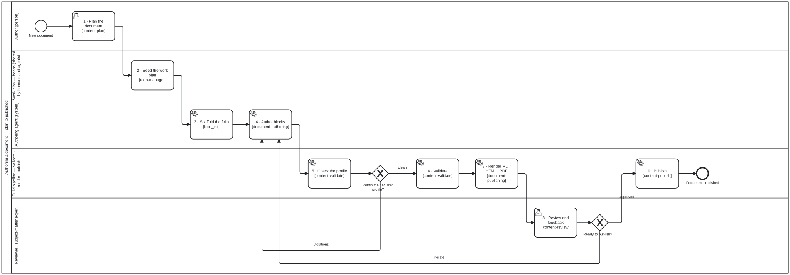

{: .note }
> Generated from `cat-harness/processes/authoring-a-document.bpmn` by `gen-processes-viz.ts` — do not edit here. [All processes](index.html)


# Authoring a document

`Process_DocumentAuthoring` · advisory · 9 step(s)

folio-assistant — authoring a document end to end (no Lean, no required TeX). Source of truth: this file. The SVG under docs/assets/img/workflows/ is generated from it by `bun run render:bpmn` — never hand-edit the SVG. The shape is the paper process minus the Lean lane and plus one step, the profile check, which is what keeps a document folio publishable without either toolchain.

## How it connects

- **Called by:** no call activity names this process
- **Calls:** none

## Lanes — who acts

| lane | role | what it does here |
|---|---|---|
| Author (person) | — | The only place a person acts before the process becomes agent- and pipeline-driven: Task_Plan sets the chapters, the blocks each needs and which statements are normative, once, before Lane_WorkPlan seeds a bean and Lane_Agent takes over every later edit, including every iteration the review and profile-check loops send back. |
| Work plan — beans (shared by humans and agents) | — | Touched exactly once in this process — Task_SeedPlan turns the plan into a bean right after Task_Plan, so a resumed session or a sibling agent can pick the authoring loop up without re-deriving what was decided at the top. |
| Authoring agent (system) | — | Task_AuthorBlocks is where every loop in this process lands — a profile violation from Lane_Build and an iterate from Lane_Reviewer both come back here — so this lane, not either gate, is what actually turns a rejection into a fixed block; Task_Scaffold runs once, before either loop exists. |
| Build pipeline — validate · render · publish | — | Owns the one gate this process has that the paper process does not — the profile check — so nothing with a math kind, a lean field or a .lean sibling reaches Task_Validate or Task_Render pretending to be document content; everything downstream of Gateway_ProfileClean assumes that profile. |
| Reviewer / subject-matter expert | — | Owns the one gate that decides publish or iterate, and is deliberately unspecialised: this process relaxes the paper process's clinical-SME lane into whichever reviewer a given document actually binds, because no single expertise fits every document the way it does a guideline. |

## Steps

Every one of the 9 step(s) is documented.

| step | lane | skill / sub-process | what it does |
|---|---|---|---|
| **1 · Plan the document** `Task_Plan` | Author (person) | [`content-plan`](../reference/skill-instructions/content-plan.html) | Scope it: chapters, the blocks each needs, which statements are normative. |
| **2 · Seed the work plan** `Task_SeedPlan` | Work plan — beans (shared by humans and agents) | [`todo-manager`](../reference/skill-instructions/todo-manager.html) | The plan becomes beans, so a resumed session or a sibling agent can pick it up. |
| **3 · Scaffold the folio [folio_init]** `Task_Scaffold` | Authoring agent (system) | [`document-structure`](../reference/skill-instructions/document-structure.html) | folio_init writes content/, uploads/, library/, the manifests, the builder shim and AGENTS.md. Skipped when the folio already exists. |
| **4 · Author blocks** `Task_AuthorBlocks` | Authoring agent (system) | [`document-authoring`](../reference/skill-instructions/document-authoring.html) [`normative-statements`](../reference/skill-instructions/normative-statements.html) | Every block edit runs the HCI validation gate — see editing-hci-validation.bpmn. A normative statement goes through normative-statements. |
| **5 · Check the profile** `Task_ProfileCheck` | Build pipeline — validate · render · publish | [`content-validate`](../reference/skill-instructions/content-validate.html) | content_profile_check: no math kind, no lean field, no .lean sibling. This is the step a paper folio does not have, and the reason a document folio never needs Lean or TeX to publish. |
| **6 · Validate** `Task_Validate` | Build pipeline — validate · render · publish | [`content-validate`](../reference/skill-instructions/content-validate.html) | Schema and constraint checks over every block. |
| **7 · Render MD / HTML / PDF** `Task_Render` | Build pipeline — validate · render · publish | [`document-publishing`](../reference/skill-instructions/document-publishing.html) | Assemble to Markdown, then pandoc. The PDF goes through an HTML engine — never latexmk. |
| **8 · Review and feedback** `Task_Review` | Reviewer / subject-matter expert | [`content-review`](../reference/skill-instructions/content-review.html) | The reviewer this folio binds. authoring-document relaxes the base SME step precisely because no single lane fits every document. |
| **9 · Publish** `Task_Publish` | Build pipeline — validate · render · publish | [`content-publish`](../reference/skill-instructions/content-publish.html) | See draft-to-publication.bpmn for the review and release path this expands into. Release authorisation is not relaxable. |

## Decisions

**2** of 2 decision(s) carry no documentation — `gateway-documented` lists them.

| decision | what decides it | branches |
|---|---|---|
| **Within the declared profile?** `Gateway_ProfileClean` | — | **violations** → 4 · Author blocks **clean** → 6 · Validate |
| **Ready to publish?** `Gateway_ReviewOutcome` | — | **iterate** → 4 · Author blocks **approved** → 9 · Publish |


