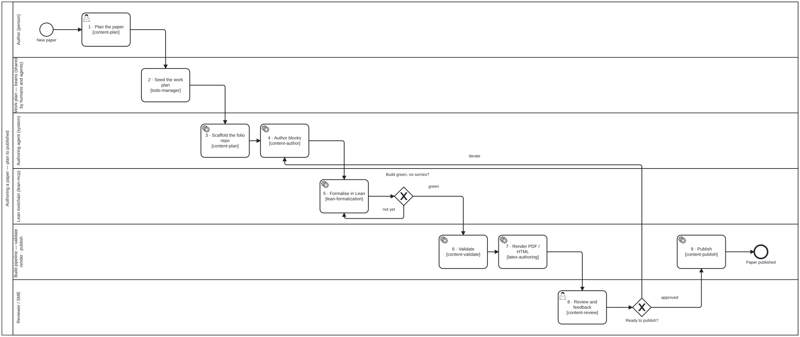

{: .note }
> Generated from `cat-harness/processes/authoring-a-paper.bpmn` by `gen-processes-viz.ts` — do not edit here. [All processes](index.html)


# Authoring a paper

`Process_PaperAuthoring` · advisory · 9 step(s)

folio-assistant — authoring a scientific paper end to end (Lean + LaTeX). Source of truth: this file. Open it in bpmn.io, Camunda Modeler, or any other BPMN 2.0 tool. The SVG under docs/assets/img/workflows/ is generated from it by `bun run render:bpmn` — never hand-edit the SVG. The <bootstrap.processes:skill> extension on an activity names the folio-assistant skill that implements it; <cat-harness.processes:bean> marks a step that reads or writes the shared work plan in beans/.

## How it connects

- **Called by:** no call activity names this process
- **Calls:** none

## Lanes — who acts

| lane | role | what it does here |
|---|---|---|
| Author (person) | `author` | The plan set here — chapters, the blocks each needs, what gets formalised — is upstream of everything else in the diagram and is never revisited: Gateway_ReviewOutcome's 'iterate' branch re-enters Lane_Agent's Task_AuthorBlocks directly, not this lane, so a scoping mistake made here surfaces only as churn several lanes downstream. |
| Work plan — beans (shared by humans and agents) | `work-plan` | Sits between Task_Plan and Task_Scaffold as the one conversion point in this diagram: the author's plan becomes beans here, which is what lets a resumed session or a different agent pick up Task_Scaffold without having sat through Task_Plan itself. |
| Authoring agent (system) | `authoring-agent` | Scaffolds the repo from the author's plan and then writes every block — including every revision, since Gateway_ReviewOutcome's 'iterate' branch re-enters Task_AuthorBlocks directly rather than sending the change back to Lane_Author to be re-scoped. The plan is the author's decision; executing against it, first draft through every rewrite, is this lane's. |
| Lean toolchain (lean-mcp) | `lean-toolchain` | Owns its own loop: Gateway_LeanGreen's 'not yet' branch returns straight to Task_Formalize rather than out to a person, and the gateway itself is DMN-computed off the build result rather than argued, so nothing downstream can proceed on a proof that merely looks close enough. The paper does not reach Task_Validate until this lane's own gate says green. |
| Build pipeline — validate · render · publish | `build-pipeline` | Its three tasks bracket the human review rather than replace it: Validate and Render turn the Lean-green manuscript into the artefact Task_Review actually reads, and Publish only fires once Gateway_ReviewOutcome has said 'approved' — this lane builds what gets judged and executes what was decided, and decides nothing itself. |
| Reviewer / SME | `reviewer` | Gateway_ReviewOutcome sits in this lane rather than a separate editor's, so in this diagram the reviewer's finding and its disposition are the same decision — iterate back to Task_AuthorBlocks or clear Task_Publish — because paper authoring has no editor lane to hold the accept/reject split modelled elsewhere in this corpus. |

## Steps

Every one of the 9 step(s) is documented.

| step | lane | skill / sub-process | what it does |
|---|---|---|---|
| **1 · Plan the paper** `Task_Plan` | Author (person) | [`content-plan`](../reference/skill-instructions/content-plan.html) | Scope the paper: chapters, the blocks each needs, what gets formalised. |
| **2 · Seed the work plan** `Task_SeedPlan` | Work plan — beans (shared by humans and agents) | [`todo-manager`](../reference/skill-instructions/todo-manager.html) | The plan becomes beans, so a resumed session or a sibling agent can pick it up. |
| **3 · Scaffold the folio repo** `Task_Scaffold` | Authoring agent (system) | [`content-plan`](../reference/skill-instructions/content-plan.html) | Create the folio repository with `bun run init-folio` (or the folio_init tool): content/, the document, chapter and first block manifests, the builder shim, AGENTS.md, .mcp.json, the session-start hook and the beans store, with the platform linked rather than copied. |
| **4 · Author blocks** `Task_AuthorBlocks` | Authoring agent (system) | [`content-author`](../reference/skill-instructions/content-author.html) | Every block edit runs the HCI validation gate — see editing-hci-validation.bpmn. |
| **5 · Formalise in Lean** `Task_Formalize` | Lean toolchain (lean-mcp) | [`lean-formalization`](../reference/skill-instructions/lean-formalization.html) [`proof-verification`](../reference/skill-instructions/proof-verification.html) | Give each formal block (definition, theorem, lemma, proposition, corollary, conjecture, proof) a .lean sibling that Lean 4 accepts, in the order lean-formalization sets out. A compiling declaration is not a formalised claim: check vacuity and narrative drift before calling it done, and record the status with proof-verification. |
| **6 · Validate** `Task_Validate` | Build pipeline — validate · render · publish | [`content-validate`](../reference/skill-instructions/content-validate.html) | Run content validation over the folio: schemas, the content profile (formal kinds only in a paper), cross-block consistency and that the Lean builds. Loop back rather than rendering over a failure. |
| **7 · Render PDF / HTML** `Task_Render` | Build pipeline — validate · render · publish | [`latex-authoring`](../reference/skill-instructions/latex-authoring.html) | Typeset the paper through LaTeX to PDF and HTML. Run latex_preflight first — missing packages, fonts or engine — rather than discovering them twenty minutes in. The preamble, class and macros belong to the folio, never to the platform. |
| **8 · Review and feedback** `Task_Review` | Reviewer / SME | [`content-review`](../reference/skill-instructions/content-review.html) | Review the rendered paper, not a description of it, and record the feedback. The outcome is iterate — back to authoring — or approved for the publication path. |
| **9 · Publish** `Task_Publish` | Build pipeline — validate · render · publish | [`content-publish`](../reference/skill-instructions/content-publish.html) | See draft-to-publication.bpmn for the review and release path this expands into. |

## Decisions

Every one of the 2 decision(s) is documented.

| decision | what decides it | branches |
|---|---|---|
| **Build green, no sorries?** `Gateway_LeanGreen` | Answered by the Lean build after step 5: is it green with no `sorry` left? `not yet` loops on formalisation; `green` goes on to validation. A build that passes with a `sorry` is not green. | **not yet** → 5 · Formalise in Lean **green** → 6 · Validate |
| **Ready to publish?** `Gateway_ReviewOutcome` | The reviewer's call after step 8. `iterate` returns to authoring with the feedback; `approved` goes to publish. | **iterate** → 4 · Author blocks **approved** → 9 · Publish |


