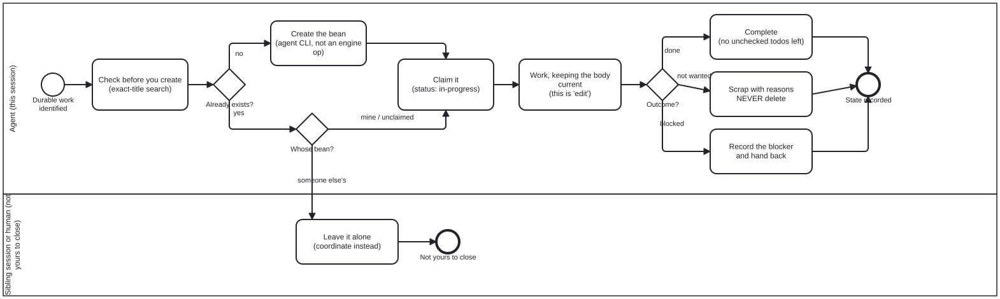

{: .note }
> Generated from `cat-harness/processes/bean-lifecycle.bpmn` by `gen-processes-viz.ts` — do not edit here. [All processes](index.html)


# Agent bean lifecycle

`Process_BeanLifecycle` · strict (defaulted) · 8 step(s)

The whole life of a work-plan item, and the rules that make one agent's bean legible to another: check before you create, claim before you work, keep the body current as you go, and end it in a state that says why. You are in this process the moment durable work is identified — which is before the first tool call, not after the work is done. The second lane exists because a bean you did not open is not yours to close: coordination replaces a decision you are not entitled to make. The one irreversible thing is refused outright. Unwanted work is SCRAPPED with its reasons, never deleted, because a scrapped bean stops the next agent re-entering a dead end while a deleted one leaves a sibling unable to tell abandonment from accident.

## How it connects

- **Called by:** no call activity names this process
- **Calls:** none

## Lanes — who acts

| lane | role | what it does here |
|---|---|---|
| Agent (this session) | — | Owns every transition on a bean it holds — check, create, claim, work, and the three-way outcome at the end — but GW_Owner is the one branch this lane cannot complete itself: the moment a bean turns out to be someone else's, the only correct move is to leave the whole lifecycle to Lane_Sibling rather than resolve, scrap or edit it from here. |
| Sibling session or human (not yours to close) | — | The only task in this diagram with no `folio:bean` op at all — every other terminal action here writes something, and this one's entire job is to write nothing to a bean it does not own, ending the lifecycle at End_NotYours rather than at the completion Lane_Agent reaches for its own beans. |

## Steps

Every one of the 8 step(s) is documented.

| step | lane | skill / sub-process | what it does |
|---|---|---|---|
| **Check before you create (exact-title search)** `Task_CheckExists` | Agent (this session) | [`todo-manager`](../reference/skill-instructions/todo-manager.html) | STRICT. `beans create` is not idempotent: it mints a fresh id every call and dedupes on nothing, so re-entering a step duplicates the plan instead of no-op'ing. In the qou folio an unguarded re-run produced 14,688 duplicate beans — 92% of every open bean — which starved the idle-backlog policy of signal and collided with 15 real ids. |
| **Create the bean (agent CLI, not an engine op)** `Task_Create` | Agent (this session) | [`todo-manager`](../reference/skill-instructions/todo-manager.html) | `beans create "<title>"`. This is the AGENT's call. The workflow engine has no `create` op — its vocabulary is claim, note and resolve, all of which act on an instance's existing bean. |
| **Leave it alone (coordinate instead)** `Task_LeaveAlone` | Sibling session or human (not yours to close) | [`bean-coordination`](../reference/skill-instructions/bean-coordination.html) | Never resolve, scrap or delete a bean another session or a human owns. Claiming is how two sessions avoid picking the same item; closing someone else's is how one of them loses work it had not finished reporting. |
| **Claim it (status: in-progress)** `Task_Claim` | Agent (this session) | [`bean-coordination`](../reference/skill-instructions/bean-coordination.html) | Idempotent. Claim BEFORE working, and note the branch, so a sibling session can see the item is taken rather than discovering it by collision. |
| **Work, keeping the body current (this is 'edit')** `Task_Work` | Agent (this session) | [`todo-manager`](../reference/skill-instructions/todo-manager.html) | Editing a bean is not a separate ceremony: check off todo items as they happen, append measurements with the command and date that produced them, and record what you now know that the next agent does not. A bean whose body is a title is a placeholder, not a plan. |
| **Complete (no unchecked todos left)** `Task_Complete` | Agent (this session) | [`todo-manager`](../reference/skill-instructions/todo-manager.html) | Only once nothing is unchecked, and with a summary of what changed. The engine's `resolve` completes a bean only after the instance itself has completed — whether work is done is a judgement, and a bean is not closed on someone else's say-so. |
| **Scrap with reasons NEVER delete** `Task_Scrap` | Agent (this session) | [`todo-manager`](../reference/skill-instructions/todo-manager.html) | `status: scrapped`, plus a "Reasons for Scrapping" section. This is what "disable" means here — the CLI has no disabled state; its vocabulary is draft, todo, in-progress, completed, scrapped. DELETION IS NEVER THE ANSWER, even though `beans delete` exists. A scrapped bean records that the work was considered and rejected, and why; a deleted one leaves a sibling session unable to tell abandonment from accident, and leaves the next agent free to re-open the same dead end. |
| **Record the blocker and hand back** `Task_RecordBlocker` | Agent (this session) | [`bean-coordination`](../reference/skill-instructions/bean-coordination.html) | Blocked is not scrapped. Set `--blocked-by`, say in the body what would unblock it, and return it to `todo` so it is visible to whoever can act. An in-progress bean nobody is progressing reads as active work. |

## Decisions

**3** of 3 decision(s) carry no documentation — `gateway-documented` lists them.

| decision | what decides it | branches |
|---|---|---|
| **Already exists?** `GW_Exists` | — | **no** → Create the bean (agent CLI, not an engine op) **yes** → Whose bean? |
| **Whose bean?** `GW_Owner` | — | **someone else's** → Leave it alone (coordinate instead) **mine / unclaimed** → Claim it (status: in-progress) |
| **Outcome?** `GW_Outcome` | — | **done** → Complete (no unchecked todos left) **not wanted** → Scrap with reasons NEVER delete **blocked** → Record the blocker and hand back |


