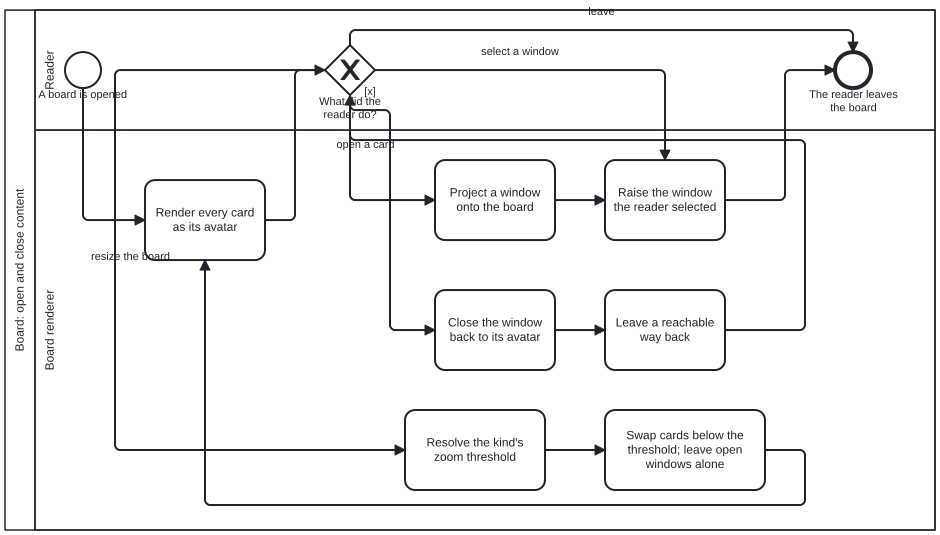

{: .note }
> Generated from `cat-harness/processes/board-open-close.bpmn` by `gen-processes-viz.ts` — do not edit here. [All processes](index.html)


# Board: open and close content

`Process_BoardOpenClose` · advisory · 7 step(s)

What a reader does to a board and what the renderer does back: every card rests as its avatar, a window opens onto the one the reader chose, and it closes back to where it came from. You are in this process when the question is a READER's — which card is open, what is raised, how to get back. Semantic zoom is in here too and is deliberately not the same mechanism: the threshold is resolved from the kind and applies itself by SIZE, while opening and closing are a person's acts. Conflating them is how a board starts changing under somebody who did not touch it. The rule the diagram exists to hold is the one about the way back: an action whose inverse is not reachable is not a toggle, and a window that cannot be closed is a navigation dead end wearing a control's clothes.

## How it connects

- **Called by:** no call activity names this process
- **Calls:** none
- **Presented on:** no docs page section shows this diagram

## Lanes — who acts

| lane | role | what it does here |
|---|---|---|
| Reader | `user` | — |
| Board renderer | `board-renderer` | Acts and decides nothing: the start, the gateway and the end all sit in the reader's lane, so every node here is downstream of a choice somebody else made. That split is the point — a renderer that chose what to open would put layout in charge of what the folio asserts. |

## Steps

Every one of the 7 step(s) is documented.

| step | lane | skill / sub-process | what it does |
|---|---|---|---|
| **Render every card as its avatar** `A_RenderAvatars` | Board renderer | [`board-windows`](../reference/skill-instructions/board-windows.html) | Render every card as its avatar — the starting state. Each content kind controls its own avatar; the board decides only that nothing starts open. |
| **Project a window onto the board** `A_Open` | Board renderer | [`board-windows`](../reference/skill-instructions/board-windows.html) | Project a window onto the board for the chosen card. A window is not the card grown large: it survives zooming out, and only [x] closes it. The frame is fixed ([x] always present, always in the same place); the kind fills in its declared controls. |
| **Raise the window the reader selected** `A_Raise` | Board renderer | [`board-windows`](../reference/skill-instructions/board-windows.html) | Raise the selected window to the top. Selecting ANY part raises it, not just a title bar. Z-order is session-only by stated default: no z is written to the layout, so a raise is never a file write. |
| **Close the window back to its avatar** `A_Close` | Board renderer | [`board-windows`](../reference/skill-instructions/board-windows.html) | [x] closes the window back to its avatar. Only a person's [x] does this; a zoom-out never closes a window, or [x] and zooming become indistinguishable to the reader. |
| **Leave a reachable way back** `A_OfferWayBack` | Board renderer | [`board-windows`](../reference/skill-instructions/board-windows.html) | Leave the way back reachable: the collapsed window becomes a control in its own position and focus moves to it — left alone, focus lands on <body> and the keyboard position is lost. An action whose inverse is not reachable is not a toggle (bean l4zi). |
| **Resolve the kind's zoom threshold** `A_ResolveThreshold` | Board renderer | [`board-windows`](../reference/skill-instructions/board-windows.html) | Resolve the semantic-zoom threshold for each card's kind: the folio default unless the kind overrides it with a stated because. Return the source alongside the value, so a card that flipped too early can be traced to a decision or to a default. |
| **Swap cards below the threshold; leave open windows alone** `A_SwapToAvatar` | Board renderer | [`board-windows`](../reference/skill-instructions/board-windows.html) | Cards whose rendered width is strictly below the threshold swap to their avatar — automatic, driven by size. Open windows are left alone: semantic zoom and open/close are two mechanisms and must not be conflated. |

## Decisions

Every one of the 1 decision(s) is documented.

| decision | what decides it | branches |
|---|---|---|
| **What did the reader do?** `GW_Act` | Waits on the reader's next action on the board. Opening a card projects a window; selecting a window raises it; `[x]` closes a window back to its avatar; resizing the board re-resolves each kind's zoom threshold; leaving ends. Every branch but `leave` comes back here, which is what makes open and close a toggle. | **open a card** → Project a window onto the board **select a window** → Raise the window the reader selected **[x]** → Close the window back to its avatar **resize the board** → Resolve the kind's zoom threshold **leave** → The reader leaves the board |


