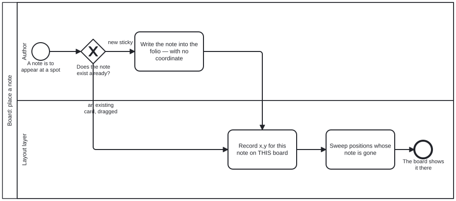

{: .note }
> Generated from `cat-harness/processes/board-place-note.bpmn` by `gen-processes-viz.ts` — do not edit here. [All processes](index.html)


# Board: place a note

`Process_BoardPlaceNote` · advisory · 3 step(s)

Putting a note at a spot on a board: write the note into the folio, record where it was drawn on THIS board, and sweep any position whose note has gone. You are in this process whenever a note is to appear somewhere. The first gateway exists because the note may already be there — placing is not the same as creating, and a process that conflated them would duplicate content every time somebody moved something. The rule the diagram holds is in the first activity's own wording: the note goes into the folio WITH NO COORDINATE. A folio is complete with no board, so a coordinate on a note would make the content depend on a drawing of it. The x,y belongs to the layer, keyed to one board, and an orphaned position is swept from the LAYER rather than being allowed to keep a note alive.

## How it connects

- **Called by:** no call activity names this process
- **Calls:** none
- **Presented on:** no docs page section shows this diagram

## Lanes — who acts

| lane | role | what it does here |
|---|---|---|
| Author | `author` | Reached only on the `new sticky` branch of GW_Exists — dragging an existing card never re-enters this lane, because A_CreateNote is the one write to the folio and everything after it is positioning. Leaving out `x`, `y` and `board` here is what lets one note sit on several boards without this lane arbitrating between them; arbitration would make placement an authoring decision, which it is not. |
| Layout layer | `corpus` | Every placement writes here, and nothing that decides anything reads it back — losing this graph loses WHERE a note sits, never WHAT it says. That asymmetry is why A_SweepOrphans cleans stray positions from this lane's own file rather than touching the note itself: the easy direction is removing a position whose note is gone, never removing a note because its position is. |

## Steps

Every one of the 3 step(s) is documented.

| step | lane | skill / sub-process | what it does |
|---|---|---|---|
| **Write the note into the folio — with no coordinate** `A_CreateNote` | Author | [`board-diagram-interchange`](../reference/skill-instructions/board-diagram-interchange.html) | A new note: write it into the folio with no x, no y, no board and no position. A folio is complete with no board, and one note may sit on several boards, which a coordinate on the note could not express. |
| **Record x,y for this note on THIS board** `A_Place` | Layout layer | [`board-diagram-interchange`](../reference/skill-instructions/board-diagram-interchange.html) | Record the note's x,y in the layout layer for THIS board, naming the note by id. An existing card dragged here only gets a new position — placing is not creating, so no content is duplicated. |
| **Sweep positions whose note is gone** `A_SweepOrphans` | Layout layer | [`board-diagram-interchange`](../reference/skill-instructions/board-diagram-interchange.html) | Remove every position in this board's layer whose note no longer exists. The sweep edits only the layer — one file, one pass — and never a note a person owns; a stale position must not keep a note alive. |

## Decisions

Every one of the 1 decision(s) is documented.

| decision | what decides it | branches |
|---|---|---|
| **Does the note exist already?** `GW_Exists` | Is the note already in the folio? A `new sticky` is written into the folio first, with no coordinate; an `existing card, dragged` only needs its x,y recorded on this board, since position belongs to the board and not to the note. | **new sticky** → Write the note into the folio — with no coordinate **an existing card, dragged** → Record x,y for this note on THIS board |


