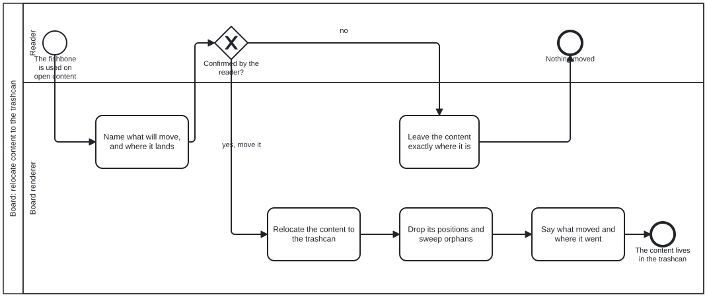

{: .note }
> Generated from `cat-harness/processes/board-relocate.bpmn` by `gen-processes-viz.ts` — do not edit here. [All processes](index.html)


# Board: relocate content to the trashcan

`Process_BoardRelocate` · strict · 5 step(s)

Moving open content to the trashcan from the board, with the reader's confirmation in front of the move and not behind it. You are in this process when the fishbone is used on open content. The confirmation gateway has a real "nothing moved" end state, because a destructive action whose refusal is not drawn is a destructive action somebody performs by accident. The order of the two writes is the content of the diagram. The CONTENT relocates, and only then are its positions dropped and orphans swept — the folio carries what is true, the layout layer carries where it was drawn, and the arrow never runs the other way. Sweeping first would leave the board authoritative over the folio for the length of one step.

## How it connects

- **Called by:** no call activity names this process
- **Calls:** none

## Lanes — who acts

| lane | role | what it does here |
|---|---|---|
| Reader | `user` | — |
| Board renderer | `board-renderer` | The order of its five tasks is load-bearing: the folio move lands before the layer update, so an interruption between the two leaves the semantic content already relocated rather than the presentation layer half-updated against a folio it no longer matches. On "no", the only action taken is to leave everything untouched — this process, unlike board-open-close, is strict, because a step that edits the folio and has not been confirmed must be refused rather than merely discouraged. |

## Steps

Every one of the 5 step(s) is documented.

| step | lane | skill / sub-process | what it does |
|---|---|---|---|
| **Name what will move, and where it lands** `A_AskConfirm` | Board renderer | [`deletion-requires-confirmation`](../reference/skill-instructions/deletion-requires-confirmation.html) | Before anything moves, name the content that would move — what it is, with its size and age — and where it lands. The confirmation sits in front of the move: an agent never relocates a durable artefact on its own initiative. |
| **Leave the content exactly where it is** `A_Cancel` | Board renderer | [`board-windows`](../reference/skill-instructions/board-windows.html) | The reader said no: nothing moves, no position is dropped, and the board is left exactly as it was. Drawn as its own end state because a destructive action whose refusal is not drawn gets performed by accident. |
| **Relocate the content to the trashcan** `A_MoveContent` | Board renderer | [`board-diagram-interchange`](../reference/skill-instructions/board-diagram-interchange.html) | Relocate the confirmed content — that one thing, not the class it belongs to — to the trashcan. The folio changes first, because the folio carries what is true. |
| **Drop its positions and sweep orphans** `A_UpdateLayer` | Board renderer | [`board-diagram-interchange`](../reference/skill-instructions/board-diagram-interchange.html) | Only after the content has moved: drop its positions from the layout layer and sweep any position whose note is now gone. Sweeping first would make the board authoritative over the folio for one step. |
| **Say what moved and where it went** `A_ReportMove` | Board renderer | [`deletion-requires-confirmation`](../reference/skill-instructions/deletion-requires-confirmation.html) | Tell the reader what moved and where it went, so the content can be found in the trashcan rather than inferred missing from a card that disappeared. |

## Decisions

Every one of the 1 decision(s) is documented.

| decision | what decides it | branches |
|---|---|---|
| **Confirmed by the reader?** `GW_Confirmed` | The reader's answer to A_AskConfirm, which named what will move and where it lands. `yes, move it` relocates the content to the trashcan; `no` leaves it exactly where it is. Nothing moves without the yes. | **yes, move it** → Relocate the content to the trashcan **no** → Leave the content exactly where it is |


