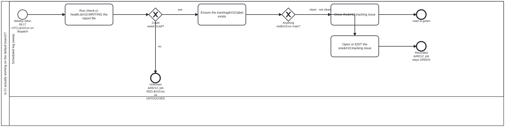

{: .note }
> Generated from `cat-harness/processes/ci-health-watch.bpmn` by `gen-processes-viz.ts` — do not edit here. [All processes](index.html)


# Is CI actually working on the default branch?

`Process_CiHealth` · strict · 4 step(s)

A WORKFLOW'S OUTCOME IS INVISIBLE FROM A CHECKOUT. Bean `xom7`: one workflow here fired on every push to `main` and FAILED ALL 30 TIMES OVER TWO MONTHS with nothing in the repository saying so. This is the backstop.&#10;&#10;WEEKLY, NOT DAILY, and the cadence is an argument rather than a default: the defect is "nobody noticed for two months", not "nobody noticed for a day", and the session-start sweep already covers every day somebody is working. A weekly run bounds the blind spot to seven days without turning the tracking issue into a feed.&#10;&#10;`Could we tell?` IS NOT SIMPLY THE EXIT CODE, and that is the subtlety worth drawing. `bun` exits 1 on an uncaught exception as well as on a live failure, so exit 1 alone does not separate "found something red" from "crashed". The REPORT FILE separates them: `--out` writes it before any exit path, so a genuine red always has one and a crash before that point does not. Exit 1 with no report is reclassified as `unknown`. Without that, a crash would open a tracking issue quoting a stale file.&#10;&#10;THE THIRD STATE IS THE WHOLE POINT, AND IT IS THE ONLY ONE THAT FAILS THE JOB. Verified 2026-09-20 by reading the `if:` guards: `unknown` runs `exit 1`; a finding does NOT. A repository in trouble leaves this workflow GREEN and speaks through the tracking issue, while a sweep that could not look turns the job red. That inversion is deliberate and is invisible from the run list, which is the argument for drawing it.&#10;&#10;ONE TRACKING ISSUE, EDITED IN PLACE, never a comment and never a second issue &#8212; a feed nobody reads is the failure mode a watchdog invites. On `unknown` the issue is left UNTOUCHED: not closed, not opened, not edited. Closing it would assert the thing the sweep just failed to establish.&#10;&#10;`Ensure the tracking label exists` sits AFTER `Could we tell?` and before the split, because both issue paths need the label &#8212; the clean path filters on it too, and on a repository where nothing has ever gone wrong it would not otherwise exist. It is skipped on `unknown`, where neither path runs and a label hiccup must not be what fails the job.

## How it connects

- **Called by:** no call activity names this process
- **Calls:** none
- **Presented on:** no docs page section shows this diagram

## Lanes — who acts

| lane | role | what it does here |
|---|---|---|
| Scheduled log sweep | `build-pipeline` | Named a 'sweep' but every path through it writes something — the report file, the tracking label, and the issue itself (opened, edited or closed) — and keeping all three in one lane is what makes 'one tracking issue, edited in place' enforceable: a write split across lanes would leave two different actors able to touch the same issue with no ordering between them. |

## Steps

Every one of the 4 step(s) is documented.

| step | lane | skill / sub-process | what it does |
|---|---|---|---|
| **Run check:ci-health, WRITING the report file** `Task_Check` | Scheduled log sweep | [`ci-health`](../reference/skill-instructions/ci-health.html) | Run check:ci-health --out, writing the report file before any exit path. Exit 0 clean, 1 live failures, 2 could not check. bun also exits 1 on an uncaught exception, so an exit 1 with no report file is a crash and is treated as could-not-check. |
| **Ensure the tracking label exists** `Task_Label` | Scheduled log sweep | [`ci-health`](../reference/skill-instructions/ci-health.html) | Create the ci-health label with --force so it exists before either issue path runs — the close path filters on it too, and on a repository that has never had a finding it would not exist yet. Skipped on an unknown verdict. |
| **Close the tracking issue** `Task_Close` | Scheduled log sweep | [`ci-health`](../reference/skill-instructions/ci-health.html) | Clean: close the open ci-health issue, if any, saying why (main is clean). Runs only on a clean verdict — on unknown the issue is left untouched and the job fails instead, because could-not-check is never rendered as clean. |
| **Open or EDIT the one tracking issue** `Task_Track` | Scheduled log sweep | [`ci-health`](../reference/skill-instructions/ci-health.html) | Findings: EDIT the one open issue labelled ci-health if there is one, otherwise create it, with the report as the body. One issue edited in place, never a new issue or a comment per run, so the tracking issue never becomes a feed. |

## Decisions

Every one of the 2 decision(s) is documented.

| decision | what decides it | branches |
|---|---|---|
| **Could we tell?** `GW_Determined` | Asked of the `verdict` output that the `check` step of .github/workflows/ci-health.yml writes, not of the raw exit code. `check:ci-health` exits 0 clean, 1 live failure(s), 2 could not check; an exit 1 with no report file is a crash and is reclassified as could-not-check, as is any other code. `no` is verdict == 'unknown': the last step runs `exit 1` and no issue step runs, so the tracking issue is left untouched. `yes` is verdict != 'unknown', the guard on the label step and so on both issue paths. | **no** → Unknown — job RED, issue UNTOUCHED **yes** → Ensure the tracking label exists |
| **Anything red on main?** `GW_Finding` | Asked of the same `verdict`, once it is known. `clean` is verdict == 'clean' (exit 0): the open `ci-health` issue, if there is one, is closed saying main is clean. `not clean` is verdict == 'red' (exit 1 with a report): the one open issue labelled `ci-health` is edited in place with the report as its body, or created if there is none. Neither branch fails the job — a red main speaks through the issue, not through this workflow's status. | **clean** → Close the tracking issue **not clean** → Open or EDIT the one tracking issue |


