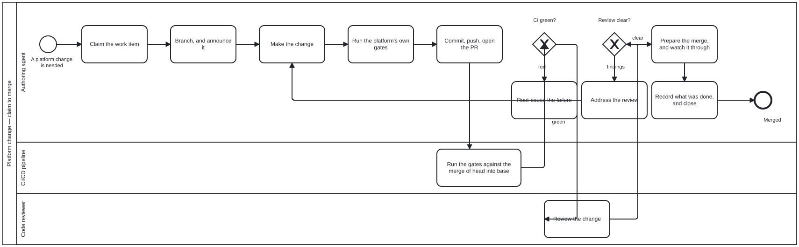

{: .note }
> Generated from `cat-harness/processes/code-change-review.bpmn` by `gen-processes-viz.ts` — do not edit here. [All processes](index.html)


# Code change and review

`Process_CodeChangeReview` · strict · 11 step(s)

Getting a change to the PLATFORM from "this is needed" to merged: claim the work, branch and announce it, make the change, prove it against the platform's own gates, and carry it through review to a merge somebody else is not left holding. You are in this process for a change to folio-assistant itself. `content-change-review` is the same shape for a folio's content, and the acceptance differs: here a code reviewer judges the engineering, there a review committee judges the editorial. The loop back through "root-cause the failure" is the point of drawing this at all. Red CI is not a state you report and leave; it is a state you re-enter the process from. The same is true of a review that is not clear.

## How it connects

- **Called by:** [Actor and role administration](actor-role-administration.html)
- **Calls:** none

## Lanes — who acts

| lane | role | what it does here |
|---|---|---|
| Authoring agent | `authoring-agent` | The `no-clean-run-over-an-empty-set` convention is bound at this lane specifically because this is the one lane that writes checks — Lane_Pipeline runs them and Lane_Reviewer reads someone else's, so a check with nothing to assert over is this lane's failure mode to guard against, nobody else's. Every activity that is not mechanical execution (Lane_Pipeline) or an outside judgement (Lane_Reviewer) sits here, including both loop-backs — a red gate returns to Task_Implement through Task_Diagnose, and review findings return to it through Task_AddressReview — so this lane never hands work off without also owning what comes back. |
| CI/CD pipeline | `build-pipeline` | Exists as a separate lane for one reason: what it tests — the merge of head into base — is not a claim the Agent lane could make about its own tree, so GW_CIGreen has to be fed by an independent run rather than by the agent reporting its own gates as done. |
| Code reviewer | `code-reviewer` | Its verdict, not the agent's own account of the diff, is what GW_ReviewClear reads: a finding routes the change back through Task_AddressReview to Task_Implement, and only a clear routes it forward to Task_PrepareMerge, so this lane alone determines which of those two paths a change takes. |

## Steps

Every one of the 11 step(s) is documented.

| step | lane | skill / sub-process | what it does |
|---|---|---|---|
| **Claim the work item** `Task_ClaimBean` | Authoring agent | [`bean-coordination`](../reference/skill-instructions/bean-coordination.html) | Claim before you work. A claim ANNOUNCES rather than reserves until the PR exists, which is why the branch is announced at the next step and not at the end. |
| **Branch, and announce it** `Task_BranchAndAnnounce` | Authoring agent | [`issue-working`](../reference/skill-instructions/issue-working.html) | Announce the branch WHEN IT IS CREATED, not when the work is done. The gap between one agent's view of an issue and everyone else's is what this closes. |
| **Make the change** `Task_Implement` | Authoring agent | [`continual-progress`](../reference/skill-instructions/continual-progress.html) | The loop's only open-ended step. Everything around it is procedure; this is the work. |
| **Run the platform's own gates** `Task_RunGates` | Authoring agent | [`platform-gates`](../reference/skill-instructions/platform-gates.html) | Before pushing, not after CI says so. `bun test` passing is NOT the gates passing: measured 2026-09-19, a green unit suite sat beside a `tsc` failure and a missing `@graphNode` tag, and the second broke a QA sidecar comparison as well — one cause, two symptoms, and an agent running only the tests would have pushed all three. |
| **Commit, push, open the PR** `Task_CommitAndOpenPR` | Authoring agent | [`continual-progress`](../reference/skill-instructions/continual-progress.html) | The PR opens at the FIRST commit, even on a stub, and permission is never asked for it. Holding a green PR back for someone to look at is not caution — it is a blocked reviewer. |
| **Root-cause the failure** `Task_Diagnose` | Authoring agent | [`ci-health`](../reference/skill-instructions/ci-health.html) | "Flake" is not a root cause. A red PR is work now, whatever its review state — only a green, mergeable head waits on reviewers. |
| **Address the review** `Task_AddressReview` | Authoring agent | [`watch`](../reference/skill-instructions/watch.html) | Every finding is answered — implemented, or replied to with why not. A design question does not excuse skipping the nits in the same review. |
| **Prepare the merge, and watch it through** `Task_PrepareMerge` | Authoring agent | [`prepare-merge`](../reference/skill-instructions/prepare-merge.html) | `prepare-merge` brings the base in, re-runs the gates and pushes — it does NOT merge. `watch` follows the PR until it is merged or closed, because webhooks do not reliably deliver CI success or a merge-conflict transition. |
| **Record what was done, and close** `Task_CloseBean` | Authoring agent | [`todo-manager`](../reference/skill-instructions/todo-manager.html) | A closed work item is read later by somebody deciding whether to reopen the subject, so "completed" with nothing behind it cannot be audited. An ISSUE is never closed on the agent's own say-so. |
| **Run the gates against the merge of head into base** `Task_RunCI` | CI/CD pipeline | — | CI tests the MERGE, not the branch. That is why a locally green tree can go red here: the agent's tree and the merge result are different trees, and the difference is invisible from a checkout. |
| **Review the change** `Task_Review` | Code reviewer | [`code-node-review`](../reference/skill-instructions/code-node-review.html) | A human or an agent acting AS reviewer. Nothing is a reviewer; somebody acts as one for the duration of this lane. |


