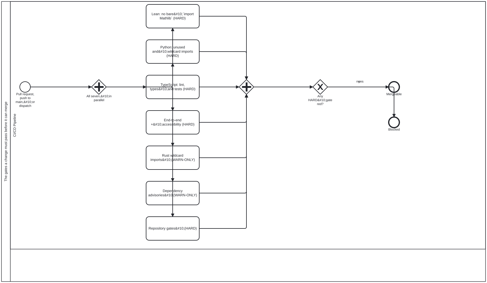

{: .note }
> Generated from `cat-harness/processes/code-quality-gates.bpmn` by `gen-processes-viz.ts` — do not edit here. [All processes](index.html)


# The gates a change must pass before it can merge

`Process_CodeQualityGates` · strict · 8 step(s)

SIX INDEPENDENT JOBS, AND NOTHING IN THE YAML SAYS SO IN ONE PLACE. Bean `7yvd`. The file reads as a long sequence; it is not one. No job declares `needs:`, so all six start together and the wall-clock cost of the whole workflow is the SLOWEST job, not the sum. That is the single most useful thing to know before adding a gate, and it is recoverable today only by checking five `needs:` keys that are not there.&#10;&#10;THE ASYMMETRY IS THE OTHER HALF. Four jobs are HARD and TWO report without blocking &#8212; `rust-wildcard` and `dependency-advisories`. Drawing them as six equal boxes would be a lie a reader would act on, so both warn-only jobs are labelled as such and the gateway after the join asks specifically about the HARD ones.&#10;&#10;THE TWO WARN-ONLY JOBS ARE WARN-ONLY BY DIFFERENT MECHANISMS, AND THE DIFFERENCE IS THE POINT. `rust-wildcard` carries `continue-on-error: true` &#8212; the RUNNER discards its result. `dependency-advisories` carries no such flag: its script exits 0 in every state and keeps the three states apart in its OUTPUT instead. That is deliberate, because a warn-only step whose exit code says nothing has only its output left to distinguish `found nothing` from `could not find out`, and `continue-on-error` would have thrown away the one signal that still worked.&#10;&#10;`continue-on-error` IS NOT A DEFAULT HERE, it is a decision that has been REVERSED once already: `python-imports` carried it, and the flag swallowed a failure on a missing path, so the job reported success over a check that never ran. It was removed and a new unused import now fails. The flag STILL survives on exactly one job &#8212; adding a second warn-only job did not add a second `continue-on-error`, which is the history being honoured rather than an oversight. Anyone reaching for the flag should read that paragraph first.&#10;&#10;`TypeScript` IS ONE BOX STANDING FOR ROUGHLY THIRTY REPOSITORY GATES &#8212; workflow policy, AGENTS.md cross-references and claims, declared assets, workflow skill refs and BPMN coverage, the knowledge-graph audit, generated-docs currency, agent memory, and the ratchet that fails a check script no workflow runs. They are sequential only because one job runs them; each is independent, and `bun run gates` is the local runner derived from this job so a contributor can run the same set before pushing.&#10;&#10;Mechanical throughout. Nothing here waits on a person, which is what makes `build-pipeline` the right lane rather than a convenient one.

## How it connects

- **Called by:** no call activity names this process
- **Calls:** none
- **Presented on:** no docs page section shows this diagram

## Lanes — who acts

| lane | role | what it does here |
|---|---|---|
| CI/CD Pipeline | `build-pipeline` | Joins all seven jobs before asking anything, then GW_Hard asks specifically about the five HARD ones — both warn-only results reach the same join but never the gate, so this lane's merge/block call is deliberately blind to a red job it also ran, which is where the seven-are-not-five asymmetry actually bites. These counts read six-and-four with the asymmetry called five-are-not-four, which was already inconsistent before `om30` split the gates job out; both are corrected here rather than incremented. |

## Steps

Every one of the 8 step(s) is documented.

| step | lane | skill / sub-process | what it does |
|---|---|---|---|
| **Lean: no bare `import Mathlib` (HARD)** `Task_Lean` | CI/CD Pipeline | [`platform-gates`](../reference/skill-instructions/platform-gates.html) | Fail on any bare `import Mathlib` in content/**/*.lean — targeted imports only. In this platform repo there is no content/, so the job prints SKIP and states that nothing was scanned rather than passing silently. |
| **Python: unused and wildcard imports (HARD)** `Task_Python` | CI/CD Pipeline | [`platform-gates`](../reference/skill-instructions/platform-gates.html) | ruff F401 (unused) and F403 (wildcard) imports over the Python trees that exist, then the Python tests. A tree that is absent is dropped rather than passed to ruff, and an empty set says SKIP — a missing path must not be swallowed as a pass. |
| **TypeScript: lint, types and tests (HARD)** `Task_TypeScript` | CI/CD Pipeline | [`platform-gates`](../reference/skill-instructions/platform-gates.html) | Three checks and nothing else: `bun run lint`, `tsc --noEmit`, then `bun test`. The repository gates it used to carry are Task_RepositoryGates now (bean `om30`). Order inside the job is load-bearing rather than stylistic: Actions stops a job at its first failing step, so `bun test` — red on `main` by the owner's decision — runs LAST, with nothing behind it to mask. While it ran first, lint and typecheck did not execute on `main` at all. |
| **End-to-end + accessibility (HARD)** `Task_E2E` | CI/CD Pipeline | [`platform-gates`](../reference/skill-instructions/platform-gates.html) | Install Chromium, check the rendered BPMN SVGs are current, then run the Playwright suite, which includes the accessibility checks. Hard: a failure blocks the PR. |
| **Rust wildcard imports (WARN-ONLY)** `Task_Rust` | CI/CD Pipeline | [`platform-gates`](../reference/skill-instructions/platform-gates.html) | Report non-test `use …::*;` in tools/**/*.rs, excluding `use super::*;`. continue-on-error: it reports and never blocks, which is why it is labelled WARN-ONLY rather than drawn like the hard jobs. |
| **Dependency advisories (WARN-ONLY)** `Task_Advisories` | CI/CD Pipeline | [`platform-gates`](../reference/skill-instructions/platform-gates.html) | Asks the one question the lockfile cannot: is anything in the resolved tree KNOWN-VULNERABLE? Warn-only by the owner's ruling on bean `j41m` — a hard gate here would hand a transitive advisory nobody can patch the power to red every PR, and the suppression that follows is what rots. `.github/dependabot.yml` is the other half of that ruling and is NOT drawn here: it is not a job in this workflow, it runs on Dependabot's schedule. |
| **Repository gates (HARD)** `Task_RepositoryGates` | CI/CD Pipeline | [`platform-gates`](../reference/skill-instructions/platform-gates.html) | The 43 repository-gate steps — workflow refs, lane and process documentation, kg:audit:check, detangle, skills, published packages — 150 `bun run` invocations in all. A SEPARATE job from Task_TypeScript since bean `om30`: they were one job in which `bun test` came second of 47 steps, and because Actions stops a job at its first failing step and no step was continue-on-error, a deliberate test failure on `main` meant none of these ran. A gate never asked and a gate that passed are indistinguishable from outside, which is `xom7` at the step rather than the workflow. No sequence dependency on Task_TypeScript is drawn because there is none: a red test must not stop these being asked. `bun run gates` derives its list from BOTH jobs, so the local set still cannot drift from CI's. |
| **Skill-registration chain (UNMASKED)** `Task_SkillChain` | CI/CD Pipeline | [`platform-gates`](../reference/skill-instructions/platform-gates.html) | Runs the five `--check` commands that adding a skill stales, each on its own: gen-skill-docs, check:glossary, docs:auto:check, kg:audit:check, kg:detangle:check. A SEPARATE job rather than steps in Task_RepositoryGates, and that separation is the whole gate: every one of the five is also a step there, but all of them run after `bun test`, which executes the kg-audit and detangle WRITERS and so repairs two of the artefacts before their checks read them (bean `ymsu`). This job never runs `bun test`, so it is the only place those five are read against the tree as checked out. Its first CI run earned the place: it went red on `kg:detangle:check` and the cause was `kg-detangle.ts` counting 1214 files of a gitignored `node_modules/` as graph nodes — 1441 where a clean checkout computes 227, pinned in a committed sidecar. Not a step in front of `bun test` either: measured on main's run 36234052354, a failing step SKIPS every step behind it, so a red there would turn one named failure into forty-five unevaluated ones. 13s, in parallel. Beans `v625`, `fjwi`. |

## Decisions

Every one of the 1 decision(s) is documented.

| decision | what decides it | branches |
|---|---|---|
| **Any HARD gate red?** `GW_Hard` | Asked once every parallel gate has joined: did any gate marked HARD fail? `no` is mergeable; `yes` blocks the merge. Warn-only gates do not decide this branch. | **no** → Mergeable **yes** → Blocked |


