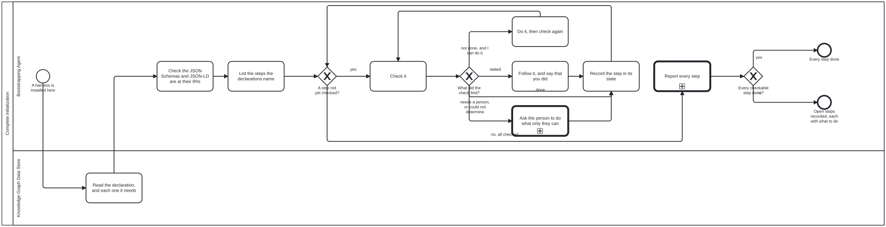

{: .note }
> Generated from `bootstrap/processes/complete-initialization.bpmn` by `gen-processes-viz.ts` — do not edit here. [All processes](index.html)


# Complete initialization

`Process_CompleteInitialization` · strict (defaulted) · 9 step(s)

A SUB-PROCESS of initialize-harness, called after a harness is installed and also when the location turns out to be an instance of the chosen harness already. It is how an agent — the one that installed the harness, or one dispatched for exactly this with nothing but this diagram and the declaration — makes sure EVERY initialization step is done.

THE STEPS ARE NOT LISTED HERE. They are named by the declarations: the instance's `<name>.json` and every declaration it `needs`, read from the sibling checkouts. A declared directory is a step (it exists); a declared asset is a step (the file is there); a dependency's `<name>/docs/bootstrap/initialization.md` is a step (it was followed); the root README and the sections it opts into are steps; the `repository` a declaration names makes the site steps — a Pages workflow, Pages switched on, the address answering. A harness above bootstrap names more in the same way — a work-plan store it declares as a directory is a directory step — and bootstrap does not need to know which. The skill `initialization-steps` has the table.

IDEMPOTENT BY CONSTRUCTION. Every step is CHECKED before anything is done, and a done step is left alone, so running this twice changes nothing the second time. Nothing is replaced: a step that would overwrite what somebody wrote is a step for a person, not for the agent.

FOUR STATES, NOT TWO. done; not done; could not determine — the check could not run (no forge CLI, no network), which is NEVER reported as done; and stated — the declarations name it but nothing can observe it (reading and following instructions), exactly as a stated precondition is never reported as satisfied.

THE PRIMARY STEP IS DRAWN, not left in the list: A_CheckDocuments, the harness's JSON Schemas and JSON-LD at the IRIs they name, checked first after the declarations are read. Everything after it — directories, README, the site — is either how those documents are reached or how a person reads about them.

WHERE TOOLS ARE AVAILABLE, a toolset may perform the checks: its `init` command, where it has one, reads the same declarations, performs what a tool can (README sections; switching Pages on with an authenticated `gh`), and reports each step in these four states. Where they are not, the agent does the same by reading files. The diagram is the same either way.

NO work-plan element on any activity, and isExecutable is false, for the reasons initialize-harness gives.

## How it connects

- **Called by:** [Initialize a harness](initialize-harness.html)
- **Calls:** [Human–agent discussion](human-agent-discussion.html), [Log a message](log-message.html)
- **Presented on:** no docs page section shows this diagram

## Lanes — who acts

| lane | role | what it does here |
|---|---|---|
| Bootstrapping Agent | `bootstrapping-agent` | Still acting on bootstrap's instructions, because this process is bootstrap's. Checks, performs what it can, asks a person for what only they can do, and records every step in its state. It never marks a step done that it did not check. |
| Knowledge Graph Data Store | `knowledge-graph-data-store` | Not an actor: the repository and its siblings, read. The declarations are read here once, at the start, and the steps come from what they say rather than from anybody's memory of what a harness needs. |

## Steps

Every one of the 9 step(s) is documented.

| step | lane | skill / sub-process | what it does |
|---|---|---|---|
| **Read the declaration, and each one it needs** `A_ReadDeclarations` | Knowledge Graph Data Store | `bootstrap-kg-navigation` | `<name>.json` at the root, then each name in its `needs`, from a sibling checkout `../<name>/<name>.json`. A dependency that is not beside it is itself a step, not done — never skipped. |
| **Check the JSON Schemas and JSON-LD are at their IRIs** `A_CheckDocuments` | Bootstrapping Agent | `publish-documents` `initialization-steps` | THE PRIMARY STEP of initializing a Knowledge Graph harness (owner, 2026-09-30: "json(ld) is primary step in initializing KG harness"), and so the first one checked once the declarations are read. Every JSON Schema the harness publishes (its `$id`) and every JSON-LD document (its vocabulary, its diagram vocabulary, its graph export, each carrying its own `@context`) is at the address it names under `iriBase`, where a program following the IRI finds it. Two checks: that the site build stages each one at its address, and that each address answers. A 404 is not published; a 403 or no answer from here could not be determined. The Pages site is the vehicle: when the documents are not yet answering, the site steps below are how they get there, and the report leads with this step's state. |
| **List the steps the declarations name** `A_ListSteps` | Bootstrapping Agent | `initialization-steps` | In the order of the table in `initialization-steps`: declaration, needs, each dependency's instructions, the documents at their IRIs (checked above, and listed first), directories, assets, README, README sections, site. Each step names the declaration that names it, so a reader can see why it is there. |
| **Check it** `A_CheckStep` | Bootstrapping Agent | `initialization-steps` | Look, do not remember. The answer is one of the four states, and "could not determine" is its own answer: a check that could not look is not a pass. |
| **Do it, then check again** `A_PerformStep` | Bootstrapping Agent | `initialization-steps` `publish-site` | Only what the agent, or a tool it has, can do without replacing anything somebody wrote: regenerate a README section, add a missing Pages workflow, switch Pages on with an authenticated `gh`. Performing is not the same as done: the flow goes back to the check, and only the check says done. |
| **Follow it, and say that you did** `A_FollowStated` | Bootstrapping Agent | `initialization-steps` | A stated step — a harness's own `docs/bootstrap/initialization.md`. Read it and do what it says. It stays `stated` in the record: nothing can observe that it was followed, and the record does not pretend otherwise. |
| **Ask the person to do what only they can** `A_AskPerson` | Bootstrapping Agent | calls [Human–agent discussion](human-agent-discussion.html) `human-agent-discussion` `publish-site` | A step the agent cannot do or cannot check from here — switching Pages on without a signed-in `gh`, granting a permission, choosing between two ways of fixing a declaration. Asked through the one reusable discussion, with the exact step written out so it can be followed without opening anything else. A person saying "done" is recorded as their word, not as a check; the next run checks it. |
| **Record the step in its state** `A_RecordStep` | Bootstrapping Agent | `initialization-steps` | The step, the declaration that named it, its state, what was seen, and — for anything not done — exactly what to do next. |
| **Report every step** `A_Report` | Bootstrapping Agent | calls [Log a message](log-message.html) `log-message` | One report, every step in its state, with counts: done, not done, could not determine, stated — led by the primary step, the JSON Schemas and JSON-LD at their IRIs. Required, which is what drawing the call says: an initialization that finished with steps open must say which. |

## Decisions

**3** of 3 decision(s) carry no documentation — `gateway-documented` lists them.

| decision | what decides it | branches |
|---|---|---|
| **A step not yet checked?** `GW_NextStep` | — | **yes** → Check it **no, all checked** → Report every step |
| **What did the check find?** `GW_StepState` | — | **done** → Record the step in its state **not done, and I can do it** → Do it, then check again **stated** → Follow it, and say that you did **needs a person, or could not determine** → Ask the person to do what only they can |
| **Every checkable step done?** `GW_AllDone` | — | **yes** → Every step done **no** → Open steps recorded, each with what to do |


