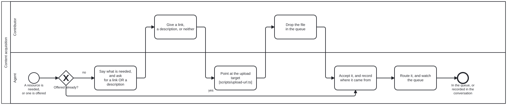

{: .note }
> Generated from `cat-harness/processes/content-acquisition.bpmn` by `gen-processes-viz.ts` — do not edit here. [All processes](index.html)


# Content acquisition

`Process_ContentAcquisition` · strict (defaulted) · 6 step(s)

How a resource gets into the graph in the first place. `document-ingestion.bpmn` begins at "a file lands in uploads/" and calls that its only entry point — true of ingestion, and silent on how the file got there. This is the step before it. The channels are plural and the set is open: uploads/ is one, the conversation is another.

## How it connects

- **Called by:** no call activity names this process
- **Calls:** none
- **Skill:** [`content-acquisition`](../reference/skill-instructions/content-acquisition.html)

## Lanes — who acts

| lane | role | what it does here |
|---|---|---|
| Contributor | `user` | Both of this lane's tasks are optional by design, not merely possible: P_Respond's 'or neither' is a real, accepted outcome rather than a stall, and A_Ask already states what happens if nothing comes back — so this lane can contribute nothing at all and the process still proceeds, which is not true of the sign-off lanes elsewhere in this corpus. |
| Agent | `ingestion-agent` | This lane is not unattended, unlike the same role elsewhere: A_Ask and A_Route both wait on Lane_Person, for minutes or days, because there is no material yet to make a gate decidable from — that only becomes true once a file or description exists. Acquisition ends at the moment something lands in the queue; everything past that boundary is document-ingestion.bpmn's actually-unattended run, not this one. |

## Steps

Every one of the 6 step(s) is documented.

| step | lane | skill / sub-process | what it does |
|---|---|---|---|
| **Say what is needed, and ask for a link OR a description** `A_Ask` | Agent | [`content-acquisition`](../reference/skill-instructions/content-acquisition.html) | Both forms, named together. A person who cannot find the file often knows exactly what it is, and a description in their own words is an acquired resource rather than a consolation prize. Asking for the upload first demands the one thing they may not have, before the cheaper answers have been offered. Say what happens if they do nothing. |
| **Give a link, a description, or neither** `P_Respond` | Contributor | — | "Or neither" is a real outcome, not a failure. The ask says what happens if nothing comes, and then that happens — the work proceeds without the resource and says so. |
| **Point at the upload target [scripts/upload-url.ts]** `A_PointToUpload` | Agent | [`content-acquisition`](../reference/skill-instructions/content-acquisition.html) | Composed from the declaration, never written by hand. The queue is declared with INSTANCE scope, so its declared path is missing the segment a repository-relative forge URL needs: /upload/main/uploads is a 404 and /upload/main/cat-harness/uploads is not, verified against GitHub 2026-09-20. Every failure is named — no origin remote, a non-GitHub forge, a declared-but-absent queue — because a URL is believed, and somebody sent to a wrong one cannot tell it from an empty directory. On failure, fall back to the conversation. |
| **Drop the file in the queue** `P_Upload` | Contributor | — | Through the forge's upload form, a commit, or any other route that lands the file in the declared queue. The agent watches rather than chases: an arrival may be minutes or days away. |
| **Accept it, and record where it came from** `A_Accept` | Agent | [`content-acquisition`](../reference/skill-instructions/content-acquisition.html) | Both branches land here. An unprompted offer is accepted as it stands — do not make somebody follow a process to hand over what they already have. Provenance is recorded whichever channel it arrived through: a description given in chat has a source and can be wrong, exactly as a PDF does. |
| **Route it, and watch the queue** `A_Route` | Agent | [`uploads-watch`](../reference/skill-instructions/uploads-watch.html) [`library-ingestion`](../reference/skill-instructions/library-ingestion.html) | A file goes to ingestion; a link or a description goes to whatever will resolve it. Acquisition stops here — the moment a file is in the queue, library-ingestion owns it, and keeping that seam sharp is what lets a resource acquired through a channel that does not exist yet reach ingestion unchanged. An arrival may be minutes or days away, so it is watched rather than chased. |


