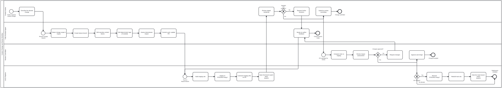

{: .note }
> Generated from `cat-harness/processes/content-change-review.bpmn` by `gen-processes-viz.ts` — do not edit here. [All processes](index.html)


# Content Change and Review

`Process_ContentChangeReview` · strict (defaulted) · 29 step(s)

Getting a change to a folio's CONTENT from a request into a published rendering: the author says what they want, an agent works out its scope and makes it, a review committee accepts or refuses it, and the pipeline deploys. You are in this process when what is changing is a folio — a chapter, a block, a piece of deterministic logic — rather than the platform that renders it. `code-change-review` is the same shape for the other side of that line, and the distinction matters because a content change is accepted by a REVIEW COMMITTEE on editorial grounds while a platform change is accepted by a code reviewer on engineering ones. Two things this is not. It is not the feedback workflow: `todo-review` triages what readers said about content that already exists. And the rendering the author reviews is a STAGED one, because a person cannot assess a rendered artefact from a description of it.

## How it connects

- **Called by:** no call activity names this process
- **Calls:** [Adjudication](adjudication.html), [Options analysis](options-analysis.html), [Review task](review-task.html)

## Lanes — who acts

| lane | role | what it does here |
|---|---|---|
| Content Author | — | Judges the staged rendering against what was asked for and either sends it back for another iteration or submits it onward. Unlike editing-hci-validation's equivalent lane, acceptance itself is not this lane's call — that is Task_Approve, downstream in the Review Committee's lane. |
| Folio-Assistant Agent | — | Owns the entire technical execution of the change end to end — scoping impact, branching, editing both narrative content and deterministic logic, assessing what else it touches, weighing how to absorb that, and pushing. It is also the single re-entry point for both the author's and the committee's feedback, which is why Task_Iterate has two incoming edges rather than the diagram forking a second revision path. |
| Review Committee | — | Compares staged against main, reviews the slices it is assigned (review-task.bpmn, one call per slice), takes a disputed finding to adjudication, and judges the impact assessment. It is also, unusually for this role elsewhere in this corpus, where the accept decision is made. Task_Approve records the approval, and Task_Merge merges only on the owner's explicit confirmation: they were one task, "Approve and merge", until bean en2d split them, because approving is the committee's judgement and merging is a separate, confirmed act. A rejection routes back to Task_Iterate in the agent's lane rather than to the author. |
| CI/CD Pipeline | — | Runs build, stage, comment and watch once per push, re-entering from Task_Iterate on every later revision rather than only the first. GW_Merged sits downstream of Task_Approve in the Reviewer's lane, so it is checking whether that approval actually resulted in a merge rather than deciding whether to approve one, and a "No" ends the pipeline quietly instead of looping back into review. |
| Review Coordinator | — | Organises a review large enough to need organising, and decides nothing about the content: ingests the reviewers' tagged comments, slices the change into pieces a reviewer can hold, assigns each slice to a review lane, and watches coverage until every changed block has a verdict or a reasoned waiver. A separate role from the editor on the owner's ruling of 2026-09-23 (bean en2d): organising a review and deciding its outcome are different accountabilities, and a process where one lane did both could not say which it was doing. |

## Steps

Every one of the 29 step(s) is documented.

| step | lane | skill / sub-process | what it does |
|---|---|---|---|
| **Describe the desired change** `Task_DescribeChange` | Content Author | — | Author describes the content change in natural language. Example: "Update the immunization schedule to add a booster at 18 months." |
| **Review staged rendering** `Task_ReviewStaging` | Content Author | [`staging-review`](../reference/skill-instructions/staging-review.html) | Author reviews the rendered feature branch at <pages-url>/STAGING/<branch-slug>/ and compares against the main site. The staging banner shows the commit SHA. |
| **Request further revisions** `Task_RequestRevision` | Content Author | [`staging-review`](../reference/skill-instructions/staging-review.html) | Author provides feedback on what needs adjustment. Agent iterates on the feature branch. |
| **Submit to review committee** `Task_SubmitForReview` | Content Author | [`staging-review`](../reference/skill-instructions/staging-review.html) | Author submits the PR for formal review by the guidance review committee. The STAGING URL is the review surface. |
| **Detect change scope & impact** `Task_DetectScope` | Folio-Assistant Agent | [`semantic-review-scoping`](../reference/skill-instructions/semantic-review-scoping.html) | Agent analyses the requested change: - Which content blocks are affected? - Are there downstream implications (indicators, referral logic, visit schedules)? - Will deterministic logic (CQL/DMN) need updating? skill: content-graph, integration-watcher |
| **Create feature branch** `Task_CreateBranch` | Folio-Assistant Agent | [`feature-staging`](../reference/skill-instructions/feature-staging.html) | Agent creates a feature branch from main. Branch naming: feature/<short-description> Opens a PR immediately (AGENTS.md: "open the PR at the first commit"). |
| **Edit narrative content blocks** `Task_EditContent` | Folio-Assistant Agent | [`content-author`](../reference/skill-instructions/content-author.html) | Agent modifies the relevant content blocks (.md files, block manifests). Validates each edit against the schema (content_validate). skill: content editing, block builders |
| **Edit deterministic logic (if needed)** `Task_EditLogic` | Folio-Assistant Agent | [`content-author`](../reference/skill-instructions/content-author.html) | If the content change affects decision logic, indicators, or workflows: - Update CQL expressions - Update DMN decision tables - Adjust indicator definitions skill: dak-authoring, fhir-pipeline |
| **Assess downstream impact** `Task_AssessImpact` | Folio-Assistant Agent | [`content-graph`](../reference/skill-instructions/content-graph.html) | Agent reviews downstream implications: - Will indicators need adjustment? - Will referral/follow-up for next visit be impacted? - Are translations affected (re-extract POT)? - Do Lean proofs still hold? skill: integration-watcher, translation-manager |
| **Options analysis how to absorb the impact** `Call_OptionsAnalysis` | Folio-Assistant Agent | calls [Options analysis](options-analysis.html) | On the edge OUT of `Task_AssessImpact` and before `Task_CommitPush`, because the impact assessment is the evidence the options are weighed against. An analysis before it would compare ways of absorbing a downstream effect nobody has measured yet; one after the commit would be a rationalisation of a choice already pushed. NOT between `Task_AssessImpact` and `Task_ReviewImpact`, although that is the handoff the work-plan named. Those two tasks are in DIFFERENT LANES with no sequence flow between them — the agent's assessment reaches the committee through `Task_CompareBeforeAfter`, not directly — so there was no edge there to interpose on. The conceptual handoff is real; the edge was not. In the Agent lane, matching `upstream-version-adoption`: this step produces the options and their trade-offs, and `GW_Approved` in the Review Committee lane is where a decision is taken. A subprocess in the reviewer's lane would read as the committee analysing its own options, which is a different process. On the trigger: reaching this call is not the same as running the whole of it. `Process_OptionsAnalysis` opens with `A_Frame`, whose trigger is `opening-brief`'s — irreversibility and surprise, not size — and leaving at that first activity is a correct outcome rather than a skipped step. A copy-edit exits immediately; a logic change that moves an indicator does not, and this is the diagram where that distinction has teeth, since `Task_EditLogic` feeds straight into the assessment. |
| **Commit, push, update PR** `Task_CommitPush` | Folio-Assistant Agent | [`prepare-merge-auto`](../reference/skill-instructions/prepare-merge-auto.html) | Agent commits all changes to the feature branch and pushes. The feature-staging.yml workflow automatically deploys to STAGING/<branch-slug>/ and comments the URL on the PR. |
| **Iterate on author feedback** `Task_Iterate` | Folio-Assistant Agent | [`content-author`](../reference/skill-instructions/content-author.html) | Agent receives revision requests from the author and applies changes. Each push triggers a new staging deployment with updated SHA stamp. |
| **Compare main vs staging** `Task_CompareBeforeAfter` | Review Committee | [`staging-review`](../reference/skill-instructions/staging-review.html) [`visual-diff`](../reference/skill-instructions/visual-diff.html) | Review committee opens both URLs side by side: - Main site: <pages-url>/ (current published state) - Staging: <pages-url>/STAGING/<branch-slug>/ The staging banner shows the commit SHA so they can verify what they are reviewing matches the PR. A changed figure, diagram or table is also pictured before and after on the review page, with the share of changed pixels in words (skill visual-diff, Tool folio-block-screenshots). |
| **Ingest tagged review comments** `Task_IngestComments` | Review Coordinator | [`review-comments`](../reference/skill-instructions/review-comments.html) | Every PR conversation comment that starts with `block: <label>` becomes a `folio-review-comment/v1` todo (open), idempotently, and is published with the preview as `review-comments.json`. The staging workflow runs this on every push and on every tagged comment; the coordinator owns that it has run before slicing, because the slices are cut around what reviewers have already said. This is the `ingest` transition of REVIEW_TRANSITIONS. |
| **Slice the change and assign reviewers** `Task_SliceAndAssign` | Review Coordinator | [`review-heatmap`](../reference/skill-instructions/review-heatmap.html) [`staging-review`](../reference/skill-instructions/staging-review.html) | From the ChangeSet and the heat map on the review page: cut the change into slices a reviewer can hold (usually a section, or a run of sections where the heat map clusters), and assign each slice to a review lane by what it contains — clinical content to a clinical SME, a decision table to a QC reviewer, prose to a narrative reviewer. A block that needs no review (a pure rename, say) is WAIVED here with a written reason, which is what the coverage gate counts. Re-entered from GW_Covered when coverage is incomplete: the uncovered blocks become new slices. |
| **Review each slice** `Call_ReviewSlices` | Review Committee | calls [Review task](review-task.html) [`content-review`](../reference/skill-instructions/content-review.html) [`review-comments`](../reference/skill-instructions/review-comments.html) | review-task.bpmn, once per slice, in parallel lanes by role. What kind of thing changed decides which review the slice descends into; the reviewer takes on that inner lane's role for the call only. Each reviewer gives the slice's blocks a verdict, and comments on the pull request with the `block:` tag where something needs saying. |
| **Withdraw a review comment** `Task_WithdrawComment` | Review Committee | [`review-comments`](../reference/skill-instructions/review-comments.html) | The reviewer who made a comment takes it back (it was a misreading, or a later slice answered it). Recorded with `folio-review-comment-move --to withdrawn`, committed to the edit-set's feature branch like every status change. This is the `withdraw` transition of REVIEW_TRANSITIONS. |
| **Adjudicate the disagreement** `Call_Adjudication` | Review Committee | calls [Adjudication](adjudication.html) [`adjudication`](../reference/skill-instructions/adjudication.html) | adjudication.bpmn. When the editor and a reviewer, or two reviewers, disagree about a finding, an adjudicator settles it and records why; the review comment moves to `adjudicated` with the Decision that closed it. |
| **Review impact assessment** `Task_ReviewImpact` | Review Committee | [`content-review`](../reference/skill-instructions/content-review.html) | Committee reviews the agent's impact assessment: - Were all downstream effects identified? - Are the indicator changes acceptable? - Does the logic change match the narrative intent? |
| **Request changes** `Task_RequestChanges` | Review Committee | [`content-review`](../reference/skill-instructions/content-review.html) [`content-review`](../reference/skill-instructions/content-review.html) | Committee provides feedback. PR stays open. Author and agent iterate further. |
| **Approve** `Task_Approve` | Review Committee | [`decision-audit`](../reference/skill-instructions/decision-audit.html) | The committee approves the change: the judgement, recorded with the evidence it rests on. Approving is not merging. They were one task ("Approve and merge") until bean en2d split them, because a self-authored change cannot be approved through GitHub's own review (the approver may not be the PR's author), and a merge needs the owner's explicit confirmation whoever approved. |
| **Merge, on explicit confirmation** `Task_Merge` | Review Committee | [`prepare-merge`](../reference/skill-instructions/prepare-merge.html) | The owner says "merge it", and only then is the branch merged. Merge to main triggers: 1. the main site rebuilds with the changes; 2. the staging preview's cleanup runs; 3. the review comments committed on the feature branch land on main, as the review record. |
| **Build staging site** `Task_BuildStaging` | CI/CD Pipeline | [`feature-staging`](../reference/skill-instructions/feature-staging.html) | feature-staging.yml triggers: 1. Regenerate docs (schema, skills, content-backed pages) 2. Render BPMN diagrams 3. Stamp build with commit SHA + timestamp + branch 4. Build Jekyll site with STAGING/ baseurl 5. Inject yellow staging banner into every HTML page |
| **Deploy to STAGING/<slug>/** `Task_DeployStaging` | CI/CD Pipeline | [`feature-staging`](../reference/skill-instructions/feature-staging.html) | peaceiris/actions-gh-pages deploys to gh-pages branch under STAGING/<branch-slug>/ with keep_files: true so other staging deployments and the main site are preserved. |
| **Comment staging URL on PR** `Task_CommentPR` | CI/CD Pipeline | [`feature-staging`](../reference/skill-instructions/feature-staging.html) | Bot comments or updates the staging URL on the PR. Includes commit SHA, branch name, and build log link. |
| **Open the branch-watch bean** `Task_WatchBranchCI` | CI/CD Pipeline | [`watch`](../reference/skill-instructions/watch.html) [`todo-manager`](../reference/skill-instructions/todo-manager.html) | First dispatch point for a CI watcher: the feature branch has changed and a staging build now exists to watch. The watcher is DISPATCHED BY OPENING A BEAN, not by a workflow_dispatch -- per the owner on bean 29ij, this is a task/workflow initiation. That is the whole reason it is an activity rather than a line of prose. A bean makes the watch durable past the session that opened it: the container is reclaimed, and what survives is the claim. Starting the watcher and recording that it is running are ONE declared step, so the two cannot disagree about whether anything is watching. Claim rather than note: the watch is work in progress, and it is idempotent, so re-entering on a subsequent push does not duplicate it. |
| **Remove STAGING/<slug>/** `Task_CleanupStaging` | CI/CD Pipeline | [`feature-staging`](../reference/skill-instructions/feature-staging.html) | When the PR is merged or closed, the cleanup job removes the STAGING/<slug>/ directory from gh-pages so stale previews don't accumulate. |
| **Rebuild main site** `Task_RebuildMain` | CI/CD Pipeline | [`content-publish`](../reference/skill-instructions/content-publish.html) | docs-site.yml triggers on the merge commit to main, rebuilding the root of gh-pages with the accepted changes. The build SHA stamp now reflects the merged state. |
| **Note the main-branch watch** `Task_WatchMainCI` | CI/CD Pipeline | [`watch`](../reference/skill-instructions/watch.html) [`todo-manager`](../reference/skill-instructions/todo-manager.html) | Second dispatch point: the change was approved and merged, and the root of the site has been rebuilt from main. This is the moment docs-site.yml failed all 30 times over two months (bean xom7) while looking exactly like a green run from inside the repo. `note` rather than `claim`, and the difference is not cosmetic. By here the branch-watch bean already exists, and whether the publish SUCCEEDED is a judgement this step cannot make -- the build reports its own exit code, and xom7 is the record of that being believed. AGENTS.md: a bean is not closed on someone else's say-so. So the step records what it observed and leaves the verdict to the watcher. |

## Decisions

Every one of the 6 decision(s) is documented.

| decision | what decides it | branches |
|---|---|---|
| **Satisfied with changes?** `GW_AuthorSatisfied` | The author's own call after looking at the staged rendering. `No` requests further revisions; `Yes` submits the change to the review committee. | **No** → Request further revisions **Yes** → Submit to review committee |
| **A comment withdrawn?** `GW_Withdraw` | Asked after the slices are reviewed: did a reviewer withdraw a comment? `Yes` records the withdrawal first; either way the flow then asks whether a finding is disputed. | **Yes** → Withdraw a review comment **No** → A finding disputed? |
| **A finding disputed?** `GW_Disputed` | Is any finding disputed between author and reviewer? `Yes` goes to adjudication; `No` goes on to check that every changed block was reviewed. | **Yes** → Adjudicate the disagreement **No** → Every changed block reviewed? |
| **Every changed block reviewed?** `GW_Covered` | Computed, not chosen: `decisions/review-coverage-gate.dmn` reads `uncoveredBlocks` (changed blocks with neither a verdict nor a reasoned waiver) and `openDefects`. Resolved comments are not coverage, and coverage is not approval — that is GW_Approved. | **no** → Slice the change and assign reviewers **yes** → Review impact assessment |
| **Changes approved?** `GW_Approved` | The committee's decision on the impact assessment. `No` requests changes; `Yes` approves. | **No** → Request changes **Yes** → Approve |
| **PR merged?** `GW_Merged` | Was the PR merged? `Yes` removes the STAGING/<slug>/ preview; `No` ends this run at End_NotMerged without deploying and without looping back into review (the lane note says why); the preview stays in place, and the next push starts a new run. | **Yes** → Remove STAGING/<slug>/ **No** → Not merged: preview kept |


