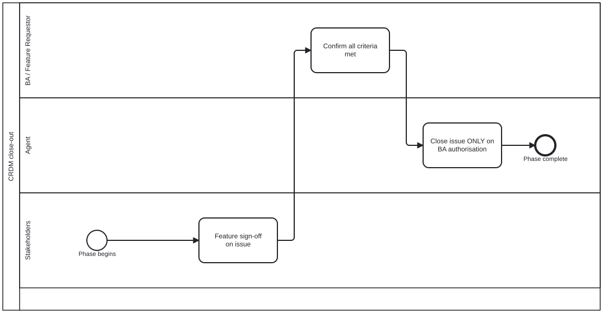

{: .note }
> Generated from `cat-harness/processes/crdm-close.bpmn` by `gen-processes-viz.ts` — do not edit here. [All processes](index.html)


# CRDM close-out

`Process_CRDM_Close` · strict (defaulted) · 3 step(s)

The stakeholders sign off, the BA confirms every criterion is met, and only then does the agent close the issue. Never the other way round: an agent must never assume completion.

## How it connects

- **Called by:** [CRDM requirements](crdm-requirements.html)
- **Calls:** none

## Lanes — who acts

| lane | role | what it does here |
|---|---|---|
| BA / Feature Requestor | — | Stands between stakeholder sign-off and the agent's close as an independent check against defined criteria — decision-audit, not a re-ask of the same yes/no the stakeholders already gave — and A_Close's own documentation says it is reachable ONLY through this confirmation, so the agent has no path to closing that bypasses it. |
| Agent | — | Holds no judgement in this diagram: both prior lanes already decided — sign-off, then confirmation against criteria — so this lane's only accountability is executing the close exactly when authorised and never before, on an issue that is the stakeholder's record rather than the agent's to close on its own reading of the thread. |
| Stakeholders | — | The first of three sequential checks this diagram exists to enforce in order — sign off, confirm, close, never any other sequence — and what is being signed off here is the delivered FEATURE on the issue, not the requirement model that crdm-requirements-definition.bpmn's Lane_Stakeholders approved earlier in the process. |

## Steps

Every one of the 3 step(s) is documented.

| step | lane | skill / sub-process | what it does |
|---|---|---|---|
| **Feature sign-off on issue** `S_FeatureSignoff` | Stakeholders | — | Stakeholders sign off on the delivered feature on the issue, having tested the built artefact rather than a description of it. |
| **Confirm all criteria met** `BA_Confirm` | BA / Feature Requestor | [`decision-audit`](../reference/skill-instructions/decision-audit.html) | The business analyst confirms every acceptance criterion from the requirements is met. The issue closes only on their authorisation — an agent never closes an issue on its own say-so. |
| **Close issue ONLY on BA authorisation** `A_Close` | Agent | [`crdm-requirements-workflow`](../reference/skill-instructions/crdm-requirements-workflow.html) | Reachable only through BA_Confirm, which is the BA saying every criterion is met. An agent must never close an issue without that explicit authorisation — the gate is the preceding task, and this name says so rather than leaving a reader to trace the flow for it. |


