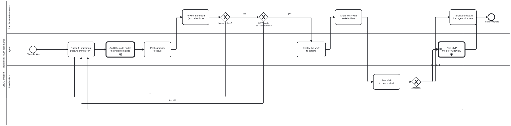

{: .note }
> Generated from `cat-harness/processes/crdm-deliver.bpmn` by `gen-processes-viz.ts` — do not edit here. [All processes](index.html)


# CRDM Phase 6 — implement, MVP, acceptance

`Process_CRDM_Deliver` · strict (defaulted) · 10 step(s)

One phase and not three, because the loops say so: an increment the BA rejects, an MVP that is not ready, and stakeholder findings all route back into implementation. A subprocess has one exit and cannot be re-entered once finished, so splitting this region would have changed what the diagram says.

## How it connects

- **Called by:** [CRDM requirements](crdm-requirements.html)
- **Calls:** [Options analysis](options-analysis.html), [Review task](review-task.html), [Post-MVP theme and UI review](theme-ui-review.html)

## Lanes — who acts

| lane | role | what it does here |
|---|---|---|
| BA / Feature Requestor | `business-analyst` | Every signal that can send the loop back to A_Implement is filtered through this lane first: BA_ReviewIncrement judges behaviour rather than code, GW_MVPReady decides whether accumulated increments are worth showing stakeholders at all, and BA_TranslateFeedback is the only step that turns S_TestMVP's raw findings into direction the agent can act on. Nothing stakeholder-facing reaches Lane_Agent without passing through here. |
| Agent | `authoring-agent` | Every loop-back in this phase — a rejected increment, an MVP not ready, stakeholder feedback — lands on A_Implement rather than on Call_OptionsAnalysis, so this lane always reworks an approach already chosen and never re-selects one. Deciding that the APPROACH itself is wrong is not this lane's call: that belongs to the calling step in crdm-requirements.bpmn, one level up. |
| Stakeholders | `stakeholder` | Tests in the stakeholder's own workflow and data rather than against the acceptance criteria BA_ReviewIncrement already checked — a second, independent pass rather than a repeat of the first. GW_StakeholderOK's `findings` branch does not hand the agent anything directly; it hands raw results to BA_TranslateFeedback, which is this lane's boundary: it reports what works and what does not, and translating that into direction is somebody else's lane. |

## Steps

Every one of the 10 step(s) is documented.

| step | lane | skill / sub-process | what it does |
|---|---|---|---|
| **Options analysis how to implement** `Call_OptionsAnalysis` | Agent | calls [Options analysis](options-analysis.html) | On the single edge from `Start_Process_CRDM_Deliver` into `A_Implement`, so the approach is chosen before any code exists. By Phase 6 the needs, requirements and data model are signed off, which is exactly the evidence an options analysis needs and the reason it belongs here rather than earlier: at `Call_Needs` there is nothing to weigh, and after `A_Implement` the choice has been made in code. Note where this is NOT. The work-plan named `crdm-requirements-workflow`, and `A_Implement` is not in that diagram — `crdm-requirements.bpmn` is the orchestrator, seven call activities and a gateway, and Phase 6 lives here in `crdm-deliver.bpmn`. The call goes where the step is, not where the plan said to look. The three loop-backs into `A_Implement` — `_5` (increment rejected), `_7` (MVP not ready), `_13` (feedback translated) — deliberately BYPASS this call. Routing them through it would run the subprocess on every iteration of the inner loop, which is the ceremony this design refuses: a gate invoked on every pass stops being read. An iteration reworks an approach already chosen; if the APPROACH is what is wrong, that is not a loop iteration and it belongs to the calling step in `crdm-requirements.bpmn`. Contrast `upstream-version-adoption`, where the loop DOES re-enter the analysis. There the loop-back returns to `A_Impact`, which re-gathers the evidence, so the second pass weighs genuinely different inputs. Here the loop returns to implementation with the evidence unchanged. `A_Implement` carries `folio:bean op="claim"`; this step carries no bean op, because `Process_OptionsAnalysis` ends with its own `decision-audit` note on the bean the caller claimed. |
| **Phase 6: Implement (feature branch + PR)** `A_Implement` | Agent | [`prepare-merge`](../reference/skill-instructions/prepare-merge.html) | Inner loop: agent claims a bean, implements on feature branch, opens PR, posts summary to the issue. |
| **Audit the code nodes the increment adds** `A_CodeAudit` | Agent | calls [Review task](review-task.html) | Descend into the review task for what this increment CHANGED IN THE GRAPH — Tool definitions in `tools/` and schema definition nodes under `schemas/`. It runs before the summary, and therefore before an MVP can be shared: a Tool or schema node shipped in an MVP is the version stakeholders start building expectations on, and a node that names a skill nobody wrote is cheaper to catch here than after sign-off. Called, not inherited: the agent keeps its implementing role and takes on the `code-reviewer` lane inside Process_CodeReview for that call path only. |
| **Deploy the MVP to staging** `A_DeployStaging` | Agent | [`feature-staging`](../reference/skill-instructions/feature-staging.html) | An MVP is shared AS A STAGING DEPLOY, not as a description of one. `feature-staging.yml` publishes the branch under `STAGING/<branch-slug>/` on gh-pages and comments the URL on the PR, so the stakeholder who tests it is looking at the built artefact rather than at a screenshot — the same argument the merge discipline makes about rendered work. Measured in this repo on 2026-09-16: holding a rendered change back for assessment made assessment harder, not safer. |
| **Post summary to issue** `A_Summary` | Agent | [`delivery-summary`](../reference/skill-instructions/delivery-summary.html) | What was accomplished, what remains, and links to the updated content for review. |
| **Review increment (test behaviour)** `BA_ReviewIncrement` | BA / Feature Requestor | [`crdm-requirements-workflow`](../reference/skill-instructions/crdm-requirements-workflow.html) | Inner loop: the BA tests each delivered increment against the acceptance criteria. They do not review code — they test behaviour. |
| **Share MVP with stakeholders** `BA_ShareMVP` | BA / Feature Requestor | [`crdm-requirements-workflow`](../reference/skill-instructions/crdm-requirements-workflow.html) | Outer loop: the BA presents the accumulated increments to stakeholders as a testable MVP. Staging URL, demo, or walkthrough. |
| **Test MVP in own context** `S_TestMVP` | Stakeholders | — | Stakeholders test the delivered feature in their own workflow, with their own data. They report what works and what does not. |
| **Translate feedback into agent direction** `BA_TranslateFeedback` | BA / Feature Requestor | [`crdm-requirements-workflow`](../reference/skill-instructions/crdm-requirements-workflow.html) | The BA translates stakeholder findings into actionable direction: new beans or bean updates for the agent. |
| **Post-MVP theme + UI review** `Call_ThemeUIReview` | Agent | calls [Post-MVP theme and UI review](theme-ui-review.html) | On the single edge out of stakeholder acceptance, because there is nothing to review until something renders. Choosing a theme is an authoring judgement made per note and there is no role-to-theme mapping, so no build-time gate could have checked it — what gets reviewed is the result. Accessibility measured rather than asserted, branding against the instance's own declaration, and every declared locale. |

## Decisions

Every one of the 3 decision(s) is documented.

| decision | what decides it | branches |
|---|---|---|
| **Meets criteria?** `GW_IncrementOK` | The BA's result from testing the increment's behaviour. `no` returns to implementation; `yes` asks whether the MVP is ready for stakeholders. | **no** → Phase 6: Implement (feature branch + PR) **yes** → MVP ready for stakeholders? |
| **MVP ready for stakeholders?** `GW_MVPReady` | Asked after an increment passes: is the whole MVP ready for stakeholders? `not yet` implements the next increment; `yes` deploys the MVP to staging. | **not yet** → Phase 6: Implement (feature branch + PR) **yes** → Deploy the MVP to staging |
| **Accepted?** `GW_StakeholderOK` | The stakeholder's result from testing the MVP in their own context. `findings` go to the BA to translate into direction for the agent; `accepted` goes on to the post-MVP theme and UI review. | **findings** → Translate feedback into agent direction **accepted** → Post-MVP theme + UI review |


