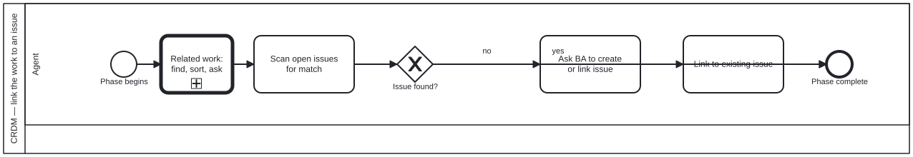

{: .note }
> Generated from `cat-harness/processes/crdm-issue-linking.bpmn` by `gen-processes-viz.ts` — do not edit here. [All processes](index.html)


# CRDM — link the work to an issue

`Process_CRDM_Issue` · strict (defaulted) · 3 step(s)

Feature work must be linked to a GitHub issue. Scan before creating, and never create one without the BA's permission — an issue is the stakeholder's record, not the agent's scratchpad.

## How it connects

- **Called by:** [CRDM requirements](crdm-requirements.html)
- **Calls:** none

## Lanes — who acts

| lane | role | what it does here |
|---|---|---|
| Agent | — | The only CRDM sub-diagram in this slice where the BA has no lane of its own: A_AskCreate is still an Agent-lane activity, so the permission this process exists to enforce is obtained out of band rather than modelled as a cross-lane handoff, unlike crdm-requirements-definition.bpmn and crdm-close.bpmn elsewhere in the same methodology. |

## Steps

Every one of the 3 step(s) is documented.

| step | lane | skill / sub-process | what it does |
|---|---|---|---|
| **Scan open issues for match** `A_ScanIssues` | Agent | [`crdm-requirements-workflow`](../reference/skill-instructions/crdm-requirements-workflow.html) | Search open issues, then recently closed ones, by title and body keywords for one this request belongs to. Requirements may span several issues; note every relevant one. |
| **Ask BA to create or link issue** `A_AskCreate` | Agent | [`crdm-requirements-workflow`](../reference/skill-instructions/crdm-requirements-workflow.html) | Ask — never create. Creating an issue without the BA's permission is the thing this step exists to prevent. |
| **Link to existing issue** `A_LinkIssue` | Agent | [`crdm-requirements-workflow`](../reference/skill-instructions/crdm-requirements-workflow.html) | A match was found: ask the person whether the requirements go on #NNN, then link the work there. The issue is where stakeholders sign off, so no phase proceeds without one. |

## Decisions

**1** of 1 decision(s) carry no documentation — `gateway-documented` lists them.

| decision | what decides it | branches |
|---|---|---|
| **Issue found?** `GW_Issue` | — | **no** → Ask BA to create or link issue **yes** → Link to existing issue |


