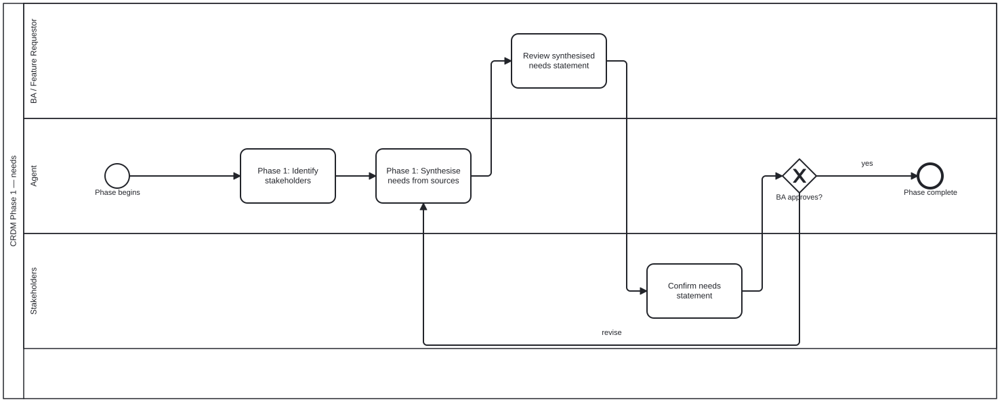

{: .note }
> Generated from `cat-harness/processes/crdm-needs.bpmn` by `gen-processes-viz.ts` — do not edit here. [All processes](index.html)


# CRDM Phase 1 — needs

`Process_CRDM_Needs` · strict (defaulted) · 4 step(s)

Identify the stakeholders, synthesise a needs statement from the sources, and loop until the BA and the stakeholders both recognise it. The loop is the phase: a needs statement nobody confirmed is an agent's summary, not a requirement.

## How it connects

- **Called by:** [CRDM requirements](crdm-requirements.html)
- **Calls:** none

## Lanes — who acts

| lane | role | what it does here |
|---|---|---|
| BA / Feature Requestor | — | The single review here is what GW_Needs is literally named for — "BA approves?" — even though Lane_Stakeholders' confirmation sits between this task and that gateway in the flow; the phase's own documentation makes clear the loop needs both, so reading the gate label alone would miss half of what it takes to exit it. |
| Agent | — | Drafts the needs statement but never decides it is right — A_Synthesise is the sole target when GW_Needs loops back — and this process's own documentation calls an unconfirmed synthesis "an agent's summary, not a requirement," which is exactly what this lane alone produces before the two lanes below it look at it. |
| Stakeholders | — | The task itself carries no documentation of its own, so this lane's entry is the only place recording what "confirm" means in Phase 1: recognising the synthesised needs statement as actually theirs, immediately before the loop gate — not, as in the later data-model phase, judging a cardinality, because there is no model yet to have one. |

## Steps

Every one of the 4 step(s) is documented.

| step | lane | skill / sub-process | what it does |
|---|---|---|---|
| **Phase 1: Identify stakeholders** `A_Stakeholders` | Agent | [`crdm-requirements-workflow`](../reference/skill-instructions/crdm-requirements-workflow.html) | The agent asks the BA who is affected by this change. The BA knows the domain — the agent does not guess. |
| **Phase 1: Synthesise needs from sources** `A_Synthesise` | Agent | [`crdm-requirements-workflow`](../reference/skill-instructions/crdm-requirements-workflow.html) | From the chat, issue, uploads and library sources, write a clear, jargon-free statement of what is needed and why, tied to a concrete workflow. Post it on the GitHub issue, not in chat, and ask the requester and stakeholders to review it. |
| **Review synthesised needs statement** `BA_ReviewNeeds` | BA / Feature Requestor | [`crdm-requirements-workflow`](../reference/skill-instructions/crdm-requirements-workflow.html) | The BA reviews what the agent synthesised and checks it against what they actually need. |
| **Confirm needs statement** `S_ConfirmNeeds` | Stakeholders | — | Stakeholders confirm, on the issue, that the needs statement says what they need — or say what to change. A stakeholder's judgement; an agent does not record it for them. |

## Decisions

Every one of the 1 decision(s) is documented.

| decision | what decides it | branches |
|---|---|---|
| **BA approves?** `GW_Needs` | The BA's answer to the needs statement. `revise` goes back to synthesising needs from the sources; `yes` completes the phase. | **revise** → Phase 1: Synthesise needs from sources **yes** → Phase complete |


