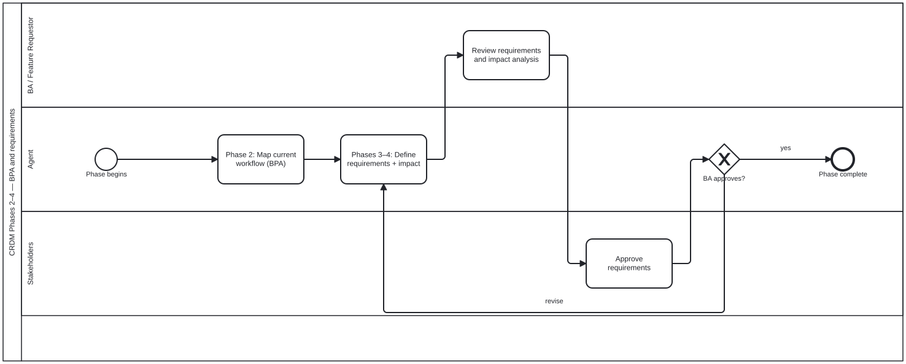

{: .note }
> Generated from `cat-harness/processes/crdm-requirements-definition.bpmn` by `gen-processes-viz.ts` — do not edit here. [All processes](index.html)


# CRDM Phases 2–4 — BPA and requirements

`Process_CRDM_Requirements` · strict (defaulted) · 5 step(s)

Map the current workflow, then define the requirements and the impact they carry, and loop until approved. Same shape as Phase 1 and for the same reason: an unapproved requirement is a proposal.

## How it connects

- **Called by:** [CRDM requirements](crdm-requirements.html)
- **Calls:** none

## Lanes — who acts

| lane | role | what it does here |
|---|---|---|
| BA / Feature Requestor | — | The one checkpoint between the agent's comparison and the stakeholders' sign-off: BA_ReviewReqs is where someone who can read the impact analysis on its own technical terms vouches for it, because Lane_Stakeholders reviews only at defined checkpoints and needs the requirement already in a form they can approve without re-deriving it. |
| Agent | — | Owns Phases 2 through 4a end to end, but the revise loop (GW_Reqs' 'revise' branch) re-enters at A_DefineReqs rather than back at A_MapWorkflow — so mapping the current workflow is this lane's one-time fact-finding, done once per phase run, while defining requirements and comparing options is what gets redone against BA feedback until Lane_Stakeholders approves. |
| Stakeholders | — | The verdict GW_Reqs reads to decide between ending the phase and sending A_DefineReqs around again — a narrower approval than crdm-close.bpmn's final feature sign-off, since what is being approved here is the REQUIREMENT model itself, not that the delivered feature satisfies it. |

## Steps

Every one of the 5 step(s) is documented.

| step | lane | skill / sub-process | what it does |
|---|---|---|---|
| **Phase 2: Map current workflow (BPA)** `A_MapWorkflow` | Agent | [`bpmn-authoring`](../reference/skill-instructions/bpmn-authoring.html) | Business-process analysis here means reading the existing diagrams under processes/ and drawing the gap, so the skill that implements this step is the BPMN one. |
| **Phases 3–4: Define requirements + impact** `A_DefineReqs` | Agent | [`crdm-requirements-workflow`](../reference/skill-instructions/crdm-requirements-workflow.html) [`content-graph`](../reference/skill-instructions/content-graph.html) | Two skills, because this step is two things: the requirements come from the CRDM process, the impact half is a dependency question the content graph answers. |
| **Phase 4a: Compare the viable options** `A_CompareOptions` | Agent | [`decision-comparison`](../reference/skill-instructions/decision-comparison.html) | Phase 4 often ends with a CHOICE rather than a plan, and this is the step that hands it over. Per option: what it does, its pro, its con, what it changes DOWNSTREAM, and how reversible it is — laid out where the rows can be read against each other, then one recommendation and a stated default. A step of its own rather than a line inside A_DefineReqs, because it has a different output and a different reader: the impact analysis is for the record, the comparison is the thing the BA answers from. Folding it in is how it gets skipped — the analysis feels finished, so the options go over as a list of names. Skipped legitimately when the analysis yields ONE viable approach. Do not manufacture alternatives to fill a table. |
| **Review requirements and impact analysis** `BA_ReviewReqs` | BA / Feature Requestor | [`crdm-requirements-workflow`](../reference/skill-instructions/crdm-requirements-workflow.html) | The BA reviews the formal requirements and the impact analysis the agent produced. |
| **Approve requirements** `S_ApproveReqs` | Stakeholders | — | Stakeholders approve the requirements and impact analysis on the issue, or send them back for revision. Only their approval moves the work to sign-off; an agent never records an approval on a person's behalf. |

## Decisions

Every one of the 1 decision(s) is documented.

| decision | what decides it | branches |
|---|---|---|
| **BA approves?** `GW_Reqs` | The BA's answer to the requirements and impact. `revise` goes back to defining them; `yes` completes the phase. | **revise** → Phases 3–4: Define requirements + impact **yes** → Phase complete |


