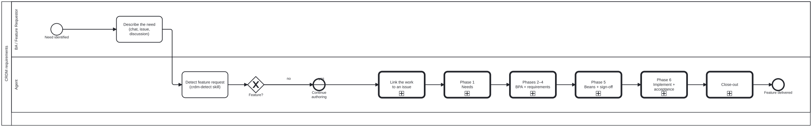

{: .note }
> Generated from `cat-harness/processes/crdm-requirements.bpmn` by `gen-processes-viz.ts` — do not edit here. [All processes](index.html)


# CRDM requirements

`Process_CRDM` · strict (defaulted) · 9 step(s)

The CRDM requirements process, decomposed. Each phase is a real subprocess in its own file: `workflow_next` reports the step you are on and the phase it sits inside, and `workflow_complete` takes the step's own id. Detection stays here rather than in a child because its "not a feature" branch ends the whole process — inside a subprocess the parent would have to re-ask the same question to route on the answer.

## How it connects

- **Called by:** no call activity names this process
- **Calls:** [CRDM close-out](crdm-close.html), [CRDM data model](crdm-data-model.html), [CRDM Phase 6 — implement, MVP, acceptance](crdm-deliver.html), [CRDM — link the work to an issue](crdm-issue-linking.html), [CRDM Phase 1 — needs](crdm-needs.html), [CRDM Phases 2–4 — BPA and requirements](crdm-requirements-definition.html), [CRDM Phase 5 — beans and sign-off](crdm-signoff.html)

## Lanes — who acts

| lane | role | what it does here |
|---|---|---|
| BA / Feature Requestor | `business-analyst` | The one activity in this diagram that is not a subprocess call: states the capability gap in its own words and, per its own documentation, does not need to know any of what follows is called CRDM. The six phases translate the need into that vocabulary, not the other way round. |
| Agent | `authoring-agent` | Holds the one gate whose "no" branch ends the entire process rather than routing into a child — GW_Feature's own documentation: a subprocess would have to re-ask the same question to route on the answer. From there it carries the BA's need through all six phases as a straight chain of subprocess calls, with no branching of its own. |

## Steps

Every one of the 9 step(s) is documented.

| step | lane | skill / sub-process | what it does |
|---|---|---|---|
| **Describe the need (chat, issue, discussion)** `BA_Submit` | BA / Feature Requestor | [`crdm-requirements-workflow`](../reference/skill-instructions/crdm-requirements-workflow.html) | The BA describes the capability gap in their own words. They do not need to know it is called CRDM. |
| **Detect feature request (crdm-detect skill)** `A_Detect` | Agent | [`crdm-detect`](../reference/skill-instructions/crdm-detect.html) | Recognise the request as a platform capability change rather than content work, from crdm-detect's signals. Never call it "CRDM" to the person. Mid-content-work, ask whether to pause for requirements now or record a bean for later — do not switch on your own. |
| **Link the work to an issue** `Call_Issue` | Agent | calls [CRDM — link the work to an issue](crdm-issue-linking.html) [`crdm-requirements-workflow`](../reference/skill-instructions/crdm-requirements-workflow.html) | Feature work must be linked to a GitHub issue. Scan before creating, and never create one without the BA's permission — an issue is the stakeholder's record, not the agent's scratchpad. |
| **Phase 1 Needs** `Call_Needs` | Agent | calls [CRDM Phase 1 — needs](crdm-needs.html) [`crdm-requirements-workflow`](../reference/skill-instructions/crdm-requirements-workflow.html) | Identify the stakeholders, synthesise a needs statement from the sources, and loop until the BA and the stakeholders both recognise it. The loop is the phase: a needs statement nobody confirmed is an agent's summary, not a requirement. |
| **Phases 2–4 BPA + requirements** `Call_Requirements` | Agent | calls [CRDM Phases 2–4 — BPA and requirements](crdm-requirements-definition.html) [`crdm-requirements-workflow`](../reference/skill-instructions/crdm-requirements-workflow.html) | Map the current workflow, then define the requirements and the impact they carry, and loop until approved. Same shape as Phase 1 and for the same reason: an unapproved requirement is a proposal. |
| **Data model Entities + cardinalities** `Call_DataModel` | Agent | calls [CRDM data model](crdm-data-model.html) [`crdm-requirements-workflow`](../reference/skill-instructions/crdm-requirements-workflow.html) | Between requirements and sign-off, and the order is the argument: requirements are statements about things, and the model says what the things ARE. Drafted earlier it is invented from nothing, since the entities come from the phase-2 BPA; drafted later, sign-off approves requirements whose nouns were never pinned — which is how two stakeholders approve one sentence meaning different things. Owner, 2026-09-20. |
| **Phase 5 Beans + sign-off** `Call_Signoff` | Agent | calls [CRDM Phase 5 — beans and sign-off](crdm-signoff.html) [`crdm-requirements-workflow`](../reference/skill-instructions/crdm-requirements-workflow.html) | The approved requirements become work-plan items, the BA signs off, and the branch is announced on the issue. The announcement is on the single edge into delivery, so the three loops back into implementation do not re-announce. |
| **Phase 6 Implement + acceptance** `Call_Deliver` | Agent | calls [CRDM Phase 6 — implement, MVP, acceptance](crdm-deliver.html) [`crdm-requirements-workflow`](../reference/skill-instructions/crdm-requirements-workflow.html) | One phase and not three, because the loops say so: an increment the BA rejects, an MVP that is not ready, and stakeholder findings all route back into implementation. A subprocess has one exit and cannot be re-entered once finished, so splitting this region would have changed what the diagram says. |
| **Close-out** `Call_Close` | Agent | calls [CRDM close-out](crdm-close.html) [`crdm-requirements-workflow`](../reference/skill-instructions/crdm-requirements-workflow.html) | The stakeholders sign off, the BA confirms every criterion is met, and only then does the agent close the issue. Never the other way round: an agent must never assume completion. |

## Decisions

Every one of the 1 decision(s) is documented.

| decision | what decides it | branches |
|---|---|---|
| **Feature?** `GW_Feature` | Answered by crdm-detect: is this request a feature request, a change to the platform, rather than content work? `no` continues authoring; `yes` enters CRDM, starting by linking the work to an issue. | **no** → Continue authoring **yes** → Link the work to an issue |


