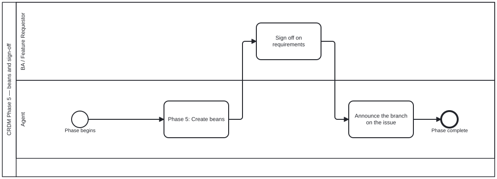

{: .note }
> Generated from `cat-harness/processes/crdm-signoff.bpmn` by `gen-processes-viz.ts` — do not edit here. [All processes](index.html)


# CRDM Phase 5 — beans and sign-off

`Process_CRDM_Signoff` · strict (defaulted) · 6 step(s)

The approved requirements become work-plan items, the BA signs off, and the branch is announced on the issue. The announcement is on the single edge into delivery, so the three loops back into implementation do not re-announce.

## How it connects

- **Called by:** [CRDM requirements](crdm-requirements.html)
- **Calls:** none

## Lanes — who acts

| lane | role | what it does here |
|---|---|---|
| BA / Feature Requestor | — | Makes two decisions of different character here: BA_Signoff approves what was drafted, and BA_ChooseKg commits it — or explicitly does not — to a knowledge-graph destination, where NONE is a legitimate answer rather than a refusal to answer. Only this lane may decide that a requirement is fully carried by the code and becomes a commit and nothing else; an agent that decided so on its own would be placing a node in somebody else's graph. |
| Agent | — | Turns Lane_BA's two decisions into durable artefacts: A_CreateBeans and A_RecordKg each mint their own bean directly with the CLI, since the engine's own vocabulary has no create, only claim, note and resolve on an instance's bean. A_AnnounceBranch then closes the phase on its one path to End with no loop of its own, so it fires exactly once — Phase 6's own loops re-enter implementation on the same branch without ever crossing back through this edge. |

## Steps

Every one of the 6 step(s) is documented.

| step | lane | skill / sub-process | what it does |
|---|---|---|---|
| **Phase 5: Create beans** `A_CreateBeans` | Agent | [`todo-manager`](../reference/skill-instructions/todo-manager.html) | The agent mints the implementation beans itself with `beans create`, running the exact-title existence check first. The engine has no `create` op — it claims, notes and resolves the instance's OWN bean — so what this step records here is a note that the plan now exists. |
| **Sign off on requirements** `BA_Signoff` | BA / Feature Requestor | [`decision-audit`](../reference/skill-instructions/decision-audit.html) | The business analyst / requester signs off on the agreed requirement set, on the issue: what was agreed and what was deferred. Recorded as their decision, with its reason, never by an agent on their behalf. |
| **Announce the branch on the issue** `A_AnnounceBranch` | Agent | [`crdm-requirements-workflow`](../reference/skill-instructions/crdm-requirements-workflow.html) | On CREATING the feature branch, comment on the issue: the branch name, the process and phase, and the beans claimed. Visibility is the whole point — without it a sibling session or a human cannot tell that work has begun, only that it has finished. Deliberately on this edge and not inside Phase 6. The three loops back into A_Implement (increment rejected, MVP not ready, feedback translated) re-enter implementation on the SAME branch, and re-announcing on each would be noise. Announce once, when the branch is created. |
| **Offer the knowledge-graph destinations for the agreed set** `A_OfferKg` | Agent | [`kg-contribution-offer`](../reference/skill-instructions/kg-contribution-offer.html) | THE STEP THAT WAS MISSING. Requirements were elicited, agreed and signed off, and then existed as an issue and a conversation — so the output of the process that exists to produce durable requirements was the one thing the knowledge graph never learned. ONE question for the SET, not one per requirement: a six-phase run can agree many, and asking six times is the same failure as a form that re-asks what it was already told. The options are DERIVED from the graphs this instance declares in `<name>.json`, read at the time of asking, so an instance that adds a graph gets it in the offer without anybody editing a skill. Never a list typed from memory. |
| **Choose a destination, or none** `BA_ChooseKg` | BA / Feature Requestor | [`kg-contribution-offer`](../reference/skill-instructions/kg-contribution-offer.html) | A PERSON'S STEP, and `none` is one of the answers rather than a refusal to answer. A requirement whose whole content is carried by the code becomes a commit and nothing else; a graph that acquires a node for it is a graph with a node nobody will ever read. The default creates NOTHING. An agent that decides on its own that a requirement "is really a skill" has manufactured a node nobody asked for, in a graph somebody else maintains — which is what this step exists to prevent. |
| **Run placement, and raise a bean for the authoring** `A_RecordKg` | Agent | [`placement`](../reference/skill-instructions/placement.html) | The offer produces a DECISION, not a node. `placement` then decides instance, graph and node kind — it is the step that catches a hardcoded path or a literal naming one folio — and the authoring itself becomes a bean, because work here is a bean before it is a file. `op="note"` and not `create`, for the reason `A_CreateBeans` above states: the engine has no `create` op — it claims, notes and resolves the instance's OWN bean. The agent mints the authoring bean itself with `beans create`, running the exact-title existence check first, and what this step records is a note that the decision was taken. |


