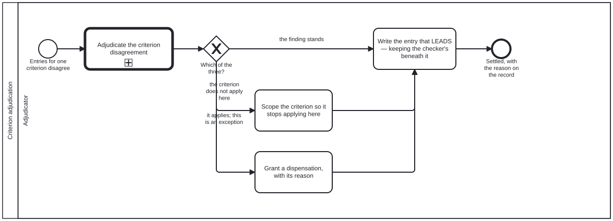

{: .note }
> Generated from `cat-harness/processes/criterion-adjudication.bpmn` by `gen-processes-viz.ts` — do not edit here. [All processes](index.html)


# Criterion adjudication

`Process_CriterionAdjudication` · advisory · 4 step(s)

Two reviewer entries for ONE QA criterion disagree: ask the adjudication, then do the one of three things that a criterion disagreement admits. You are in this process when the disagreement is about a criterion — a script failing what a reviewer passed, an agent and a person reading the same block differently. If what disagrees is not a criterion, this is the wrong process and `adjudication.bpmn` is the one to call directly, with your own outcomes. The three outcomes are legitimate in the same way, and it is not which one is chosen: the finding stands, the criterion does not apply here and should be scoped, or it applies and this is a stated exception. All three converge on A_RecordEntry, because what makes an outcome sound is that its reason was recorded. ADVISORY at the process level, for the reason the adjudication itself is: a judgement cannot be gated, since the whole reason it was entered is that the mechanism ran out of facts. What is NOT relaxable is A_RecordEntry. A judgement nobody wrote down is indistinguishable from a checker that was never run, so the judgement is free and the record is not.

## How it connects

- **Called by:** [Prose and the code it describes](narrative-code-review.html), [Narrative review](review-narrative.html), [Voice overlay review](voice-review.html), [Wireframe design review](wireframe-design-review.html)
- **Calls:** [Adjudication](adjudication.html)
- **Presented on:** no docs page section shows this diagram

## Lanes — who acts

| lane | role | what it does here |
|---|---|---|
| Adjudicator | `adjudicator` | One lane, because every step here is the adjudicator's: asking the question, choosing among the answers, and writing the entry. The feedback provider's lane is in `adjudication.bpmn`, where stating a finding happens — a provider has no entitlement to settle what it reported, and drawing it here would suggest otherwise. The role admits person and agent. `refresh-materialized` already gives the reason in its own words — "a human or agentic decision, never a merge rule" — and the steps are plain tasks rather than user tasks so the diagram does not assert a person where an agent is legitimate. |

## Steps

Every one of the 4 step(s) is documented.

| step | lane | skill / sub-process | what it does |
|---|---|---|---|
| **Adjudicate the criterion disagreement** `Call_Adjudicate` | Adjudicator | calls [Adjudication](adjudication.html) [`adjudication`](../reference/skill-instructions/adjudication.html) | The shared judgement — entry condition, untainted dispatch, person-or-agent restriction — asked with THIS question's permitted answers. `cat-harness.processes:adjudication codes` sits here rather than on `A_Adjudicate` inside it because the answers depend on what was asked, and the gateway below is what acts on them: the engine refuses a mismatch between the two. `Process_Adjudication` may also leave at `End_NotAdjudicable` — one entry and no other side is a review or a gate, not a disagreement — in which case nothing below runs and there is nothing to record. |
| **Scope the criterion so it stops applying here** `A_ScopeCriterion` | Adjudicator | [`adjudication`](../reference/skill-instructions/adjudication.html) | One edit to the criterion rather than ten overrules on the blocks it should never have covered. This branch is the one an adjudicator under time pressure converts into a dispensation, and the conversion is a defect: a dispensation lapses when the source moves, so a mis-scoped criterion granted its way past comes back every time anybody touches the block. |
| **Grant a dispensation, with its reason** `A_Dispensation` | Adjudicator | [`adjudication`](../reference/skill-instructions/adjudication.html) | The rule applies and this subject is a stated exception. A `kind: "human"` entry with `result: "pass"` overrides the script's `fail` for that criterion, and ONLY while its `field_hash` matches the current source — so the dispensation is scoped to the version it was granted against, lapses when the block changes, and never becomes precedent. There is nothing to overturn later; the source moving overturns it. A dispensation with no `notes` is not a dispensation. It is an override somebody applied to get to green, and nobody can review it afterwards — which is why this step is not relaxable. |
| **Write the entry that LEADS — keeping the checker's beneath it** `A_RecordEntry` | Adjudicator | [`adjudication`](../reference/skill-instructions/adjudication.html) | Not relaxable, and the one step here that is not. A judgement nobody wrote down is indistinguishable from a checker that was never run, so the judgement is free and the record is not. Do not resolve the disagreement away: both entries stay, the adjudication on top under the sweep's most-recent-matching-hash rule. A disagreement between a checker and a reviewer is information, and somebody re-running the check next month needs to find that a checker read it differently rather than a clean pass. `/api/relevance/adjudicate` reached the same rule independently — `human_adjudicated` written alongside, never over, the agent's `assessed_by`. |

## Decisions

Every one of the 1 decision(s) is documented.

| decision | what decides it | branches |
|---|---|---|
| **Which of the three?** `GW_Outcome` | The three are legitimate in the same way: what makes an outcome sound is not which one it is but that its reason was recorded. All three converge on A_RecordEntry for exactly that reason. | **the finding stands** → Write the entry that LEADS — keeping the checker's beneath it **the criterion does not apply here** → Scope the criterion so it stops applying here **it applies; this is an exception** → Grant a dispensation, with its reason |


