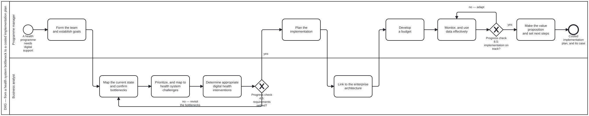

{: .note }
> Generated from `smart-base/methodologies/processes/diig-investment-path.bpmn` by `gen-processes-viz.ts` — do not edit here. [All processes](index.html)


# DIIG — from a health system bottleneck to a costed implementation plan

`Process_DIIG` · advisory · 9 step(s)

The nine-chapter sequence of the WHO/ITU Digital Implementation Investment Guide, as the Guide numbers it. Each chapter's output is the next chapter's input, and the two exclusive gateways are the Guide's OWN progress checks (4.5 and 8.5) rather than gates added here. Adopted whole per `methodology-adoption`, and rendered from the ingested sections at `smart-base/library/9789240010567-eng/`. Chapter 1 is the Guide's introduction — scope, key terms and when the Guide applies — so it is the start event's documentation rather than an activity: nothing is performed there. ADVISORY, not strict. This is a per-methodology process and DIIG is somebody else's method: the engine can report where a programme has got to, but what counts as an adequate answer to "have we identified the bottlenecks" belongs to the programme and its stakeholders, not to this repository. The four unrelaxable steps of the base editorial gate are untouched by it. WHAT THIS DIAGRAM DOES NOT DO. DIIG Table 3.3.1 scores bottlenecks on three 1-3 criteria and sums them into a ranking. The three criteria are adopted; the arithmetic is refused, per `methodology-adoption` — three ordinal judgements on incommensurable scales, summed with equal weight, produce a number whose precision is invented. So A_PrioritizeBottlenecks records each criterion's answer and its reason and orders by argument. There is no computed score anywhere in this process, and a DMN-backed gateway would be the wrong shape for exactly that reason.

## How it connects

- **Called by:** no call activity names this process
- **Calls:** none

## Lanes — who acts

| lane | role | what it does here |
|---|---|---|
| Programme manager | — | DIIG Table 2.1.1 names the key roles and their descriptions. The lane is the ROLE, taken on for its duration — the same actor is a business analyst in the next lane along, and on a small team frequently is. There is NO stakeholder lane, and the first draft of this diagram had one. A lane is who PERFORMS the task, not who receives its output: Chapter 9's value proposition is made BY the implementing team TO whoever pays, so the activity belongs here and the stakeholder is its audience. `kg:audit` caught it as `role-carries-activity-skill` — the stakeholder role carries no skills at all, which is the shape of a role that acts on nothing. |
| Business analyst | — | DIIG's own description of the role, verbatim from `sections/page-031.md`: "Analyses and documents workflow of the clinical care and health programme processes and recommends digital health interventions relative to the prioritized business requirements." Chapters 3, 4 and 6 are that work. |

## Steps

Every one of the 9 step(s) is documented.

| step | lane | skill / sub-process | what it does |
|---|---|---|---|
| **Form the team and establish goals** `A_FormTeam` | Programme manager | [`methodology-adoption`](../reference/skill-instructions/methodology-adoption.html) | DIIG Chapter 2. Determine roles and responsibilities; develop a common understanding of the health programme's needs and goals; understand programme operations across levels of the health system. |
| **Map the current state and confirm bottlenecks** `A_MapCurrentState` | Business analyst | [`methodology-adoption`](../reference/skill-instructions/methodology-adoption.html) | DIIG Chapter 3.1. Determine the health programme processes to target, map their workflows, identify and confirm bottlenecks. Then 3.2, a root cause analysis. This is where DIIG builds on CRDM, and it says so: "This process builds on the Public Health Informatics Institute's Collaborative Requirements Development Methodology (CRDM)". Its three areas of concentration are business process analysis, business process redesign and requirements definition — two of which name diagrams this platform already executes. They are parallel tracks, not a composite: pick one per decision and name it. |
| **Prioritize, and map to health system challenges** `A_PrioritizeBottlenecks` | Business analyst | [`methodology-adoption`](../reference/skill-instructions/methodology-adoption.html) | DIIG Chapters 3.3 and 3.4. Prioritize the bottlenecks, then map the programme-specific ones onto the generic health system challenges. THE ARITHMETIC IS REFUSED HERE. DIIG Table 3.3.1 asks three questions, each scored 1-3 — how much impact does this bottleneck have on the process, what is the likelihood of overcoming it, is it important to a wide range of stakeholders — and sums them into a Score and a Prioritized Ranking. The three criteria are adopted whole; the total is not. Record each criterion's answer AND its reason, and order by argument. A ranked list reads as evidence in a way three stated judgements do not, and the weights were invented. |
| **Determine appropriate digital health interventions** `A_DetermineInterventions` | Business analyst | [`methodology-adoption`](../reference/skill-instructions/methodology-adoption.html) | DIIG Chapter 4. Select interventions for the prioritized challenges, assess whether the enabling environment can support them, identify functional requirements and user stories, map the future-state workflow, and check whether existing applications already meet the requirements. The interventions CONSIDERED AND NOT CHOSEN are part of the output, with why — `methodology-adoption`'s fourth refusal. A deleted alternative leaves the next reader unable to tell a decision from an oversight. Selection is from the Classification, and the `who-digital-health` voice governs the naming: an intervention is a capability, not the software that delivers it. |
| **Plan the implementation** `A_PlanImplementation` | Programme manager | [`methodology-adoption`](../reference/skill-instructions/methodology-adoption.html) | DIIG Chapter 5. Infrastructure; legislation, policy and compliance, including data management, privacy and security, and the regulation of new technologies; leadership and governance, including external partnerships; workforce and training; services and applications. |
| **Link to the enterprise architecture** `A_LinkEnterpriseArchitecture` | Business analyst | [`methodology-adoption`](../reference/skill-instructions/methodology-adoption.html) | DIIG Chapter 6. Assess the digital health enterprise architecture, identify the common and enabling components and shared services that make up the digital health platform, and link the investment to both. |
| **Develop a budget** `A_DevelopBudget` | Programme manager | [`methodology-adoption`](../reference/skill-instructions/methodology-adoption.html) | DIIG Chapter 7. Phases of implementation, cost drivers, and the budget matrix. This is the chapter that turns the preceding six into a COSTED implementation plan, which is the artefact the whole Guide exists to produce and the one a funder reads. |
| **Monitor, and use data effectively** `A_MonitorAndUseData` | Programme manager | [`methodology-adoption`](../reference/skill-instructions/methodology-adoption.html) | DIIG Chapter 8. Establish a logic model, plan the monitoring and evaluation, establish a culture of data use, and manage adaptively — using the data to optimize the interventions rather than only to report on them. The full treatment of this chapter is a separate publication in this library, `9789241511766-eng`, Monitoring and Evaluating Digital Health Interventions. It is a parallel track, not a sub-step: do not blend the two. |
| **Make the value proposition and set next steps** `A_ValueProposition` | Programme manager | [`methodology-adoption`](../reference/skill-instructions/methodology-adoption.html) | DIIG Chapter 9. The case made to whoever pays, and what follows. Scaling up is a different method and a different publication — `9789241509510-eng`, The MAPS Toolkit — which begins where this implementation ends. |

## Decisions

Every one of the 2 decision(s) is documented.

| decision | what decides it | branches |
|---|---|---|
| **Progress check 4.5: requirements settled?** `GW_ProgressCheck4` | DIIG's own gate at 4.5, not one added here. No DMN: what counts as settled is the programme's judgement and its stakeholders', and a computed branch would assert a repeatability this question does not have. | **no — revisit the bottlenecks** → Map the current state and confirm bottlenecks **yes** → Plan the implementation |
| **Progress check 8.5: implementation on track?** `GW_ProgressCheck8` | DIIG's own gate at 8.5. A "no" returns to Chapter 8 rather than failing the process, because adaptive management IS the answer the Guide gives: 8.4 is "use data to optimize interventions", so iterating here is the method working rather than the method stalling. | **no — adapt** → Monitor, and use data effectively **yes** → Make the value proposition and set next steps |


