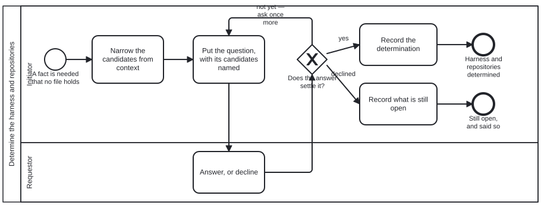

{: .note }
> Generated from `bootstrap/processes/discussion.bpmn` by `gen-processes-viz.ts` — do not edit here. [All processes](index.html)


# Determine the harness and repositories

`Process_Discussion` · strict (defaulted) · 5 step(s)

THE SECOND PROCESS IN CAT_BOOTSTRAP, and an exception to bootstrap holding as little as possible. Two facts have no answer in any file an Initiator can reach: WHICH harness this repository should become, and WHICH repositories are read from and written to. No instruction body produces them — they are judgements held by whoever asked for the harness. An agent that cannot obtain them cannot take the first step of `initialize-harness`, so this is presupposed by every task rather than indicated by one. (Logging sits differently and is NOT the contrast it first looks like: the owner's rule is "logging is optional, unless indicated on tasks", and `initialize-harness` indicates it — which is why `log-message` is here too.) SYMMETRIC IN ITS PARTICIPANTS. Human-to-agent and agent-to-agent are the same process: the Requestor lane is filled by a person or by a sibling agent that already holds the answer. The output records which, because the two are evidence of different weight, but neither is refused and they are not conflated. THE TOOL DOES NOT DECIDE. `discuss` carries a question out and an answer back. Judgement — the Initiator's — chooses what to ask and rules on when an answer settles the matter. The task is finished when a document conforming to `discussion.output.schema.json` exists, not when a pleasant exchange has occurred. PRECONDITION: the Initiator has read bootstrap/README.md and has narrowed the candidates as far as context allows. BPMN has no precondition element and this schema adds none yet, so it is stated here as `initialize-harness` states its own, and tracked as bean `lv3j`. NO folio:bean on any activity, and isExecutable is false, for the reasons `initialize-harness` gives: a bean is work-plan machinery and an engine is harness machinery, and an Initiator runs before either exists. This is data an Initiator reads.

## How it connects

- **Called by:** no call activity names this process
- **Calls:** none
- **Skill:** [`discussion`](../reference/skill-instructions/discussion.html)

## Lanes — who acts

| lane | role | what it does here |
|---|---|---|
| Initiator | — | Holds the one judgement this process refuses to compute: whether an answer actually settles the question, which is why G_Settled carries no folio:decision unlike the DMN-backed gateways elsewhere in this corpus. It narrows candidates before spending the one question a reader is entitled to, and closes either with a determination or, on a decline, with what is still open — never a guess standing in for either. |
| Requestor | — | Filled interchangeably by a person or a sibling agent that already holds the answer — the output records which, since the two are evidence of different weight, but this lane's standing to answer is the same either way. Declining is a legitimate exit here, not a failure: it is what turns the outcome into "unsettled" rather than forcing a guess. |

## Steps

Every one of the 5 step(s) is documented.

| step | lane | skill / sub-process | what it does |
|---|---|---|---|
| **Narrow the candidates from context** `A_NarrowCandidates` | Initiator | [`discussion`](../reference/skill-instructions/discussion.html) | Before asking. A repository that already carries `cat-harness/cat-harness.json` is not a blank slate, and a question whose candidates the agent could have worked out itself wastes the one question it is entitled to. |
| **Put the question, with its candidates named** `A_PutQuestion` | Initiator | [`discussion`](../reference/skill-instructions/discussion.html) | Uses the `discuss` tool. One question where one will do — the Initiator's persona is "asks exactly one question when it must". A question a reader must go and research is not ready to be asked. |
| **Answer, or decline** `A_Answer` | Requestor | — | The Requestor lane, filled by a person or by a sibling agent. Declining is a permitted move and not an error: it produces `outcome: unsettled` with what is still open, never a guess. |
| **Record the determination** `A_RecordDetermination` | Initiator | [`discussion`](../reference/skill-instructions/discussion.html) | Writes a document conforming to `discussion.output.schema.json`: the harness, the repositories as read-from / written-to pairs, `determinedBy`, and who answered. This artefact is what finishes the task. |
| **Record what is still open** `A_RecordUnsettled` | Initiator | [`discussion`](../reference/skill-instructions/discussion.html) | The declined route. `outcome: unsettled` with `stillOpen`, so the next actor resumes rather than restarts. An agent that reaches for a default here has produced a guess, not a determination. |

## Decisions

Every one of the 1 decision(s) is documented.

| decision | what decides it | branches |
|---|---|---|
| **Does the answer settle it?** `G_Settled` | Judgement, exercised by the Initiator — which is why this gateway carries no `folio:decision`. Whether an answer settles the matter is not computable from the answer's text, and a DMN table here would be a claim that it is. | **yes** → Record the determination **not yet — ask once more** → Put the question, with its candidates named **declined** → Record what is still open |


