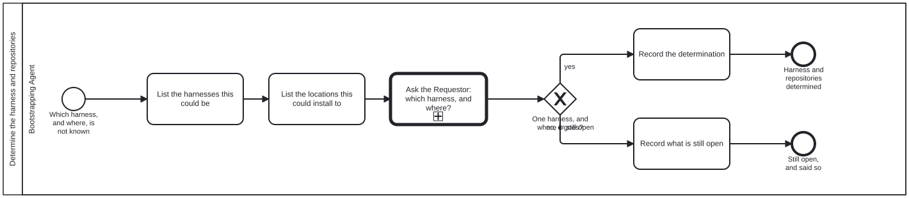

{: .note }
> Generated from `bootstrap/processes/discussion.bpmn` by `gen-processes-viz.ts` — do not edit here. [All processes](index.html)


# Determine the harness and repositories

`Process_Discussion` · strict (defaulted) · 6 step(s)

A SUB-PROCESS of initialize-harness, never an entry point. Two facts have no answer in any file a Bootstrapping Agent can reach: WHICH harness this repository should become, and WHICH repositories are read from and written to. No instruction body produces them — they are judgements held by whoever asked for the harness. An agent that cannot obtain them cannot take the first step of `initialize-harness`, which is why that process's first step calls this one.

WHERE THIS IS, DETERMINED FIRST (owner, 2026-10-01: "i wanted to see more about determining context / role / process as part of precondition.. and that needs to be clarified as part of discussion/interaction"). Before narrowing anything, the Bootstrapping Agent says where it is: the Process (Initialize a harness, at its first step, inside this one), the Roles (itself as the Bootstrapping Agent; the person it will ask as the Requestor), and the context (what the request said, what the checkout holds). These are declared below as preconditions of the listing, established by A_DetermineWhere; one that cannot be established is not guessed — it becomes the FIRST question of the called discussion, which asks about it before the harness question.

THE ASKING IS NOT DRAWN HERE. This process narrows and records; the question itself is put through `human-agent-discussion`, the one reusable way bootstrap asks a person anything — context, options, a recommendation, one question, and what happens with no answer. What is particular to THIS question is carried in: the candidates, and that NO default is allowed. Which harness a repository becomes is not reversible by running anything again, so silence ends as unsettled, never as "bootstrap, by default".

THE OUTPUT IS A DOCUMENT. The task is finished when a document conforming to `discussion.output.schema.json` exists, not when a pleasant exchange has occurred.

NO work-plan element on any activity, and isExecutable is false, for the reasons `initialize-harness` gives.

## How it connects

- **Called by:** [Initialize a harness](initialize-harness.html)
- **Calls:** [Human–agent discussion](human-agent-discussion.html)
- **Presented on:** no docs page section shows this diagram

## Lanes — who acts

| lane | role | what it does here |
|---|---|---|
| Bootstrapping Agent | `bootstrapping-agent` | Narrows the candidates before spending the one question a reader is entitled to, and closes either with a determination or with what is still open — never a guess standing in for either. The Requestor takes part inside the called discussion, which is why this diagram has no lane for them. |

## Steps

Every one of the 6 step(s) is documented.

| step | lane | skill / sub-process | what it does |
|---|---|---|---|
| **Determine where you are: process, roles, context** `A_DetermineWhere` | Bootstrapping Agent | `discussion` `human-agent-discussion` | Before narrowing, say where this is happening, in the words you will use in the question. PROCESS: Initialize a harness, at its first step, inside Determine the harness and repositories — the only place a Bootstrapping Agent can be (FR-2). If you cannot say that (you were started some other way, or a step you believed done is not), you are out of process: do not infer your way back in. ROLES: you act as the Bootstrapping Agent because you were told so; the person you will ask is the Requestor — the one who asked for the harness, and the only one who may choose it. A request relayed by somebody else leaves the Requestor undetermined. CONTEXT: what the request said, and what the checkout holds — a declaration at its root, a harness named in the request. Whatever cannot be determined is handed to the called discussion as undetermined, and asked about first; it is never filled with a default. |
| **List the harnesses this could be** `A_ListHarnesses` | Bootstrapping Agent | `confirm-harness` | Zero or more. The candidate everybody has is bootstrap itself. Context may name others: "please set up <owner>/<repo> here" names one, and so does any Harness built on bootstrap that the Requestor mentions. This step narrows; it does not decide. |
| **List the locations this could install to** `A_ListLocations` | Bootstrapping Agent | `confirm-harness` | Zero or more. Is this a git repository already, or were one or more URLs to repositories supplied? Both are Knowledge Graph Data Stores; the difference is only how they are reached. A location whose root already holds a declaration, `<name>.json`, is not a blank slate, and says so in the question. |
| **Ask the Requestor: which harness, and where?** `A_AskRequestor` | Bootstrapping Agent | calls [Human–agent discussion](human-agent-discussion.html) `confirm-harness` `human-agent-discussion` | The candidates go in as the options; the recommendation may name one; the default is NONE. What A_DetermineWhere established goes in too — the process, the two roles, the context — so the called discussion checks it rather than re-deriving it; and anything it could not establish goes in as undetermined, to be asked first. The Requestor's answer comes back as answered, or the question as still open. |
| **Record the determination** `A_RecordDetermination` | Bootstrapping Agent | `discussion` | Writes a document conforming to `discussion.output.schema.json`: the harness, the repositories as read-from / written-to pairs, `determinedBy: asked`, and who answered. This artefact is what finishes the task. |
| **Record what is still open** `A_RecordUnsettled` | Bootstrapping Agent | `discussion` | `outcome: unsettled` with what was asked and what is still open, so the next actor resumes rather than restarts. An agent that reaches for a default here has produced a guess, not a determination. |

## Decisions

Every one of the 1 decision(s) is documented.

| decision | what decides it | branches |
|---|---|---|
| **One harness, and where it goes?** `G_Settled` | At most one harness: a list of two is not an answer, and the Bootstrapping Agent may not break the tie. Judgement, not a computed decision. | **yes** → Record the determination **no, or still open** → Record what is still open |


