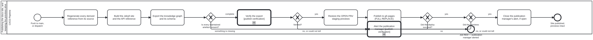

{: .note }
> Generated from `cat-harness/processes/docs-site-publish.bpmn` by `gen-processes-viz.ts` — do not edit here. [All processes](index.html)


# Publishing the docs site, and keeping the previews alive

`Process_DocsSite` · strict · 8 step(s)

PUBLISHING THE SITE IS A FULL REPLACE, AND THAT IS THE WHOLE REASON THIS IS DRAWN. Bean `7yvd`. The workflow is 432 lines and its shape is not legible from them: what a reader needs to know is that `gh-pages` is REPLACED wholesale, so anything on that branch which this build did not produce is gone unless something puts it back.&#10;&#10;That is bean `plj1` — every open pull request's review preview deleted by an unrelated merge, silently, for months. The repair is the two steps either side of the publish, and they are a PAIR: `Restore the open PRs' staging previews` copies them into the publish directory before the replace, and `Did the previews survive?` reads the deployed ref afterwards. Neither is sufficient alone — a restore nobody verifies is a restore that can silently stop working, which is exactly how the original defect lasted.&#10;&#10;BOTH GATEWAYS REFUSE RATHER THAN WARN, and the second is three-state: it fails on a preview that is missing AND on a check that could not tell, because a verification that has gone blind must not read as permission. Same rule as `ci-health` — could-not-determine is never rendered as clean.&#10;&#10;`Regenerate every derived reference from its source` stands for five separate generators (schema reference, skill instruction pages, content-backed docs, the translation index, the BPMN renders). They are drawn as one task on purpose: they are independent of each other and sequential only because a single job runs them, so five boxes would assert an ordering the workflow does not have.&#10;&#10;Mechanical throughout. There is no human lane, which is what makes `build-pipeline` the right lane rather than a convenient one. VERIFIED AND ALERTED (bean vigi, owner 2026-09-23): the export is verified BEFORE the deploy and blocks it on anything but a pass; and every step after the publish button that fails — an incomplete export, a verification failure, a failed deploy, a lost preview — goes through one alert to the publication manager. A clean publish closes that alert.

## How it connects

- **Called by:** no call activity names this process
- **Calls:** [Alert the publication manager](publish-alert.html), [Verify the export before it is deployed](publish-verification.html)
- **Presented on:** no docs page section shows this diagram

## Lanes — who acts

| lane | role | what it does here |
|---|---|---|
| CI/CD Pipeline | `build-pipeline` | Before it will even attempt the risky part, GW_Complete can refuse outright and end at End_Refused if a maintained artefact is missing — so an incomplete build never reaches Task_Publish's full replace at all, which is a harder stop than the restore/verify pair further down the same lane makes for a partial one. |

## Steps

Every one of the 8 step(s) is documented.

| step | lane | skill / sub-process | what it does |
|---|---|---|---|
| **Regenerate every derived reference from its source** `Task_Regenerate` | CI/CD Pipeline | — | Regenerate every derived reference from its source before building: skill schema and instruction pages, content-backed docs pages, the graph projections and viewers, the handler and translation indexes, and the rendered BPMN diagrams. The published site is built from sources, never from committed copies that may be stale. |
| **Build the Jekyll site and the API reference** `Task_Build` | CI/CD Pipeline | — | Compose the docs layers, build the Jekyll site, mount instance-rendered content, and generate the TypeScript API reference with TypeDoc. |
| **Export the knowledge graph and its schema** `Task_Export` | CI/CD Pipeline | — | Export the knowledge graph and its schema into the published tree, then check every maintained artefact is present and no block-level markup escaped. The unpublished graph kinds are stripped on export. |
| **Verify the export** `Call_Verify` | CI/CD Pipeline | calls [Verify the export before it is deployed](publish-verification.html) [`publish-verification`](../reference/skill-instructions/publish-verification.html) | Process_PublishVerification: the verifier set over the built tree, before anything is deployed. Owner, 2026-09-23: before deployment, blocking. |
| **Restore the OPEN PRs' staging previews** `Task_Restore` | CI/CD Pipeline | [`feature-staging`](../reference/skill-instructions/feature-staging.html) | Copy every OPEN pull request's STAGING/<slug>/ preview from gh-pages into the publish directory before the replace, once per publish attempt. Without it the full replace deletes every preview, silently (bean plj1). Only open PRs' previews are carried. |
| **Publish to gh-pages (FULL REPLACE)** `Task_Publish` | CI/CD Pipeline | — | Publish to gh-pages as a FULL REPLACE: anything on the branch this build did not produce is gone unless the restore put it back. The verify step that follows reads the deployed ref to confirm the previews survived. |
| **Close the publication manager's alert, if open** `Task_CloseAlert` | CI/CD Pipeline | — | A clean publish resolves whatever the last failure raised: close the open publication-manager tracking issue with a comment naming this run. |
| **Alert the publication manager** `Call_Alert` | CI/CD Pipeline | calls [Alert the publication manager](publish-alert.html) [`publish-verification`](../reference/skill-instructions/publish-verification.html) | Process_PublishAlert — the ONE alert every failing step after the publish button goes through, whichever step it was. |

## Decisions

Every one of the 4 decision(s) is documented.

| decision | what decides it | branches |
|---|---|---|
| **Is every maintained artefact present?** `GW_Complete` | Answered by the export: is every maintained artefact present? `something is missing` goes to the alert and publishes nothing, because a full replace would ship the gap; `complete` goes on to verify the export. | **something is missing** → Alert the publication manager **complete** → Verify the export |
| **Verified?** `GW_Verified` | Answered by the verification sub-process's end: `yes` only when every in-scope document passed. `no, or could not tell` blocks the deploy and alerts — an unverified release is not a verified one. | **yes** → Restore the OPEN PRs' staging previews **no, or could not tell** → Alert the publication manager |
| **Did the deploy succeed?** `GW_Deployed` | Answered by the deploy step itself. `no` goes to the alert: a failed deploy after the publish button is exactly the failure the owner asked to be told about. `yes` checks the previews survived. | **yes** → Did the previews survive? **no** → Alert the publication manager |
| **Did the previews survive?** `GW_Survived` | Asked after the full-replace publish: are the open PRs' previews still there? `yes` closes any open alert and ends published; `no, or could not tell` goes to the alert, because a preview that cannot be confirmed is treated as deleted. | **yes** → Close the publication manager's alert, if open **no, or could not tell** → Alert the publication manager |


