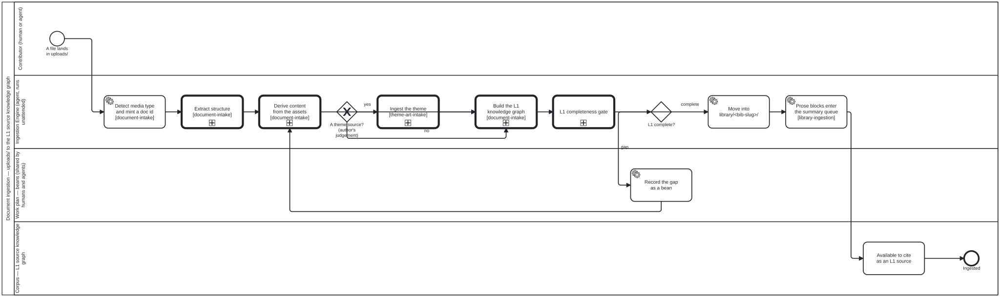

{: .note }
> Generated from `cat-harness/processes/document-ingestion.bpmn` by `gen-processes-viz.ts` — do not edit here. [All processes](index.html)


# Document ingestion — uploads/ to the L1 source knowledge graph

`Process_Ingestion` · advisory · 9 step(s)

folio-assistant — Document ingestion — uploads/ to the L1 source knowledge graph. Source of truth: this file. Open it in bpmn.io, Camunda Modeler, or any other BPMN 2.0 tool. The SVG under docs/assets/img/workflows/ is generated from it by `bun run render:bpmn` — never hand-edit the SVG. The <folio:skill> extension on an activity names the folio-assistant skill that implements it; <folio:bean> marks a step that reads or writes the shared work plan in beans/.

## How it connects

- **Called by:** [Adopt a methodology from a source document](methodology-from-source.html)
- **Calls:** [Ingestion subprocess — build the L1 knowledge graph](ingest-build-l1-kg.html), [Ingestion subprocess — derive content from the assets](ingest-derive-content.html), [Ingestion subprocess — extract structure](ingest-extract-structure.html), [Ingestion subprocess — ingest a theme](ingest-theme.html), [Ingestion subprocess — the L1 completeness gate](ingest-l1-completeness-gate.html)

## Lanes — who acts

| lane | role | what it does here |
|---|---|---|
| Contributor (human or agent) | — | — |
| Ingestion Engine (agent, runs unattended) | — | Runs the whole pipeline from Task_Detect through Task_Promote — including the theme branch, which stays in THIS lane rather than dipping into Lane_2: deciding a document is a theme source is the engine asking its author a question, not a write to the shared work plan. It does not stop at a gap: Gateway_Complete's 'gap' branch leaves this lane only long enough for Lane_2 to record the bean, then Flow_i8 returns control here at CallActivity_Derive rather than ending the run — so an incomplete L1 build is this lane's problem to keep working until Gateway_Complete says otherwise. |
| Work plan — beans (shared by humans and agents) | — | A one-task detour from the Ingestion Engine's own loop: it exists as its own lane rather than a step inside Lane_1 specifically so that recording an incomplete L1 build is visible as a write to the SHARED plan — a bean anyone can see and pick up — rather than a private retry the engine keeps to itself. |
| Corpus — L1 source knowledge graph | — | The terminal state the whole diagram exists to reach: once Task_Promote lands material in library/<bib-slug>/, this lane is where that fact is recorded as available, and it is the boundary this diagram stops at — everything that depends on the source afterward, such as authoring-a-document.bpmn's citations, starts from here rather than being drawn into this process. |

## Steps

Every one of the 9 step(s) is documented.

| step | lane | skill / sub-process | what it does |
|---|---|---|---|
| **Detect media type and mint a doc id** `Task_Detect` | Ingestion Engine (agent, runs unattended) | [`document-intake`](../reference/skill-instructions/document-intake.html) | Sniff the media type rather than trusting the extension, and mint the doc id from the page-1 arXiv stamp where there is one, else from the filename. |
| **Extract structure** `CallActivity_Extract` | Ingestion Engine (agent, runs unattended) | calls [Ingestion subprocess — extract structure](ingest-extract-structure.html) [`document-intake`](../reference/skill-instructions/document-intake.html) | See ingest-extract-structure.bpmn. |
| **Derive content from the assets** `CallActivity_Derive` | Ingestion Engine (agent, runs unattended) | calls [Ingestion subprocess — derive content from the assets](ingest-derive-content.html) [`document-intake`](../reference/skill-instructions/document-intake.html) | See ingest-derive-content.bpmn. Most of this subprocess is not implemented yet. |
| **Ingest the theme** `CallActivity_IngestTheme` | Ingestion Engine (agent, runs unattended) | calls [Ingestion subprocess — ingest a theme](ingest-theme.html) [`theme-art-intake`](../reference/skill-instructions/theme-art-intake.html) | See ingest-theme.bpmn. The subprocess derives one Theme node with kind sticky\|webpage\|publication, and refuses a source it cannot complete rather than emitting a partial theme. |
| **Build the L1 knowledge graph** `CallActivity_BuildKg` | Ingestion Engine (agent, runs unattended) | calls [Ingestion subprocess — build the L1 knowledge graph](ingest-build-l1-kg.html) [`document-intake`](../reference/skill-instructions/document-intake.html) | See ingest-build-l1-kg.bpmn. |
| **L1 completeness gate** `CallActivity_Gate` | Ingestion Engine (agent, runs unattended) | calls [Ingestion subprocess — the L1 completeness gate](ingest-l1-completeness-gate.html) | See ingest-l1-completeness-gate.bpmn. NOT YET SKILL-BACKED. This step named `paper-relevance-triage`, which has never existed, and is not `proof-triage` (that one triages proofs). Left uncovered until the skill is written. The gate contains one adjudication (Task_FlagDrift: `drift` or `false-positive`), and its own Task_Verdict records either answer before returning. So both answers reach this step, and nothing here branches on them; Gateway_Complete branches on the gate's completeness verdict instead. |
| **Record the gap as a bean** `Task_OpenBean` | Work plan — beans (shared by humans and agents) | [`todo-manager`](../reference/skill-instructions/todo-manager.html) | A missing derived artefact is a tracked gap, not a silent omission. The document stays in uploads/ until the gap closes. |
| **Move into library/<bib-slug>/** `Task_Promote` | Ingestion Engine (agent, runs unattended) | [`document-intake`](../reference/skill-instructions/document-intake.html) | The folder name IS the bibliography citation key, so a citation and a directory are the same string. |
| **Available to cite as an L1 source** `Task_Citeable` | Corpus — L1 source knowledge graph | [`document-intake`](../reference/skill-instructions/document-intake.html) [`document-intake`](../reference/skill-instructions/document-intake.html) [`document-intake`](../reference/skill-instructions/document-intake.html) | Every knowledge-graph reference to this source now resolves through library/. Authoring and review consume it from here -- see authoring-a-document.bpmn. |

## Decisions

Every one of the 2 decision(s) is documented.

| decision | what decides it | branches |
|---|---|---|
| **A theme source? (author's judgement)** `Gateway_ThemeSource` | Wired 2026-09-23 on the owner's ruling for bean `j66n`, choosing "human/agentic judgement at the gateway" over a declared predicate. THE PREDICATE IS DELIBERATELY ABSENT. The alternative on offer was a testable rule — a captured web deployment, or a document that STATES palette and typography rules — and it was refused for the reason the owner had already given when withdrawing `xffc`/`d3yq`: "no formal role/theme mapping per se. that is authoring (human/agentic) decision/judgement." So this gateway is answered by whoever is ingesting, not computed. An arbitrary branded PDF is not a theme source because a rule says so; it is not one because the author says it is not. WHY IT IS A GATEWAY AND NOT A FILTER INSIDE THE SUBPROCESS. `ingest-theme.bpmn` starts at "Theme source in hand" and can refuse as incomplete. Routing every document into it would make "this is not a theme" and "this theme is malformed" the same refusal, and the second is a defect while the first is the normal case. | **yes** → Ingest the theme **no** → Build the L1 knowledge graph |
| **L1 complete?** `Gateway_Complete` | The verdict of the L1 completeness gate. `gap` records the gap as a bean; `complete` promotes the source into library/<bib-slug>/. | **gap** → Record the gap as a bean **complete** → Move into library/<bib-slug>/ |


