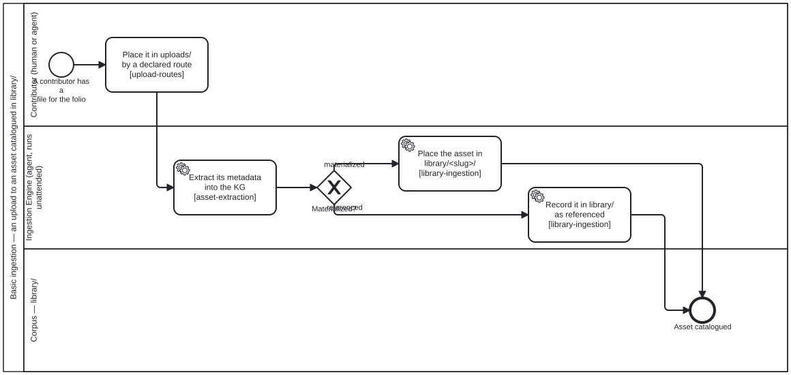

{: .note }
> Generated from `cat-harness/processes/library/document-ingestion.bpmn` by `gen-processes-viz.ts` — do not edit here. [All processes](index.html)


# Basic ingestion — an upload to an asset catalogued in library/

`Process_Ingestion` · advisory · 4 step(s)

folio-assistant — Basic ingestion — an upload to an asset catalogued in library/.

Source of truth: this file. Open it in bpmn.io, Camunda Modeler, or any other
BPMN 2.0 tool. The SVG under docs/assets/img/workflows/ is generated from it
by `bun run render:bpmn` — never hand-edit the SVG.

The <bootstrap.processes:skill> extension on an activity names the folio-assistant skill
that implements it; <cat-harness.processes:bean> marks a step that reads or writes the shared
work plan in beans/.

REWRITTEN AS THE BASIC FLOW in placement PR6 (bean `apcg`; owner ruling 3, 2026-09-30): "only basic doc ingestion high level workflow in cat-harness. very little process context assumed. just that the uploaded asset has extracted metadata inserted into KG and asset in library/ (if materialized)." Accept, extract the metadata into the KG, ask whether the asset is materialized, place it in library/<slug>/. It calls NO subprocess and makes no content-type decision.

THE ID `Process_Ingestion` IS KEPT ON PURPOSE: `methodology-from-source.bpmn`'s Call_Ingest names it, and so does every higher-layer process that refines this flow. Refinement is by INVERSION — a refining process calls this one as its first step and continues with its own work; nothing here names a refinement, because the corpus has no BPMN extension point and a harness diagram naming a higher one would be an upward edge. The document pipeline that used to be this diagram's body (rungs, the four ingest phases, the L1 completeness gate, promotion, the summary queue) is such a refinement now, in the layer above.

## How it connects

- **Called by:** [Adopt a methodology from a source document](methodology-from-source.html), [L1 document ingestion — a document to the L1 source knowledge graph](l1-document-ingestion.html)
- **Calls:** none
- **Presented on:** [Document ingestion — `uploads/` and `library/` are two stages of one pipeline](../document-ingestion.html#uploads-and-library-are-two-stages-of-one-pipeline)

## Lanes — who acts

| lane | role | what it does here |
|---|---|---|
| Contributor (human or agent) | `user` | Whoever puts the file in the queue. UNDOCUMENTED UNTIL 2026-09-30, and legitimately so until then: the lane held nothing but a start event, and a lane with no activity has no performer to describe. Task_Place gave it one. "HUMAN OR AGENT" IS A MEASUREMENT, NOT A HEDGE. Over this repository's own history both have stood here: files have reached a queue in commits authored by `Carl Leitner` (including 16 made through the forge's web form, committer `GitHub`) and in commits authored by `Claude`. That is why Task_Place is a plain `bpmn:task` rather than a `userTask` — asserting a human performs it would contradict the lane's own role graph, which is what `activity-fulfilment-kind` exists to catch. WHAT THE LANE IS ACCOUNTABLE FOR, and where it ends. Choosing a route, writing the bytes into the DECLARED queue of the instance that will own them, and discharging afterwards whatever that route could not — the web form has no working tree, so no pre-commit hook and no generator runs on it. The lane does NOT ingest and does not clean the queue: it hands over, and Lane_1 takes it from there. `upload-routes` carries the routes and their obligations. |
| Ingestion Engine (agent, runs unattended) | `ingestion-agent` | Runs the basic flow from the metadata step to the placement in library/, unattended: every decision in it is decidable from the material and its declarations. It asks one question — is the asset materialized? — and that is answered from the materialization state vocabulary (`schemas/materialization-state.ts`, placement PR5), not by judgement. It does NOT choose a reader for the bytes, derive sections or blocks, or describe images: those are a refining process's work, which calls this flow first. THE FLOW ENDS IN THIS LANE. The asset catalogued in library/ — held, or recorded as referenced — is the terminal state, and every knowledge-graph reference to it resolves through library/ from here; a refining process continues from it rather than being drawn into this one. There is no separate corpus lane: it would hold only the end event, and a lane with no activity has no performer to describe. |

## Steps

Every one of the 4 step(s) is documented.

| step | lane | skill / sub-process | what it does |
|---|---|---|---|
| **Place it in uploads/ by a declared route** `Task_Place` | Contributor (human or agent) | [`upload-routes`](../reference/skill-instructions/upload-routes.html) | THE FIRST LINK, and it did not exist until 2026-09-30. Everything downstream of here takes a file that is already in the queue, and both ingest Tools type their first input as "The upload to ingest, under the declared `uploads` graph". So the act of PUTTING it there was performed by three different mechanisms and governed by none of them. WHAT THIS STEP IS. The basic flow's ACCEPT step: choosing an arrival route, writing the bytes into the declared queue of the instance that will own them, and discharging what that route does not discharge for you. The routes, what each writer owes, and the two that are mechanisms against the one that is a persona are in the `upload-routes` skill; `upload-url` composes the forge URL for the web route from the declaration rather than from a literal, because a hand-written one 404'd. WHY A PLAIN `bpmn:task` AND NOT A `userTask`. A `userTask` asserts a human performs it, and this lane is named "Contributor (human or agent)" precisely because both do — measured over this repository's own history, files have reached `uploads/` in commits authored by `Carl Leitner` and in commits authored by `Claude`. Asserting human-only here would be the `activity-fulfilment-kind` contradiction written deliberately: the diagram saying one thing and the lane's role graph another. A plain task asserts nothing about the performer, which is the truth. WHY THE BEAN OP IS `note` AND NOT `claim`. Placing a file claims nothing; it adds to a queue. What it owes the work plan is visibility — three batches of PDFs arrived through the forge's web UI (`c8349950fa5`, `f4ddfc65c8d`, `b8549160bb1`) with no bean, no PR and no note, and the first sibling to notice was a generator going stale. A note against the ingestion bean is what makes the queue's growth something another session can see. |
| **Extract its metadata into the KG** `Task_ExtractMetadata` | Ingestion Engine (agent, runs unattended) | [`asset-extraction`](../reference/skill-instructions/asset-extraction.html) | THE METADATA STEP. What enters the knowledge graph is the asset's INDEX — what it is, how big, what type, when it says it was written — and, for a container, what is in it; its contents do not go in unless somebody asks, with a reason. Owner, 2026-09-20: "make sure you have zip ingestion skills to extract metadata of assets into KG. don't extract contents unless explict ask by user." The tool is `cat-harness-tools/scripts/extract-assets.ts`, writing a `folio-extraction/v1` record (`schemas/extraction.ts`, moved down to this layer in placement PR5). The media type is sniffed from the leading bytes, never taken from the extension. |
| **Place the asset in library/<slug>/** `Task_PlaceInLibrary` | Ingestion Engine (agent, runs unattended) | [`library-ingestion`](../reference/skill-instructions/library-ingestion.html) | The materialized branch. The asset lands in library/<slug>/ with its metadata record, its provenance and its fixity. The folder name IS the citation key, so a citation and a directory are the same string. The upload is then RETIRED, not left and not deleted: it moves to fsh-guts/uploads/ beside a sidecar naming where it came from and when (owner, 2026-09-29), and `check:uploads-retired` finds one that was not. A refining process that derives content from the bytes does so before that retirement; `library-ingestion` carries the rule. |
| **Record it in library/ as referenced** `Task_CatalogueReference` | Ingestion Engine (agent, runs unattended) | [`library-ingestion`](../reference/skill-instructions/library-ingestion.html) | The referenced branch. Nothing is fetched and no bytes are written: the catalogue record says where the asset is and that we hold none. A reference is not a fetch — it stays navigable without being held, and materializing it later is `materialize-remote.bpmn`'s decision, with its purpose and five gates, not this flow's. |

## Decisions

Every one of the 1 decision(s) is documented.

| decision | what decides it | branches |
|---|---|---|
| **Materialized?** `Gateway_Materialized` | Answered from the materialization state (`schemas/materialization-state.ts`): `materialized` means the bytes are here; `referenced` means we know where they are and hold none. `unknown` is not a third branch here because a node must DECLARE its state — there is no default — and an asset this flow cannot classify is recorded as referenced-with-a-reason rather than placed as if held. Collapsing referenced into materialized is the failure the vocabulary exists to stop: corpus-grep searches library/ only, so a referenced node placed as held reads as present to every consumer. | **materialized** → Place the asset in library/<slug>/ **referenced** → Record it in library/ as referenced |


