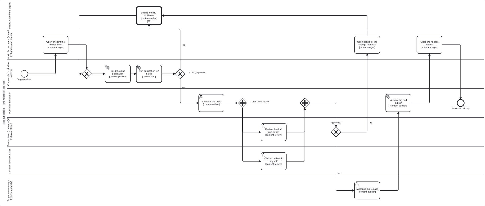

{: .note }
> Generated from `cat-harness/processes/draft-to-publication.bpmn` by `gen-processes-viz.ts` — do not edit here. [All processes](index.html)


# Draft, review and publish

`Process_Publication` · strict · 11 step(s)

folio-assistant — corpus to draft publication to officially published. Source of truth: this file. Open it in bpmn.io, Camunda Modeler, or any other BPMN 2.0 tool. The SVG under docs/assets/img/workflows/ is generated from it by `bun run render:bpmn` — never hand-edit the SVG. The <bootstrap.processes:skill> extension on an activity names the folio-assistant skill that implements it; <cat-harness.processes:bean> marks a step that reads or writes the shared work plan in beans/.

## How it connects

- **Called by:** [Content lifecycle](content-lifecycle.html)
- **Calls:** [Editing and HCI validation](editing-hci-validation.html)

## Lanes — who acts

| lane | role | what it does here |
|---|---|---|
| Editors + authoring agents | `editor` | The one call activity both rejection paths loop back to — a red QA gate directly, and a review rejection only once Lane_WorkPlan has turned each finding into a bean — so a fix here never needs to know which failure sent it back. |
| Work plan — beans (shared by humans and agents) | `work-plan` | Carries the release's own state across the cycle: the release bean opened at the start says what is in the draft and who holds it, a rejected review becomes one change bean per finding before the loop back to editing, and only this lane's close marks a release actually done rather than merely built. |
| Corpus + build pipeline (system) | `build-pipeline` | Owns the one gate that decides whether the draft is fit to be circulated: Task_BuildDraft turns the corpus into a draft and the DMN-backed Gateway_QaGreen decides whether Task_CirculateDraft ever runs, so a red result here is caught before Lane_ReviewTeam or Lane_Sme spend time on a draft that was never fit to review. |
| Publication manager | `publication-manager` | Fans the QA-gated draft out to review and SME sign-off in parallel, then — once the programme manager authorises — is the only lane that actually presses publish, so both the review verdict and the release authority pass through this one hand before anything goes live. |
| Review team (content · QC · technical officer) | `reviewer` | Owns the single approved/not-approved gateway the whole review rests on: it fires only after Lane_Sme's sign-off has also reached the join, but the call is this lane's alone, and a rejection here is what turns into the change beans Lane_WorkPlan opens next. |
| Clinical / scientific SMEs | `clinical-sme` | Runs in parallel with Lane_ReviewTeam, not after it — Gateway_ReviewJoin waits on both — but does not own the approve/reject gateway that follows: sign-off here is necessary for the join to complete and nothing more, which keeps a clinical judgement from also becoming the phase-gate call. |
| Programme manager (release authority) | `programme-manager` | Sits between review's approval and the actual publish — a second, distinct gate on an already-approved draft, because content being right and a release being authorised to ship are two different questions, and only this lane answers the second one. |

## Steps

Every one of the 11 step(s) is documented.

| step | lane | skill / sub-process | what it does |
|---|---|---|---|
| **Open or claim the release bean** `Task_OpenReleaseBean` | Work plan — beans (shared by humans and agents) | [`todo-manager`](../reference/skill-instructions/todo-manager.html) | The release itself is a bean: it carries what is in this draft, what is outstanding, and who is holding it. |
| **Build the draft publication** `Task_BuildDraft` | Corpus + build pipeline (system) | [`content-publish`](../reference/skill-instructions/content-publish.html) | Render the corpus into the draft form of the folio: PDF, HTML site, or FHIR IG. |
| **Run publication QA gates** `Task_PublicationQa` | Corpus + build pipeline (system) | [`content-test`](../reference/skill-instructions/content-test.html) [`quality-control`](../reference/skill-instructions/quality-control.html) | Publication-readiness QA across layers — QC reports, IG Publisher QA, proof status, broken links, build warnings. |
| **Editing and HCI validation** `CallActivity_Editing` | Editors + authoring agents | calls [Editing and HCI validation](editing-hci-validation.html) [`content-author`](../reference/skill-instructions/content-author.html) [`content-validate`](../reference/skill-instructions/content-validate.html) | The editing sub-process. Every change to the corpus goes through its HCI validation gate — a red draft is fixed there, never by patching the built artifact. |
| **Circulate the draft** `Task_CirculateDraft` | Publication manager | [`content-review`](../reference/skill-instructions/content-review.html) | The draft publication is circulated to the review team for formal review. |
| **Review the draft publication** `Task_ReviewDraft` | Review team (content · QC · technical officer) | [`content-review`](../reference/skill-instructions/content-review.html) | Content reviewer, QC reviewer and technical officer review the draft as a whole — coherence, phase-gate criteria, breaking vs non-breaking change. |
| **Clinical / scientific sign-off** `Task_SmeSignoff` | Clinical / scientific SMEs | [`content-review`](../reference/skill-instructions/content-review.html) | Domain sign-off: clinical SMEs for a guideline, subject-matter reviewers for a paper. |
| **Open beans for the change requests** `Task_OpenChangeBeans` | Work plan — beans (shared by humans and agents) | [`todo-manager`](../reference/skill-instructions/todo-manager.html) [`content-feedback`](../reference/skill-instructions/content-feedback.html) | Each requested change becomes a bean, so the editors and agents picking the work up next see exactly what review asked for and what is still open. |
| **Authorise the release** `Task_AuthorizeRelease` | Programme manager (release authority) | [`content-publish`](../reference/skill-instructions/content-publish.html) | Publication requires authorisation by the programme manager or designated authority. |
| **Version, tag and publish** `Task_PublishRelease` | Publication manager | [`content-publish`](../reference/skill-instructions/content-publish.html) [`ig-publication`](../reference/skill-instructions/ig-publication.html) | Version bump, release notes, tag, build the final artifacts, deploy to the publication platform. |
| **Close the release beans** `Task_CloseReleaseBeans` | Work plan — beans (shared by humans and agents) | [`todo-manager`](../reference/skill-instructions/todo-manager.html) | What shipped is resolved; what slipped stays open and carries into the next cycle. |

## Decisions

Every one of the 2 decision(s) is documented.

| decision | what decides it | branches |
|---|---|---|
| **Draft QA green?** `Gateway_QaGreen` | Answered by the publication QA gates. `no` returns to editing and HCI validation; `yes` circulates the draft. | **no** → Editing and HCI validation **yes** → Circulate the draft |
| **Approved?** `Gateway_ReviewOutcome` | Asked once every reviewer has answered: is the draft approved? `no` opens beans for the change requests; `yes` goes to authorising the release. | **no** → Open beans for the change requests **yes** → Authorise the release |


