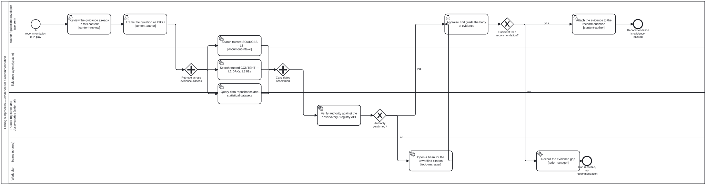

{: .note }
> Generated from `cat-harness/processes/evidence-retrieval.bpmn` by `gen-processes-viz.ts` — do not edit here. [All processes](index.html)


# Evidence for a recommendation

`Process_EvidenceRetrieval` · strict · 10 step(s)

The author reviews the guidance already in their content, frames the question as PICO, retrieves candidate evidence across three classes (trusted L1 sources, trusted L2/L3 content, data repositories), verifies each candidate's authority against the publishing body's own API, grades the body of evidence, and either attaches it to the recommendation or records the gap. STRAWPERSON: registries, grading system and API bindings are not fixed here.

## How it connects

- **Called by:** [Editing and HCI validation](editing-hci-validation.html)
- **Calls:** none

## Lanes — who acts

| lane | role | what it does here |
|---|---|---|
| Author / guideline developer (person) | `author` | Brackets the machine work rather than doing it: frames the PICO before Lane_Agent fans out across evidence classes, then is the only lane that grades what comes back and decides whether it is sufficient for a recommendation — retrieval and authority-checking are delegated, but the judgement that turns evidence into a claim never leaves this lane. |
| Evidence agent (system) | `evidence-agent` | The appraisal in the role's own description happens elsewhere in this diagram: this lane only fans out in parallel across the three evidence classes and joins the candidates, while grading is Lane_Author's call and authority is Lane_Trusted's — so what it owns here is coverage, not judgement. |
| Trusted registries and observatories (external) | `external-registry` | Task_VerifyAuthority and its gateway sit here rather than with Lane_Agent because the decision is not this instance's call — it is a readout of what the external API returns, and the moment that answer is uncertain or absent, Lane_WorkPlan opens a bean rather than this lane inventing a verdict. |
| Work plan — beans (shared) | `work-plan` | Catches two different shortfalls at two different severities: an unverified citation is noted but the process continues into grading, while an insufficient body of evidence ends the process at its own event — so only the second is fatal, and both stay visible in the work plan rather than one being silently absorbed into the other. |

## Steps

Every one of the 10 step(s) is documented.

| step | lane | skill / sub-process | what it does |
|---|---|---|---|
| **Review the guidance already in this content** `Task_ReviewExisting` | Author / guideline developer (person) | [`content-review`](../reference/skill-instructions/content-review.html) | The author reads what the document, DAK or IG ALREADY says on this question, before looking outward. A recommendation that contradicts a sibling recommendation in the same artefact is a defect no external evidence will reveal. |
| **Frame the question as PICO** `Task_FramePico` | Author / guideline developer (person) | [`content-author`](../reference/skill-instructions/content-author.html) | Population, Intervention, Comparator, Outcome. The PICO is what makes the search reproducible and the evidence auditable: without it, 'we looked for evidence' is not a claim anyone can check. WHO guideline development states the question this way before any retrieval. |
| **Search trusted SOURCES — L1** `Task_L1Sources` | Evidence agent (system) | [`document-intake`](../reference/skill-instructions/document-intake.html) | Ingested primary literature under library/: the sections/*.md tree and, where a document was scanned, ocr/page-NNN.txt. NOTE the known blind spot — a document OCR'd but never re-run through pdf-structure.py has only a stub in sections/, so a sections-only search misses it. |
| **Search trusted CONTENT — L2 DAKs, L3 IGs** `Task_L2L3Content` | Evidence agent (system) | [`document-intake`](../reference/skill-instructions/document-intake.html) [`document-intake`](../reference/skill-instructions/document-intake.html) [`document-intake`](../reference/skill-instructions/document-intake.html) | Already-adjudicated guidance: WHO SMART DAKs at L2 and FHIR Implementation Guides at L3. A recommendation adopted in a published DAK is evidence of a different kind from a primary study -- it is a prior decision, with its own provenance, and must be cited as that rather than laundered into primary evidence. NOT YET SKILL-BACKED. This step named `corpus-search`, which has never existed. It is not `corpus-grep`, whose job is the pre-declaration check that something really is an open gap — searching adjudicated L2/L3 content for evidence is a different task, so pointing the ref there would have been a plausible-looking wrong answer. Left uncovered until the skill is written. |
| **Query data repositories and statistical datasets** `Task_DataRepos` | Evidence agent (system) | [`document-intake`](../reference/skill-instructions/document-intake.html) [`document-intake`](../reference/skill-instructions/document-intake.html) [`document-intake`](../reference/skill-instructions/document-intake.html) | Indicator and microdata sources. Distinct from the two above because the unit of evidence is a MEASUREMENT with a population, a period and a method, not a claim in prose. |
| **Verify authority against the observatory / registry API** `Task_VerifyAuthority` | Trusted registries and observatories (external) | — | Each candidate is resolved against the standard API of the body that publishes it, so that 'authoritative' is a RESOLVED FACT rather than an assertion in the citation. What is checked: that the identifier resolves at the publisher; that the retrieved record matches what the citation claims; that the version and date are the ones cited; and that the publisher is one this folio has declared trusted. STRAWPERSON: the concrete registry list and endpoints are not settled here -- see the folio:policy note. |
| **Open a bean for the unverified citation** `Task_RecordUnverified` | Work plan — beans (shared) | [`todo-manager`](../reference/skill-instructions/todo-manager.html) | An unresolvable citation is not dropped and not silently kept. It becomes a tracked item, so the gap is visible in the work plan rather than surviving as a footnote nobody re-checks. |
| **Appraise and grade the body of evidence** `Task_AppraiseGrade` | Author / guideline developer (person) | [`evidence-appraisal`](../reference/skill-instructions/evidence-appraisal.html) | Certainty of evidence per the grading system the folio declares. The grade attaches to the BODY of evidence for one PICO question, not to an individual citation -- which is why this step is after the join and not inside the fan-out. |
| **Record the evidence gap** `Task_RecordGap` | Work plan — beans (shared) | [`todo-manager`](../reference/skill-instructions/todo-manager.html) | Insufficient evidence is a RESULT. It is recorded as such -- an honest gap the guideline can state -- rather than being closed by weakening the recommendation until the available evidence supports it. |
| **Attach the evidence to the recommendation** `Task_AttachEvidence` | Author / guideline developer (person) | [`content-author`](../reference/skill-instructions/content-author.html) | The PICO, the graded body of evidence, each verified citation and its resolved authority record are written onto the recommendation block, so a reader can retrace the whole chain from the sentence back to the source. |

## Decisions

Every one of the 2 decision(s) is documented.

| decision | what decides it | branches |
|---|---|---|
| **Authority confirmed?** `Gateway_Authoritative` | Answered by checking the source against the observatory or registry API: is its authority confirmed? `no` opens a bean for the unverified citation; `yes` goes on to appraise and grade the evidence. | **no** → Open a bean for the unverified citation **yes** → Appraise and grade the body of evidence |
| **Sufficient for a recommendation?** `Gateway_Sufficient` | Answered by the appraisal: is the graded evidence enough to support a recommendation? `no` records the evidence gap; `yes` attaches the evidence to the recommendation. | **no** → Record the evidence gap **yes** → Attach the evidence to the recommendation |


