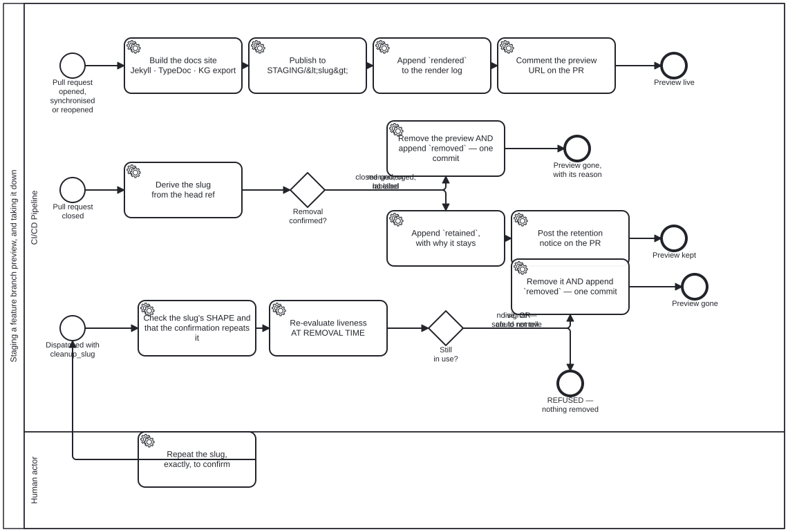

{: .note }
> Generated from `cat-harness/processes/feature-staging.bpmn` by `gen-processes-viz.ts` — do not edit here. [All processes](index.html)


# Staging a feature branch preview, and taking it down

`Process_FeatureStaging` · strict (defaulted) · 12 step(s)

THE LIFECYCLE OF A REVIEW PREVIEW, drawn rather than described. Bean `7yvd`, owner: "make sure all workflows documented as bpmn". This is the first `.github/workflows/*.yml` documented here, and it was chosen because its shape was the least visible: three jobs, eight `if:` branches, a confirmation gate and a deletion trigger, written down only in a sixty-line YAML comment. Three entry points, and they are three different processes sharing a file. A pull request opened or pushed to STAGES a preview. A pull request CLOSED asks whether the preview should go. A dispatch removes ONE preview that the first two can no longer reach — bean `w2g5`: the health sweep can only ever report a preview whose pull request is already closed, so by the time anybody reads the finding the event has fired, the job has run and the label was absent. Labelling afterwards fires nothing. TWO GATEWAYS, and both are three-state rather than yes/no. `Removal confirmed?` reads a merge as confirmation in its own right (bean `1feu`) while still requiring a label for a close without a merge. `Still in use?` refuses on a live signal AND on could-not-tell, because a preflight that has gone blind must not read as permission. EVERY PATH THAT CHANGES `STAGING/` WRITES TO THE RENDER LOG, and the two removal paths write the record in the SAME COMMIT as the removal. A separate log push can fail alone and leave a preview that vanished with nothing saying why, which is the state bean `plj1` left the publish branch in for months. The single human step is the dispatch confirmation. Everything else is mechanical, which is what makes `build-pipeline` the right lane rather than a convenient one.

## How it connects

- **Called by:** no call activity names this process
- **Calls:** none
- **Names the `feature-staging` skill without calling this process:** [Content Change and Review](content-change-review.html), [CRDM Phase 6 — implement, MVP, acceptance](crdm-deliver.html), [Publishing the docs site, and keeping the previews alive](docs-site-publish.html), [Adopting an upstream version bump](upstream-version-adoption.html) — `activity-calls-skill-process` asks whether each should be a call activity.
- **Skill:** [`feature-staging`](../reference/skill-instructions/feature-staging.html)

## Lanes — who acts

| lane | role | what it does here |
|---|---|---|
| CI/CD Pipeline | `build-pipeline` | Runs all three entry points — stage, cleanup, cleanup-dispatch — as one actor because none of the work in any of them needs judgement; the one step that does, confirming a dispatch deletion, was carved out into Lane_Human rather than left here. Every path that changes `STAGING/` writes its render-log entry in the SAME commit as the change, because a log push that can fail on its own is exactly how a preview vanishes with nothing on the branch saying why. |
| Human actor | `user` | The only lane whose actor cannot be a machine — `deletion-requires-confirmation` is not satisfied by a click, so H_Confirm must repeat the slug rather than approve generically, which is what stops a confirmation from an earlier run being replayed against a different preview. It precedes Start_Dispatch rather than following it, so the dispatch entry point cannot fire at all until this lane has acted. |

## Steps

Every one of the 12 step(s) is documented.

| step | lane | skill / sub-process | what it does |
|---|---|---|---|
| **Build the docs site Jekyll · TypeDoc · KG export** `Task_Build` | CI/CD Pipeline | [`feature-staging`](../reference/skill-instructions/feature-staging.html) | Build the preview from the PR's head: regenerate the generated docs, trim what this preview does not need, render the BPMN diagrams, then Jekyll, TypeDoc and the knowledge-graph export, with the staging banner and SEO identity claims stripped. |
| **Publish to STAGING/&lt;slug&gt;** `Task_Deploy` | CI/CD Pipeline | [`feature-staging`](../reference/skill-instructions/feature-staging.html) | `keep_files: true` and a `destination_dir`, so this push adds one directory beside whatever else is on the branch. It is also RETRIED once: five other workflows push to `gh-pages` without joining this one's concurrency group, and a queue does not help because GitHub CANCELS a pending job when a newer one arrives for the same group rather than queueing it. Measured 2026-09-19: three staging runs from three different branches inside 17 seconds, two cancelled. |
| **Append `rendered` to the render log** `Task_LogRendered` | CI/CD Pipeline | [`render-logging`](../reference/skill-instructions/render-logging.html) | Its OWN commit, not part of the deploy. The publish action writes only into `destination_dir`, so an entry riding in `_site` would land at `STAGING/<slug>/_render-log/` — inside the directory a cleanup removes, which is the one place a record of the removal must not be. `continue-on-error`: a preview that deployed and whose entry did not is a gap in the record, not a failed deploy. |
| **Comment the preview URL on the PR** `Task_Comment` | CI/CD Pipeline | [`staging-review`](../reference/skill-instructions/staging-review.html) | Post, or update in place, one comment on the PR giving the preview URL (STAGING/<slug>/) and the commit it was built from. Pull-request events only. |
| **Derive the slug from the head ref** `Task_Slug` | CI/CD Pipeline | [`feature-staging`](../reference/skill-instructions/feature-staging.html) | Derive the slug from the PR's head ref: every character outside [a-zA-Z0-9._-] becomes '-', runs of '-' collapse, and leading or trailing '-' is trimmed. It must be one safe path segment, checked by value. |
| **Remove the preview AND append `removed` — one commit** `Task_Remove` | CI/CD Pipeline | [`deletion-requires-confirmation`](../reference/skill-instructions/deletion-requires-confirmation.html) | ONE COMMIT for the removal and its record. A separate log push can fail on its own and leave a preview that vanished with nothing saying why — which is the exact state bean `plj1` left the branch in. `render-log.ts` refuses a `removed` entry with no reason, so this step fails loudly rather than writing a record that says an artefact went and not why. |
| **Append `retained`, with why it stays** `Task_LogRetained` | CI/CD Pipeline | [`render-logging`](../reference/skill-instructions/render-logging.html) | The event that makes the log worth reading. A removal was CONSIDERED and refused; without an entry that leaves no trace on the branch at all, and the next person asking *"why is this preview still up"* has only a comment on a pull request that may itself be closed. |
| **Post the retention notice on the PR** `Task_Notice` | CI/CD Pipeline | [`staging-review`](../reference/skill-instructions/staging-review.html) | Removal was not confirmed, so the preview stays: post a retention notice on the PR giving its URL and saying it has NOT been removed, and the two ways to remove it: the staging:cleanup label while the PR is open, or, once it is closed, a Run workflow dispatch with cleanup_slug and a matching cleanup_confirm. |
| **Check the slug's SHAPE and that the confirmation repeats it** `Task_Validate` | CI/CD Pipeline | [`deletion-requires-confirmation`](../reference/skill-instructions/deletion-requires-confirmation.html) | Guarded three ways because a dispatch input is a DELETION TRIGGER. `workflow_dispatch` is available only to an actor with write access; the slug must match exactly the characters the sed pipeline can produce, with `.` and `..` refused by name; and the confirmation must repeat the slug, so a confirmation cannot be carried over from an earlier run against a different preview. |
| **Re-evaluate liveness AT REMOVAL TIME** `Task_Preflight` | CI/CD Pipeline | [`deletion-requires-confirmation`](../reference/skill-instructions/deletion-requires-confirmation.html) | Re-evaluated AT REMOVAL TIME, through the same `previewLiveness` the health sweep uses rather than a second implementation of it. The sweep runs daily and proposes; this acts. Between them a branch can come back to life — bean `w2g5` documents exactly that, a session reusing one branch across five successive pull requests. |
| **Remove it AND append `removed` — one commit** `Task_RemoveDisp` | CI/CD Pipeline | [`deletion-requires-confirmation`](../reference/skill-instructions/deletion-requires-confirmation.html) | Say what is going — size and file count — then remove STAGING/<slug>/ and append `removed` to the render log in the SAME commit, so a preview cannot vanish without a record of who dispatched it and why. The slug is a dispatch input, so the tool re-checks it by value rather than trusting the guard. |
| **Repeat the slug, exactly, to confirm** `H_Confirm` | Human actor | [`deletion-requires-confirmation`](../reference/skill-instructions/deletion-requires-confirmation.html) | The one step in this process that is a person's. Repeating the slug is not ceremony: it names the artefact being confirmed, so a confirmation cannot be inherited by a later run pointed at a different preview. |

## Decisions

Every one of the 2 decision(s) is documented.

| decision | what decides it | branches |
|---|---|---|
| **Removal confirmed?** `GW_Confirmed` | THREE inputs, two outcomes, and bean `1feu` set the split: a MERGED pull request needs no label, because the merge IS the confirmation — a person decided the content belongs on `main`, which says more about the preview than a label does. A pull request closed WITHOUT merging still needs `staging:cleanup`, because there the preview is the only rendering of that work: not redundant, the last copy. The branch taken is emitted as `reason=merged \| labelled \| closed-unmerged-and-unlabelled` and written into the log entry, so an audit of a removal can tell which rule did it. | **merged, or labelled** → Remove the preview AND append `removed` — one commit **closed unmerged, no label** → Append `retained`, with why it stays |
| **Still in use?** `GW_Live` | THREE states, and the third is why this gateway exists. Still in use → refuse, exit 1. COULD NOT TELL → refuse, exit 2. Only a determined absence of every liveness signal removes anything. Refusing to delete is the only recoverable direction, and a preflight that has gone blind must not read as permission. | **no signal — safe to remove** → Remove it AND append `removed` — one commit **live, OR could not tell** → REFUSED — nothing removed |


