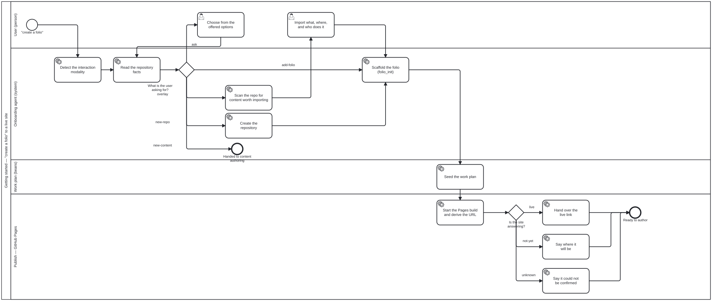

{: .note }
> Generated from `cat-harness/processes/getting-started.bpmn` by `gen-processes-viz.ts` — do not edit here. [All processes](index.html)


# Getting started

`Process_GettingStarted` · strict · 12 step(s)

folio-assistant — getting started: from "create a folio" to a live site. "Create a folio" is five different requests. Gateway_Intent computes which one from decisions/folio-intent.dmn rather than letting the agent assume, and `ask` is one of the outcomes the table can return. Gateway_Live applies the same construction to publication, with `unknown` kept distinct from `not-yet`. Source of truth: this file. The SVG under docs/assets/img/workflows/ is generated from it by `bun run render:bpmn` — never hand-edit the SVG.

## How it connects

- **Called by:** no call activity names this process
- **Calls:** none
- **Skill:** [`getting-started`](../reference/skill-instructions/getting-started.html)

## Lanes — who acts

| lane | role | what it does here |
|---|---|---|
| User (person) | — | Answers the one question Gateway_Intent cannot compute for itself — "ask" is one of five outcomes decisions/folio-intent.dmn can return — and, only on the overlay path, three further questions a repo scan cannot answer on its own: what to import, where it goes, and who does the importing. |
| Onboarding agent (system) | — | Every write in this diagram belongs to this lane, and each sits behind the non-relaxable read-first gate: nothing is created or scaffolded until Gateway_Intent has classified what was actually asked for, which is what stands between this lane and writing over somebody's existing project. |
| Work plan (beans) | — | Seeds one bean per top-level content object the author named, positioned after scaffolding but before the Pages probe — a work plan exists for a folio whose publication status is not yet known, rather than waiting on that answer. |
| Publish — GitHub Pages | — | Derives the URL and holds the three-way report that follows it: "live", "not-yet" and "unknown" are reached by exclusive branches of one DMN-computed gateway, and this lane is what keeps a failed probe from being reported as the softer "not-yet" it would be tempting to default to. |

## Steps

Every one of the 12 step(s) is documented.

| step | lane | skill / sub-process | what it does |
|---|---|---|---|
| **Detect the interaction modality** `Task_DetectModality` | Onboarding agent (system) | [`interaction-modality`](../reference/skill-instructions/interaction-modality.html) | Before the first question is asked, establish HOW to ask it: audio, ordinary chat, selectable options for a user with limited hand function, large-type for low vision. A user who finds the questions unusable never reaches the rest of this diagram. |
| **Read the repository facts** `Task_ReadFacts` | Onboarding agent (system) | [`getting-started`](../reference/skill-instructions/getting-started.html) | Mechanical, read-only: does a `<name>.config.json` declare a contentType, does the working tree hold somebody's existing project, and what has the user actually said. These are the three inputs to folio-intent.dmn. Non-relaxable: scaffolding without looking first is how a folio gets written over somebody's project. |
| **Choose from the offered options** `Task_AskIntent` | User (person) | [`interaction-modality`](../reference/skill-instructions/interaction-modality.html) [`getting-started`](../reference/skill-instructions/getting-started.html) | The question is presented as a short list of selectable options, never as free prose, and the list names the top-level content types the agent knows about. The answer becomes the statedIntent fact and the table is evaluated again — the user's answer is read as evidence, like any other fact. |
| **Scan the repo for content worth importing** `Task_ScanRepo` | Onboarding agent (system) | [`repo-conversion`](../reference/skill-instructions/repo-conversion.html) [`document-intake`](../reference/skill-instructions/document-intake.html) | Read-only. Classifies candidates into library/ (external source) and content/ (authored here), and reports what it could not classify as its own bucket rather than forcing every file into one of the two. |
| **Import what, where, and who does it** `Task_ConfirmImport` | User (person) | [`repo-conversion`](../reference/skill-instructions/repo-conversion.html) [`dispatch-agent`](../reference/skill-instructions/dispatch-agent.html) | Three questions the scan cannot answer: import these or not; library or content for each group; leave the files where they are or reorganize to declutter. Plus whether to dispatch one ingestion agent or a small swarm. Non-relaxable: nobody's files are moved or imported on inference. |
| **Create the repository** `Task_CreateRepo` | Onboarding agent (system) | [`repo-conversion`](../reference/skill-instructions/repo-conversion.html) | Only on the new-repo branch, and only after the user has named it. An empty working directory is scaffolded in place instead. |
| **Scaffold the folio (folio_init)** `Task_Scaffold` | Onboarding agent (system) | [`getting-started`](../reference/skill-instructions/getting-started.html) | content/, uploads/, library/, the first manifests, <slug>.json and <slug>.config.json, the builder shim, AGENTS.md with its stubs, .mcp.json, the session-start hook and the beans store. Refuses rather than overwrites when a folio is already present. |
| **Seed the work plan** `Task_SeedPlan` | Work plan (beans) | [`todo-manager`](../reference/skill-instructions/todo-manager.html) | The first beans: what the author said they want to get started on, one bean per top-level content object they named. |
| **Start the Pages build and derive the URL** `Task_PagesBootstrap` | Publish — GitHub Pages | [`getting-started`](../reference/skill-instructions/getting-started.html) | scripts/pages-bootstrap.ts: derive the site URL from the git remote or <name>.config.json, report whether a publish workflow exists, and optionally probe until the site answers. |
| **Hand over the live link** `Task_ReportUrl` | Publish — GitHub Pages | [`getting-started`](../reference/skill-instructions/getting-started.html) | Confirmed live. The link is given as a link, and the author is told what is on it. |
| **Say where it will be** `Task_ReportPending` | Publish — GitHub Pages | [`getting-started`](../reference/skill-instructions/getting-started.html) | A measured 404. The author is told the address and that the first build has not landed there yet — which is useful, and is not the same as being told it is live. |
| **Say it could not be confirmed** `Task_ReportUnknown` | Publish — GitHub Pages | [`getting-started`](../reference/skill-instructions/getting-started.html) | No URL, no probe, or a failed request. Reported as "could not check", never as "not yet" and never as "live". |

## Decisions

Every one of the 2 decision(s) is documented.

| decision | what decides it | branches |
|---|---|---|
| **What is the user asking for?** `Gateway_Intent` | Computed, not chosen. decisions/folio-intent.dmn returns one of five branches from statedIntent, isFolio and repoHasContent. Non-relaxable: this gateway IS the fix. | **ask** → Choose from the offered options **overlay** → Scan the repo for content worth importing **new-repo** → Create the repository **new-content** → Handed to content authoring **add-folio** → Scaffold the folio (folio_init) |
| **Is the site answering?** `Gateway_Live` | Computed from decisions/pages-live-gate.dmn. Three outcomes, and `unknown` is not a softer `not-yet`. | **live** → Hand over the live link **not-yet** → Say where it will be **unknown** → Say it could not be confirmed |


