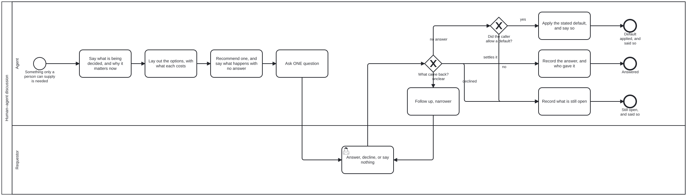

{: .note }
> Generated from `bootstrap/processes/human-agent-discussion.bpmn` by `gen-processes-viz.ts` — do not edit here. [All processes](index.html)


# Human–agent discussion

`Process_HumanAgentDiscussion` · strict (defaulted) · 13 step(s)

A REUSABLE SUB-PROCESS, never an entry point. Every diagram in bootstrap that needs something only a person can supply — a choice, a judgement, a step only they have the rights to perform — reaches it through a call activity with calledElement="Process_HumanAgentDiscussion", rather than drawing its own asking. One way of asking, drawn once: a caller that draws its own has a second answer to "how do I ask", free to drift from this one.

BEFORE ANY QUESTION, THE ASKER DETERMINES WHERE IT IS (owner, 2026-10-01: "i wanted to see more about determining context / role / process as part of precondition.. and that needs to be clarified as part of discussion/interaction"). Three things, each drawn as a task and declared below as a precondition of the first question: (1) the CONTEXT — what is already known, which declaration governs it, and what has already been decided, so a settled question is not reopened; (2) the ROLES — which Role the asker is acting as, and which Role the person answering holds, because an Actor performs a task in a Process AS a Role and the same Actor is a different Role in another diagram; (3) the PROCESS and TASK the question belongs to — or that there is none, and the agent is idle, classifying a request. A question asked without these is asked on behalf of nobody in particular: its context step has nothing to say, and its answer cannot be recorded against a step.

WHAT CANNOT BE DETERMINED IS ASKED FIRST. When any of the three cannot be determined from what the agent can read, that becomes the first question of this same discussion, in the same order (context, options, recommendation, one question), and the caller's own question waits, counted. Its answer is recorded and the three are determined again before the caller's question is put. No default is allowed for it: an agent that assumes which process or role it is in is asserting an authority nobody gave it.

THE ORDER IS THE PROCESS: context, then options, then a recommendation, then the question. Never the question first with the explanation available on request. The test a question must pass before it is put: can the reader answer it without opening anything? If answering needs them to open a file, an issue or the scrollback, the question is not ready.

WHAT HAPPENS IF NOBODY ANSWERS is said before the question is put, not decided after. A default may be applied only when the CALLER allows one (the decision is reversible and the caller's own instructions name the default), and it is then recorded as assumed, with the default named — never as the person's answer. Where the caller allows none (which harness a repository becomes is the standing example: a wrong answer succeeds at being the wrong thing), silence ends as unsettled.

SYMMETRIC IN ITS PARTICIPANTS. The answering lane is a person or a sibling agent that already holds the answer; the record says which, because the two are evidence of different weight.

NO work-plan element, and isExecutable is false, for the reasons initialize-harness gives.

## How it connects

- **Called by:** [Complete initialization](complete-initialization.html), [Determine the harness and repositories](discussion.html)
- **Calls:** none
- **Names the `human-agent-discussion` skill without calling this process:** [Determine the harness and repositories](discussion.html) — `activity-calls-skill-process` asks whether each should be a call activity.
- **Presented on:** no docs page section shows this diagram

## Lanes — who acts

| lane | role | what it does here |
|---|---|---|
| Agent | — | Whichever agent called this sub-process. It determines where it is, prepares the question, rules on whether an answer settles it, and records the outcome in the form its caller asked for. It never supplies the answer itself. |
| Requestor | `requestor` | The person who asked — or a sibling agent that already holds the answer. Answering, declining and saying nothing are all legitimate moves here, and each has its own end. |

## Steps

Every one of the 13 step(s) is documented.

| step | lane | skill / sub-process | what it does |
|---|---|---|---|
| **Determine the context: what is known, and already decided** `A_DetermineContext` | Agent | `human-agent-discussion` | Before composing anything: what is already known, each fact with where it came from; which declaration governs the matter (the instance's `<name>.json`, the diagram the caller is in, the Skill its task names); what state is recorded; and whether the question has ALREADY been decided — by the person earlier in the conversation, or in a declaration that quotes their ruling. A settled question is not asked again: asking it reopens a decision and spends the person's attention twice. Read it, do not remember it: cite what you read. What the caller handed in is checked here, not re-derived. |
| **Determine the roles: which you act as, and the person's** `A_DetermineRoles` | Agent | `human-agent-discussion` | An Actor performs a task in a Process AS a Role. Nothing is a Role by nature: the same agent is the Bootstrapping Agent in one diagram and another Role in the next, and which one it is depends on the lane of the task it is performing now. So say which Role you are acting as — the lane of the CALLING task, since this lane is variable — and which Role the person you ask holds (the Requestor, or whoever the calling lane names). It decides what you may ask them for: only the Requestor chooses a harness, and a question put to somebody who does not hold the decision gets an answer that settles nothing. |
| **Determine the process and task, or that you are idle** `A_DetermineProcess` | Agent | `human-agent-discussion` | Name the Process, the lane and the task the question belongs to, and say so in the message: "Process: Initialize a harness, at Determine the harness and repositories, as the Bootstrapping Agent". A reader who does not know which process you are in will assume the last one's rules still hold. If you are in no Process, that is an answer too: you are IDLE, and what you are doing is classifying a request to find the Process it belongs to — say that, rather than presenting a question as though a step had asked for it. You are OUT of process, and it is undetermined, when you cannot name the instance, when two candidates fit, when the step you believed was next is not the one the diagram enables, or when the work in hand was not what you said you would do. Do not infer your way back in. |
| **Ask first about what could not be determined** `A_AskUndeterminedFirst` | Agent | `human-agent-discussion` | The caller's question waits, and is counted ("one more question after this"). What is put first is the undetermined one: the context you could not establish, the Role you are not sure you hold, or the Process you cannot place this in. It goes through the same order as any question — say what you determined and what you could not, the candidates you see, the one you would pick and why — and it allows NO default: a Process or Role assumed rather than confirmed is an authority nobody gave. With more than one undetermined, ask about the outermost first (the Process before the Role before the context), since the outer answer usually settles the inner. |
| **Say what is being decided, and why it matters now** `A_GiveContext` | Agent | `human-agent-discussion` | First, and in the message itself: where you are (the Process and task, as which Role, asking whom — from the three determinations), what the decision is, what depends on it, and what is already known — each fact with where it came from. A link is where somebody goes for more; it is never where the terms are defined. |
| **Lay out the options, with what each costs** `A_LayOutOptions` | Agent | `human-agent-discussion` | Every option the agent could narrow the question to, each with what it costs and what it makes hard to undo. Narrow from context first: an option the agent could have ruled out itself wastes the reader's attention. |
| **Recommend one, and say what happens with no answer** `A_Recommend` | Agent | `human-agent-discussion` | Mark the option the agent would take and say why. Then say what happens if nobody answers: the default, when the caller allows one, or that the question stays open and the work stops, when it does not. Said now, so silence has a meaning both sides agreed to before it happened. |
| **Ask ONE question** `A_PutQuestion` | Agent | `human-agent-discussion` | One question, answerable by picking. With several decisions open, ask one in full and give a count for the rest. Uses whatever channel the caller is in — in bootstrap, the conversation the person is already in. |
| **Answer, decline, or say nothing** `A_Answer` | Requestor | — | The Requestor's move. Declining is an answer. Saying nothing is not, and is what the recommendation's "if there is no answer" was for. |
| **Follow up, narrower** `A_FollowUp` | Agent | `human-agent-discussion` | The answer did not settle it: it named a kind rather than an option, or chose two. Ask once more, narrower, naming what the first answer left open. Once: an agent that keeps asking has stopped narrowing. |
| **Record the answer, and who gave it** `A_RecordAnswer` | Agent | `human-agent-discussion` | In the form the caller asked for — for bootstrap's harness question, a document conforming to discussion.output.schema.json with determinedBy asked. Who answered (a person or an agent) is part of the record. An answer about the context, the Role or the Process is recorded the same way, as the person's word. |
| **Apply the stated default, and say so** `A_ApplyDefault` | Agent | `human-agent-discussion` | Only the default stated in A_Recommend, only where the caller allows one, and recorded as assumed with the default named — never as the person's answer. The next message to the person says it was applied, so they can reverse it. |
| **Record what is still open** `A_RecordUnsettled` | Agent | `human-agent-discussion` | Declined, or silent where no default is allowed. The record says what was asked and what is still open, so the next actor resumes rather than restarts. Never a guess. When it is the context, the Role or the Process that is still open, say so and stop: a step completed in the wrong Process records an authority that was never given. |

## Decisions

Every one of the 4 decision(s) is documented.

| decision | what decides it | branches |
|---|---|---|
| **Context, roles and process all determined?** `GW_Determined` | Judgement. "Determined" means the agent can state each in its message with where it came from; "I think so" about a Process or a Role is not determined. | **yes** → Say what is being decided, and why it matters now **no** → Ask first about what could not be determined |
| **What came back?** `GW_WhatCameBack` | Judgement, exercised by the agent — which is why this gateway carries no computed decision. Whether an answer settles the matter is not computable from its text. | **settles it** → Record the answer, and who gave it **unclear** → Follow up, narrower **no answer** → Did the caller allow a default? **declined** → Record what is still open |
| **Did the caller allow a default?** `GW_DefaultAllowed` | Never for a question about the context, the Role or the Process (A_AskUndeterminedFirst): those allow none. | **yes** → Apply the stated default, and say so **no** → Record what is still open |
| **Was that the caller's question, or a precondition?** `GW_WhichQuestion` | An answer to A_AskUndeterminedFirst settles where the agent is, not what the caller needed: determine the three again with it, then put the caller's question. An answer to the caller's question ends the discussion. | **the caller's** → Answered **a precondition: determine again** → Determine the context: what is known, and already decided |


