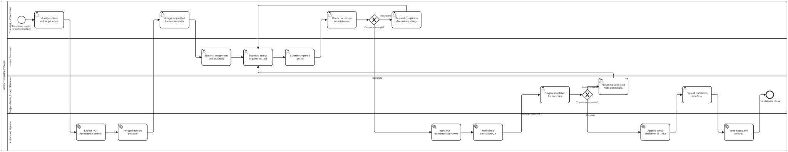

{: .note }
> Generated from `cat-harness/processes/human-translation-workflow.bpmn` by `gen-processes-viz.ts` — do not edit here. [All processes](index.html)


# Human Translation Workflow

`Process_HumanTranslation` · strict (defaulted) · 16 step(s)

The human half of translation: a coordinator assigns a locale to a qualified translator, the translator works in their own tool, a subject-matter expert judges accuracy, and only then is the result official. You are in this process when a person is doing the translating. `translation-workflow` is the machine half — extraction, injection, staleness — and it hands off to this one at exactly the point a judgement is needed. The two are separate because completeness is mechanical and accuracy is not: the coordinator's gate asks whether enough strings are filled, the reviewer's asks whether they are right, and no amount of the first substitutes for the second. What makes a translation OFFICIAL is the reviewer's sign-off, never the file being complete.

## How it connects

- **Called by:** no call activity names this process
- **Calls:** none

## Lanes — who acts

| lane | role | what it does here |
|---|---|---|
| Translation Coordinator | `translation-coordinator` | Owns the completeness gate, Gateway_Complete, a different question from the accuracy Lane_Reviewer judges later: this lane can send work back to the translator for missing or fuzzy strings before a single sentence has been checked for meaning. |
| Human Translator | `translator` | Task_TranslateInTool is where both loops in this process land — an incompleteness request from the coordinator and a correction from the reviewer — so nothing in the task itself says which one sent the work back; only the annotations that travel with each loop carry that distinction. |
| Subject-Matter Expert / Reviewer | `reviewer` | The one reviewer lane in this corpus where sign-off is acceptance: Task_Signoff makes the translation official directly, with no separate editor lane after it, because translation fidelity is the acceptance criterion and there is no different judgement left for an editor to add. |
| Automated Pipeline | `build-pipeline` | Owns extraction, glossary preparation, injection and round-trip QA — the only machine check for semantic drift — whose findings go to Task_SMEReview whatever they say, so a clean round-trip is evidence for the reviewer, never a bypass of them. The same lane writes the final status.json once sign-off lands, so the official record sits beside the checks that fed it. |

## Steps

Every one of the 16 step(s) is documented.

| step | lane | skill / sub-process | what it does |
|---|---|---|---|
| **Identify content and target locale** `Task_IdentifyContent` | Translation Coordinator | [`translation-manager`](../reference/skill-instructions/translation-manager.html) | The coordinator selects: - Which content nodes need translation (block, section, chapter, or folio) - The target locale (one of the supportedLocales in <name>.config.json) - The priority and deadline |
| **Assign to qualified human translator** `Task_AssignTranslator` | Translation Coordinator | [`translation-manager`](../reference/skill-instructions/translation-manager.html) | The coordinator assigns the translation to a qualified translator, ideally a domain SME for the content area. For WHO content, the translator should be familiar with WHO SMART Guidelines terminology. The assignment includes: - The .pot file(s) from extraction - The domain glossary - Context notes (block kind, chapter, content area) - The deadline |
| **Check translation completeness** `Task_CheckCompleteness` | Translation Coordinator | [`translation-manager`](../reference/skill-instructions/translation-manager.html) | Verify that all msgid entries have msgstr translations. Partial translations are acceptable for initial submissions but must be flagged for follow-up. The coordinator checks: - % of strings translated - Any fuzzy-flagged entries - Missing critical sections |
| **Request completion of remaining strings** `Task_RequestMoreWork` | Translation Coordinator | [`translation-manager`](../reference/skill-instructions/translation-manager.html) | Return to the translator with a list of untranslated or fuzzy strings that need attention. |
| **Receive assignment and materials** `Task_ReceiveAssignment` | Human Translator | [`translation-manager`](../reference/skill-instructions/translation-manager.html) [`translation-manager`](../reference/skill-instructions/translation-manager.html) [`translation-manager`](../reference/skill-instructions/translation-manager.html) | The translator receives: - .pot file with source strings (msgid) - Domain glossary with approved term translations - Context notes per string - Style guide and WHO terminology references Tools: Poedit, Weblate, Crowdin, or direct .po editing. |
| **Translate strings in preferred tool** `Task_TranslateInTool` | Human Translator | [`translation-manager`](../reference/skill-instructions/translation-manager.html) | The translator works through each msgid, producing msgstr translations. They: - Follow the domain glossary for technical terms - Preserve placeholder tokens ({1}, {2}) in position - Mark uncertain translations as #fuzzy - Note any source ambiguities for the coordinator |
| **Submit completed .po file** `Task_SubmitPO` | Human Translator | [`translation-manager`](../reference/skill-instructions/translation-manager.html) [`translation-manager`](../reference/skill-instructions/translation-manager.html) [`translation-manager`](../reference/skill-instructions/translation-manager.html) | The translator submits the completed .po file back to the pipeline. This may happen via: - Git commit + push - Weblate/Crowdin sync - File upload to the coordinator |
| **Review translation for accuracy** `Task_SMEReview` | Subject-Matter Expert / Reviewer | [`translation-manager`](../reference/skill-instructions/translation-manager.html) [`translation-manager`](../reference/skill-instructions/translation-manager.html) [`translation-manager`](../reference/skill-instructions/translation-manager.html) | A subject-matter expert reviews the injected translated markdown for: - Clinical/technical accuracy of terminology - Preservation of meaning from the source - Cultural appropriateness for the target locale - Consistency with the domain glossary For WHO content: the SME verifies that normative statements ("SHALL", "SHOULD", "MAY") are translated with the correct force in the target language. |
| **Return for correction with annotations** `Task_ReturnForCorrection` | Subject-Matter Expert / Reviewer | [`translation-manager`](../reference/skill-instructions/translation-manager.html) | The reviewer annotates specific passages that need correction and returns to the translator with detailed feedback. Each annotation includes: - The passage in question - What is wrong (terminology, meaning, style) - The suggested correction or reference |
| **Sign off translation as official** `Task_Signoff` | Subject-Matter Expert / Reviewer | [`translation-manager`](../reference/skill-instructions/translation-manager.html) | The reviewer signs off the translation, making it official. This records: - signedOffBy: the reviewer's identity - signedOffAt: the current timestamp - sourceHash: SHA-256 of the source .md - level: block \| section \| chapter \| folio Tool: translation_signoff MCP tool |
| **Extract POT (translatable strings)** `Task_ExtractPOT` | Automated Pipeline | [`translation-manager`](../reference/skill-instructions/translation-manager.html) | Pre-processes source markdown: 1. Segments prose by paragraph 2. Shields non-translatable content (math, code, labels) as placeholders 3. Normalizes whitespace 4. Extracts metadata (titles, alt text, captions) Produces .pot file(s) at the configured granularity. Tool: translation_extract MCP tool |
| **Prepare domain glossary** `Task_PrepareGlossary` | Automated Pipeline | [`translation-manager`](../reference/skill-instructions/translation-manager.html) | Generates or retrieves the domain glossary for the target locale. Sources: 1. Root folio's translations/ glossary 2. Folio-assistant dependency translations (depth-first walk) 3. WHO standard terminology (from smart-base) 4. Previous translations of related content |
| **Inject PO → translated Markdown** `Task_InjectPO` | Automated Pipeline | [`translation-manager`](../reference/skill-instructions/translation-manager.html) | Post-processes the completed .po file: 1. Substitutes msgstr for msgid in source markdown 2. Unshields placeholder tokens back to original content 3. Validates structural integrity (paragraph count, heading levels) 4. Validates completeness (flags empty msgstr) 5. Runs linting (doubled punctuation, orphaned placeholders) Tool: translation_inject MCP tool |
| **Round-trip translation QA** `Task_RoundTripQA` | Automated Pipeline | [`translation-manager`](../reference/skill-instructions/translation-manager.html) | Bean: folio-assistant-ktt2 Back-translates target-language .md to source language and compares meaning. Distinguishes semantic drift from terminology misses. Tool: translation_validate MCP tool No gateway follows: drift or clean, the translation goes to Task_SMEReview with the findings attached. Which of two readings is right is a human call (translation-manager, "route drift to a human reviewer"), and every translation in this workflow is reviewed and signed off anyway, so a clean result is evidence for the reviewer and never a way around them. |
| **Append WHO disclaimer (if DAK)** `Task_AppendDisclaimer` | Automated Pipeline | [`translation-manager`](../reference/skill-instructions/translation-manager.html) | For WHO SMART Guidelines content, automatically appends the WHO legal disclaimer: - Translation not created by WHO - English edition is authoritative original - WHO not responsible for translation accuracy Only applies when folio contentType includes WHO/DAK content. |
| **Write status.json (official)** `Task_WriteStatus` | Automated Pipeline | [`translation-manager`](../reference/skill-instructions/translation-manager.html) | Writes translations/<locale>/status.json with the official sign-off metadata and source hash for staleness detection. |

## Decisions

Every one of the 2 decision(s) is documented.

| decision | what decides it | branches |
|---|---|---|
| **Complete enough?** `Gateway_Complete` | Answered by the completeness check on the submitted PO file: are enough strings translated? `Incomplete` asks the translator to finish the rest; `Complete` injects the PO into translated Markdown. | **Incomplete** → Request completion of remaining strings **Complete** → Inject PO → translated Markdown |
| **Translation accurate?** `Gateway_Accurate` | The SME's result. `Needs correction` returns the translation with annotations; `Accurate` goes on to the WHO disclaimer, sign-off and status. | **Needs correction** → Return for correction with annotations **Accurate** → Append WHO disclaimer (if DAK) |


