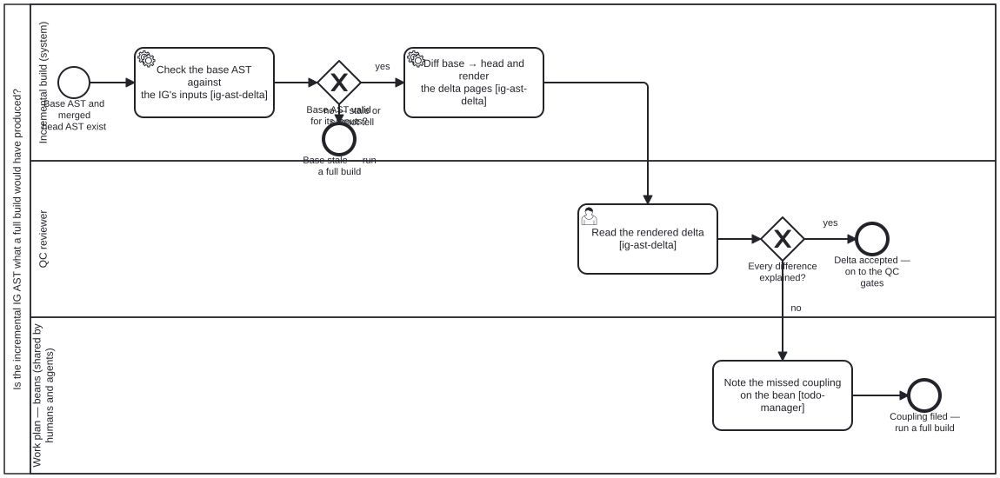

{: .note }
> Generated from `fhir-harness/processes/content/ig-ast-delta-review.bpmn` by `gen-processes-viz.ts` — do not edit here. [All processes](index.html)


# Is the incremental IG AST what a full build would have produced?

`Process_IgAstDeltaReview` · advisory · 4 step(s)

The review step of an incremental FHIR IG build, as its own subprocess: list and inspect the differences between the incremental IG AST and what a full build would have produced, then accept them or raise a finding. THE REVIEW STEP OF AN INCREMENTAL IG BUILD, drawn as its own subprocess (bean `a9tx`, owner 2026-09-30: "list and view differentials/deltas against AST ... as part of (sub-?)process/skills/tools, including pipeline rendering").

WHERE IT SITS. In `ig-incremental-build.bpmn` it belongs between Task_Merge and Task_Qa: after the restored and rebuilt records are merged, before the QC gates read the aggregate. That diagram predates the AST work and is not edited here; `ig-ast-delta` §"Where this sits in a process" states the placement until it is.

WHAT IT GUARDS. An incremental build rebuilds only the cone of a change, computed on the BASE edges. If the cone rules miss a coupling, a resource that should have changed does not, and nothing downstream can tell: the merged AST looks exactly like a correct one. So a person reads the delta, and a difference nobody can explain is treated as a missed coupling rather than as a curiosity.

WHAT IT DOES NOT CLAIM. A clean review says the delta is explained, not that the IG is correct. The AST stays a cache: every rendered page carries the provisional mark, and a release is still cut from a full build (`ig-publisher-reduction` P4).

## How it connects

- **Called by:** no call activity names this process
- **Calls:** none
- **Presented on:** no docs page section shows this diagram

## Lanes — who acts

| lane | role | what it does here |
|---|---|---|
| Incremental build (system) | `build-pipeline` | Checks that the base AST still matches the IG's inputs, then diffs base against head and renders the delta pages. Both steps are mechanical and read files only; neither decides anything a person has to own. A stale or undeterminable base ends here, before any delta is shown, because a delta against the wrong base explains nothing. |
| QC reviewer | `qc-reviewer` | Reads the rendered delta and answers one question: is every difference explained by the change? This is the only judgement in the subprocess, and it is a person's (or a reviewing agent acting in this role) because "explained" depends on what the change was meant to do, which no tool knows. |
| Work plan — beans (shared by humans and agents) | `work-plan` | Where an unexplained difference is recorded before the run falls back to a full build: a note on bean `a9tx` under W8, naming the resource and the path, so the cone rules get fixed rather than the difference being forgotten when the full build comes back green. |

## Steps

Every one of the 4 step(s) is documented.

| step | lane | skill / sub-process | what it does |
|---|---|---|---|
| **Check the base AST against the IG's inputs** `Task_Validity` | Incremental build (system) | [`ig-ast-delta`](../reference/skill-instructions/ig-ast-delta.html) | `ig-ast.ts validity <base> --ig <root>`: folio-assistant-core's compiledValidity on the manifest's inputs, with the input digest recomputed by the same algorithm as the Java writer. Exit 0 valid, 1 stale-inputs (names which input), 2 cannot-tell. Run against the BASE revision's checkout. |
| **Diff base → head and render the delta pages** `Task_Diff` | Incremental build (system) | [`ig-ast-delta`](../reference/skill-instructions/ig-ast-delta.html) | `ig-ast.ts diff <base> <head> --plan plan.json --site <site>/ast-delta/`: resources added, removed, changed (with an element-level differential) and version-changed; edges added and removed; the plan's decision. Every page opens with the provisional mark and is wrapped in raw so narrative Liquid is not executed. |
| **Read the rendered delta** `Task_Review` | QC reviewer | [`ig-ast-delta`](../reference/skill-instructions/ig-ast-delta.html) | Start at the delta index; open each changed resource's page. Check `builtAt` before judging: a resource carried from the base was not rebuilt, so a difference there is the change itself or a missed coupling, never noise. The differential is structural: a reordered repeating element shows at every index. |
| **Note the missed coupling on the bean** `Task_FileCoupling` | Work plan — beans (shared by humans and agents) | [`todo-manager`](../reference/skill-instructions/todo-manager.html) | Append to bean `a9tx` (W8): the resource key, the differential path, and why it is unexplained. Check before creating: beans create is not idempotent. A note, not a new bean, unless the owner asks for one. |

## Decisions

Every one of the 2 decision(s) is documented.

| decision | what decides it | branches |
|---|---|---|
| **Base AST valid for its inputs?** `GW_Valid` | Answered by Task_Validity's exit code. 0 takes `yes`, into the diff. 1 (stale-inputs) and 2 (cannot-tell) both take `no`: cannot-tell is never a pass, and a delta against a base that may not be what it claims explains nothing. | **yes** → Diff base → head and render the delta pages **no — stale or cannot tell** → Base stale — run a full build |
| **Every difference explained?** `GW_Explained` | Answered by the reviewer in Task_Review. `yes` when every added, removed and changed resource is accounted for by the change. `no` when any is not, including a resource that SHOULD have changed and did not, which the delta shows as absent rather than as a row. | **yes** → Delta accepted — on to the QC gates **no** → Note the missed coupling on the bean |


