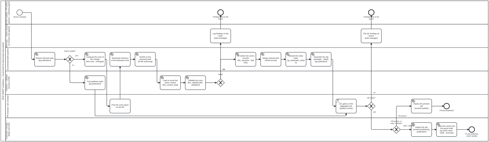

{: .note }
> Generated from `cat-harness/processes/ig-incremental-build.bpmn` by `gen-processes-viz.ts` — do not edit here. [All processes](index.html)


# Incremental IG build

`Process_IgIncremental` · advisory · 18 step(s)

One change — a PR push or a push to main — through the incremental IG build of docs/proposals/ig-incremental-build.md: restore the derived state, compute the change's dependency cone, compile and validate only the cone against the warm validator, re-render the cone's records, rebuild the meta-index, assemble the site, gate on QA, then deploy — and, on main or a release only, seed the cache from the green build. A cache miss or a moved toolchain falls back to today's full build. Advisory, like the other content-type pipelines: the package that owns the content owns what adequate means.

## How it connects

- **Called by:** no call activity names this process
- **Calls:** none

## Lanes — who acts

| lane | role | what it does here |
|---|---|---|
| FHIR modeller / PR author (person + authoring agent) | — | — |
| Work plan — beans (shared by humans and agents) | — | Where both failure branches land before the process ends rather than just stopping: Gateway_Valid's `no` and Gateway_QcPass's `no` each write their findings here — Task_LogFindings, Task_QcBeans — before either EndEvent_Findings or EndEvent_FindingsQc, so a run that stops short always leaves a record of why rather than only a red check. |
| Incremental build (system) | — | Owns everything that stays inside the cone: restore the cache, compute the cone, check it out, compile and re-render only that slice, then merge and rebuild the aggregates — Task_Index never re-derives an artefact on its own, so a missing record is a miss rather than a silent rebuild. What needs the JVM's warm state, it hands to Lane_Services rather than running itself. |
| Publisher + validator services (JVM) | — | Two separate duties rather than one: Task_FullBuild is the complete fallback the diagram takes when Gateway_Restore finds the cache unusable, bypassing the cone machinery and reaching Task_Qa on its own. Task_ContextLoad and Task_Validate are the other duty — holding the loaded dependency packages and expansions warm across runs is what makes validating a handful of cone files cheap, and losing that warm state is the same cache miss that routes to the fallback instead. |
| PR reviewer / QC reviewer | — | Sees the change's shape before the build finishes — Task_ConeReport names what will rebuild and whether a shared hub is touched, posted while the checkout is still running — then gates on Task_Qa by reading the cone's own rows in the aggregate first. On a PR branch it also deploys the preview itself, but never seeds the shared cache: that stays Lane_PubMgr's, reached only past Gateway_Path on main or a release. |
| Publication manager — deploy and seed | — | Reached only past Gateway_Path's main-or-release branch, never for a PR preview — which is what makes this the one lane allowed to touch the shared cache. Task_Seed does not seed on a green build alone: it writes to a -test branch and verifies a restore from a clean clone before promoting, so what licenses the shared cache is the verified restore, not the deploy that came before it. |

## Steps

**7** of 18 step(s) carry no documentation — `activity-documented` lists them.

| step | lane | skill / sub-process | what it does |
|---|---|---|---|
| **Restore derived state** `Task_Restore` | Incremental build (system) | [`ig-publication`](../reference/skill-instructions/ig-publication.html) | ig-cache restore: per-artefact records, the terminology cache, the package cache and temp/, keyed by the toolchain slug. Exit 0 usable, 1 miss, 2 environment error, 3 present but toolchain moved. |
| **Full publisher build** `Task_FullBuild` | Publisher + validator services (JVM) | [`ig-publication`](../reference/skill-instructions/ig-publication.html) | Exit 1 or 3 from restore: the whole IG is built as today. Its outputs become the records the next seed writes. |
| **Compute the cone of the change (fsh-cone --changed)** `Task_Cone` | Incremental build (system) | [`ig-publication`](../reference/skill-instructions/ig-publication.html) [`ig-publication`](../reference/skill-instructions/ig-publication.html) [`ig-publication`](../reference/skill-instructions/ig-publication.html) | content/pipeline/fsh-cone.ts over the changed files: the forward cone is what to rebuild, the backward cone is what to check out. |
| **Post the cone report on the PR** `Task_ConeReport` | PR reviewer / QC reviewer | [`quality-control`](../reference/skill-instructions/quality-control.html) [`quality-control`](../reference/skill-instructions/quality-control.html) [`quality-control`](../reference/skill-instructions/quality-control.html) | Review path: the reviewer sees what this change rebuilds — how many artefacts, and whether a hub (a shared RuleSet, CQL library or value set) is touched — before the build finishes. On main it is a log line. |
| **Restricted checkout of the backward cone** `Task_Checkout` | Incremental build (system) | [`ig-publication`](../reference/skill-instructions/ig-publication.html) [`ig-publication`](../reference/skill-instructions/ig-publication.html) [`ig-publication`](../reference/skill-instructions/ig-publication.html) | git sparse-checkout of the cone's files plus sushi-config.yaml, ig.ini and the alias files — a median of three files, p90 eleven, on smart-immunizations. |
| **SUSHI on the restricted tank** `Task_Sushi` | Incremental build (system) | [`l3-fhir-authoring`](../reference/skill-instructions/l3-fhir-authoring.html) | — |
| **Load or reuse the warm context (fhir_context_load)** `Task_ContextLoad` | Publisher + validator services (JVM) | [`ig-publication`](../reference/skill-instructions/ig-publication.html) [`ig-publication`](../reference/skill-instructions/ig-publication.html) [`ig-publication`](../reference/skill-instructions/ig-publication.html) | The validator's server mode holds the loaded dependency packages, snapshots and expansions in its session cache. Cold start loads the restored derived FHIR rather than regenerating it. |
| **Validate the cone (fhir_validate)** `Task_Validate` | Publisher + validator services (JVM) | [`fhir-validation`](../reference/skill-instructions/fhir-validation.html) | — |
| **Log findings on the bean** `Task_LogFindings` | Work plan — beans (shared by humans and agents) | [`todo-manager`](../reference/skill-instructions/todo-manager.html) | — |
| **Re-render the cone's records (fhir_narrative · skip lists)** `Task_Render` | Incremental build (system) | [`ig-publication`](../reference/skill-instructions/ig-publication.html) [`ig-publication`](../reference/skill-instructions/ig-publication.html) [`ig-publication`](../reference/skill-instructions/ig-publication.html) | Narrative and fragments for the cone only: the publisher's -no-validate / -no-narrative complements today, Rapido's differential build once its tracker is persisted. |
| **Merge restored and rebuilt records** `Task_Merge` | Incremental build (system) | [`ig-publication`](../reference/skill-instructions/ig-publication.html) | — |
| **Rebuild the meta-index (ig_metaindex_rebuild)** `Task_Index` | Incremental build (system) | [`ig-publication`](../reference/skill-instructions/ig-publication.html) [`ig-publication`](../reference/skill-instructions/ig-publication.html) [`ig-publication`](../reference/skill-instructions/ig-publication.html) | The whole-IG aggregates only — artifacts, TOC, canonicals, expansions, package, QA aggregate. Never re-derives an artefact: a missing record is a miss (exit 1), not a silent rebuild. |
| **Assemble the site (template · Jekyll)** `Task_Site` | Incremental build (system) | [`ig-publication`](../reference/skill-instructions/ig-publication.html) | — |
| **QC gates on the aggregate QA** `Task_Qa` | PR reviewer / QC reviewer | [`quality-control`](../reference/skill-instructions/quality-control.html) | qa.json is the aggregate of per-artefact outcomes; the reviewer reads the cone's rows first. |
| **File QC findings as beans** `Task_QcBeans` | Work plan — beans (shared by humans and agents) | [`todo-manager`](../reference/skill-instructions/todo-manager.html) | — |
| **Deploy the preview site** `Task_DeployPreview` | PR reviewer / QC reviewer | [`content-publish`](../reference/skill-instructions/content-publish.html) | A preview never seeds the shared cache. |
| **Deploy the site [content-publish]** `Task_Deploy` | Publication manager — deploy and seed | [`content-publish`](../reference/skill-instructions/content-publish.html) [`ig-publication`](../reference/skill-instructions/ig-publication.html) | — |
| **Seed the cache from the green build (ig-cache seed · verify · promote)** `Task_Seed` | Publication manager — deploy and seed | [`ig-publication`](../reference/skill-instructions/ig-publication.html) [`ig-publication`](../reference/skill-instructions/ig-publication.html) [`ig-publication`](../reference/skill-instructions/ig-publication.html) | Only a green build of main or a release seeds. Seed writes to the -test branch, verifies a restore from a clean clone, then promotes. |


