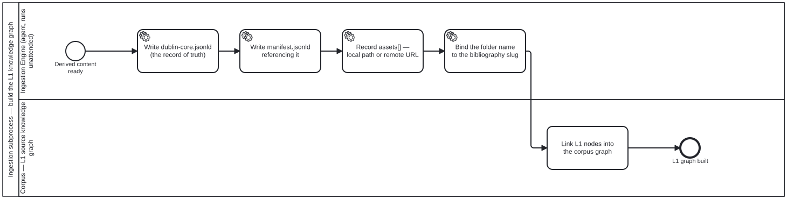

{: .note }
> Generated from `cat-harness/processes/ingest-build-l1-kg.bpmn` by `gen-processes-viz.ts` — do not edit here. [All processes](index.html)


# Ingestion subprocess — build the L1 knowledge graph

`Process_BuildL1Kg` · advisory · 5 step(s)

folio-assistant — Ingestion subprocess — build the L1 knowledge graph. Source of truth: this file. Open it in bpmn.io, Camunda Modeler, or any other BPMN 2.0 tool. The SVG under docs/assets/img/workflows/ is generated from it by `bun run render:bpmn` — never hand-edit the SVG. The <bootstrap.processes:skill> extension on an activity names the folio-assistant skill that implements it; <cat-harness.processes:bean> marks a step that reads or writes the shared work plan in beans/.

## How it connects

- **Called by:** [Document ingestion — uploads/ to the L1 source knowledge graph](document-ingestion.html)
- **Calls:** none
- **Presented on:** [Document ingestion — Build the L1 knowledge graph](../document-ingestion.html#build-the-l1-knowledge-graph)

## Lanes — who acts

| lane | role | what it does here |
|---|---|---|
| Ingestion Engine (agent, runs unattended) | `ingestion-agent` | Writes four records in a fixed order and touches the corpus graph in none of them — dublin-core as the record of truth, a manifest that references it, assets[] kept as a SIBLING of library: because that tree is regenerated and would drop anything written inside it, and finally the slug binding Task_Link depends on. Getting the order or the placement wrong here is invisible until the next sync silently drops it. |
| Corpus — L1 source knowledge graph | `corpus` | The single moment the four records Lane_0 wrote become reachable by reference rather than just present on disk: Task_Link is what a knowledge-graph reference in a paper, an L2 or an L3 artefact actually resolves through, and until it runs, dublin-core.jsonld and its siblings are files in library/ that nothing in the graph points to yet. |

## Steps

Every one of the 5 step(s) is documented.

| step | lane | skill / sub-process | what it does |
|---|---|---|---|
| **Write dublin-core.jsonld (the record of truth)** `Task_Dublin` | Ingestion Engine (agent, runs unattended) | [`document-intake`](../reference/skill-instructions/document-intake.html) | One standalone Dublin Core record per folder. dcterms is already this corpus's JSON-LD vocabulary, so this extends a live context rather than introducing one. |
| **Write manifest.jsonld referencing it** `Task_Manifest` | Ingestion Engine (agent, runs unattended) | [`document-intake`](../reference/skill-instructions/document-intake.html) | Write manifest.jsonld for the folder: its @id, @type folio:SourceDocument, what it contains and its provenance, referencing the standalone dublin-core.jsonld as the record of truth rather than copying its fields. |
| **Record assets[] — local path or remote URL** `Task_Assets` | Ingestion Engine (agent, runs unattended) | [`document-intake`](../reference/skill-instructions/document-intake.html) | kind / role / url-or-path / checksum / retrieved. A SIBLING of library:, never inside it: LibraryRef is regenerated from the tree, so an authored URL placed there is dropped on the next sync. |
| **Bind the folder name to the bibliography slug** `Task_Bind` | Ingestion Engine (agent, runs unattended) | [`document-intake`](../reference/skill-instructions/document-intake.html) | Bind the folder name to the document's bibliography slug, so library/<bib-slug>/ and its citation key are the same string: a citation resolves to a directory without a lookup table between them. |
| **Link L1 nodes into the corpus graph** `Task_Link` | Corpus — L1 source knowledge graph | [`document-intake`](../reference/skill-instructions/document-intake.html) | Anything in library/ is L1 source content. A knowledge-graph reference from any artefact -- paper, L2, L3 -- resolves to it through library/. |


