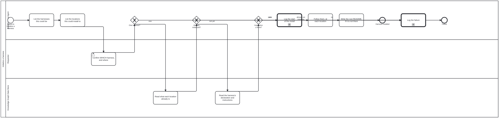

{: .note }
> Generated from `bootstrap/processes/initialize-harness.bpmn` by `gen-processes-viz.ts` — do not edit here. [All processes](index.html)


# Initialize a harness

`Process_InitializeHarness` · strict (defaulted) · 9 step(s)

THE ONLY PROCESS IN CAT_BOOTSTRAP AN ACTOR STARTS. An Initiator that has read bootstrap/README.md is at its start event and has nowhere else to begin. The other diagrams here are not entry points and cannot be confused with this one: `log-message` is an independent SUB-PROCESS, called from a step and never started; `discussion` is entered from within this process when a fact is needed that no file holds — WHICH harness this should become and WHICH repositories are read from and written to, judgements no instruction body produces. PRECONDITIONS are DECLARED below as folio:precondition elements rather than asserted here (bean `lv3j`). Three of the four are kind="stated": nothing in this repository can observe whether an actor understands what a role is, and a check claiming to would be a green tick over an unverified claim — so they evaluate to could-not-determine, never to satisfied. The fourth is checkable, and note what it actually checks: that README.md EXISTS, not that the Initiator read it. Reading is not observable from here. NO folio:bean on any activity: a bean is work-plan machinery and an Initiator runs before the harness that carries it. isExecutable is false because the engine that runs a diagram is harness machinery too — this is data an Initiator reads, not a process bootstrap can drive.

## How it connects

- **Called by:** no call activity names this process
- **Calls:** [Log a message](log-message.html)

## Lanes — who acts

| lane | role | what it does here |
|---|---|---|
| Initiator | — | Everything this process performs other than confirming which harness and reading the target location belongs here. It narrows candidates without choosing among them (A_ListHarnesses's own documentation says narrows, not decides), follows the CHOSEN harness's own instructions rather than any bootstrap holds, and logs failure on all three refusal paths rather than retrying — a guessed harness produces a repository set up as the wrong thing, which this process treats as worse than stopping. |
| Requestor | — | The only judgement in the whole process, per A_ConfirmHarness's own documentation: takes the Initiator's list of zero or more harnesses and locations and returns zero or exactly ONE harness — never two, since a list of two is not an answer and the Initiator may not break that tie itself. |
| Knowledge Graph Data Store | — | Not an actor: the location itself, read rather than acting. Whether it already carries a declaration at its root — already an instance — and, if not, where its chosen harness's own instructions live at the predetermined path, are both read here before the Initiator writes anything. |

## Steps

Every one of the 9 step(s) is documented.

| step | lane | skill / sub-process | what it does |
|---|---|---|---|
| **List the harnesses this could be** `A_ListHarnesses` | Initiator | [`confirm-harness`](../reference/skill-instructions/confirm-harness.html) | Zero or more. The DEFAULT is bootstrap itself. Context may name others: "please set up <owner>/<repo> here" in a discussion names one, and so does any Harness built on bootstrap that the Requestor mentions. This step narrows; it does not decide. |
| **List the locations this could install to** `A_ListLocations` | Initiator | [`confirm-harness`](../reference/skill-instructions/confirm-harness.html) | Zero or more. Is this a git repository already, or were one or more URLs to repositories supplied? Both are Knowledge Graph Data Stores; the difference is only how they are reached. |
| **Confirm WHICH harness, and where** `A_ConfirmHarness` | Requestor | [`confirm-harness`](../reference/skill-instructions/confirm-harness.html) | The only step needing a person, and the only place a judgement is made. IN, from the Initiator: a list of zero or more harnesses and a list of zero or more locations. OUT, from the Requestor: zero or ONE harness, and a list of zero or more locations. One at most — a list of two is not an answer, and the Initiator may not break the tie itself. |
| **Read what each location already is** `A_ReadLocation` | Knowledge Graph Data Store | [`bootstrap-kg-navigation`](../reference/skill-instructions/bootstrap-kg-navigation.html) | Ask the location, not your memory of it: a Knowledge Graph Data Store that carries a declaration at its root is ALREADY an instance, and it says so itself. `<name>.json` present and parsing is the whole test, and `kg-navigation` says what the three answers mean — absent (not an instance yet, which is this process's case), present, and present-but-unreadable, which is an instance asserting something broken and is not a green light either. Before reading the chosen harness rather than after, deliberately: if the location is spoken for there is nothing to learn from the harness, and fetching it first only makes the failure more expensive. |
| **Read the harness's declaration and instructions** `A_ReadDeclaration` | Knowledge Graph Data Store | [`bootstrap-kg-navigation`](../reference/skill-instructions/bootstrap-kg-navigation.html) | Performed against the data store — a git repository, through the git CLI or a forge API. The instructions are at a PREDETERMINED spot on the harness: `<stub>/docs/bootstrap/initialization.md`, the same for every harness, which is what lets an Initiator be pointed at one nobody has written yet. |
| **Log the start of the install** `A_LogInstallStart` | Initiator | calls [Log a message](log-message.html) [`log-message`](../reference/skill-instructions/log-message.html) | REQUIRED logging, which is what drawing the call says. Logged before anything is written, so an install interrupted halfway is distinguishable from one never begun. A callActivity rather than a task: `log-message` is an independent sub-process, the second and last diagram in bootstrap. Any step may call it without being drawn; this one is drawn because here it is a step rather than a courtesy. |
| **Follow them, at each location** `A_Install` | Initiator | [`bootstrap-kg-navigation`](../reference/skill-instructions/bootstrap-kg-navigation.html) | The instructions belong to the harness being installed, not to bootstrap — bootstrap does not know what any Harness above it requires, and does not need to. |
| **Write the root README, if it is not there** `A_WriteRootReadme` | Initiator | [`root-readme`](../reference/skill-instructions/root-readme.html) | The repository now IS an instance of something, and nothing at its root says so. A person landing on the checkout — or an agent that arrives before it has found any declaration — reads README.md first, and until this step there was no guarantee one existed. It carries two things and no more: a LINK to the harness that was installed, and the OVERALL install status across every location A_Install touched. Not one line per location buried in a log — the status a reader wants is "is this repository set up, and as what". WHEN ABSENT, never replacing. A repository that already has a README has one somebody wrote, and overwriting it would destroy authored content to state a fact that belongs in a generated region. Where a README is already there, the link and status go in a marker pair the harness's own readme_sync maintains. WRITING IT IS NOT A PROCESS WRITE. `instance-readme` declares `layer: context` — read at session start, never written by a running process — and this step writes one. Both hold, because INITIALISATION IS NOT PROCESS RUNTIME: the rule governs a process operating on an instance that exists, and this is the act that brings the instance into being. See the harness's content-context-and-state-graphs, which states it. |
| **Log the failure** `A_LogFailure` | Initiator | calls [Log a message](log-message.html) [`log-message`](../reference/skill-instructions/log-message.html) | Both failure paths pass through here, so "logged as failed" is a step somebody performs rather than an adjective on an end event. The end event said the process ended logged; nothing said who logged it or with what. The two ways in are the reason it is ONE call rather than two: what differs between them is the message, which is an input, not the mechanism. |

## Decisions

**3** of 3 decision(s) carry no documentation — `gateway-documented` lists them.

| decision | what decides it | branches |
|---|---|---|
| **One harness?** `GW_HarnessChosen` | — | **none** → Log the failure **one** → Read what each location already is |
| **Already initialized?** `GW_AlreadyInitialized` | — | **already an instance** → Log the failure **not yet** → Read the harness's declaration and instructions |
| **Instructions there?** `GW_InstructionsFound` | — | **no** → Log the failure **yes** → Log the start of the install |


