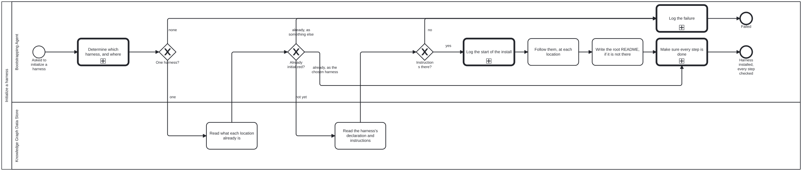

{: .note }
> Generated from `bootstrap/processes/initialize-harness.bpmn` by `gen-processes-viz.ts` — do not edit here. [All processes](index.html)


# Initialize a harness

`Process_InitializeHarness` · strict (defaulted) · 8 step(s)

THE ONLY PROCESS IN BOOTSTRAP AN ACTOR STARTS. A Bootstrapping Agent that has read bootstrap's README.md is at its start event and has nowhere else to begin. Every other diagram here is reached from this one by a call activity and is never started: `discussion` determines which harness and where; `human-agent-discussion` is the one reusable way any diagram asks a person anything; `complete-initialization` makes sure every step the declarations name is done; `log-message` records what a step is doing.

PRECONDITIONS are DECLARED below as bootstrap.processes:precondition elements rather than asserted here. Three of the four are kind="stated": nothing in this repository can observe whether an actor understands what a role is, and a check claiming to would be a green tick over an unverified claim — so they evaluate to could-not-determine, never to satisfied. The fourth is checkable, and note what it actually checks: that README.md EXISTS, not that the Bootstrapping Agent read it. Reading is not observable from here.

NO work-plan element on any activity: a work plan is harness machinery and a Bootstrapping Agent runs before the harness that carries it. isExecutable is false because the engine that runs a diagram is harness machinery too — this is data a Bootstrapping Agent reads, not a process bootstrap can drive.

## How it connects

- **Called by:** no call activity names this process
- **Calls:** [Complete initialization](complete-initialization.html), [Determine the harness and repositories](discussion.html), [Log a message](log-message.html)
- **Presented on:** no docs page section shows this diagram

## Lanes — who acts

| lane | role | what it does here |
|---|---|---|
| Bootstrapping Agent | `bootstrapping-agent` | Everything this process performs other than reading the target location. The one judgement — WHICH harness — is not made here: it is the Requestor's, obtained inside `discussion` through `human-agent-discussion`, which is why this diagram has no Requestor lane. It follows the CHOSEN harness's own instructions rather than any bootstrap holds, and logs failure on all three refusal paths rather than retrying — a guessed harness produces a repository set up as the wrong thing, which this process treats as worse than stopping. |
| Knowledge Graph Data Store | `knowledge-graph-data-store` | Not an actor: the location itself, read rather than acting. Whether it already carries a declaration at its root — already an instance — and, if not, where its chosen harness's own instructions live at the predetermined path, are both read here before the Bootstrapping Agent writes anything. |

## Steps

Every one of the 8 step(s) is documented.

| step | lane | skill / sub-process | what it does |
|---|---|---|---|
| **Determine which harness, and where** `A_DetermineHarness` | Bootstrapping Agent | calls [Determine the harness and repositories](discussion.html) `confirm-harness` | The candidates are listed and the Requestor is asked, in `discussion`, which asks through `human-agent-discussion`. IN: nothing but the context this agent was handed. OUT: zero or ONE harness, and the locations — a document conforming to `discussion.output.schema.json`. One at most: a list of two is not an answer, and the Bootstrapping Agent may not break the tie itself. |
| **Read what each location already is** `A_ReadLocation` | Knowledge Graph Data Store | `bootstrap-kg-navigation` | Ask the location, not your memory of it: a Knowledge Graph Data Store that carries a declaration at its root is ALREADY an instance, and it says so itself. `<name>.json` present and parsing is the whole test, and `bootstrap-kg-navigation` says what the three answers mean — absent (not an instance yet), present, and present-but-unreadable, which is an instance asserting something broken and is not a green light either. Before reading the chosen harness rather than after, deliberately: if the location is spoken for by another harness there is nothing to learn from the chosen one, and fetching it first only makes the failure more expensive. |
| **Read the harness's declaration and instructions** `A_ReadDeclaration` | Knowledge Graph Data Store | `bootstrap-kg-navigation` | Performed against the data store — a git repository, through the git CLI or a forge API. The instructions are at a PREDETERMINED spot on the harness: `<stub>/docs/bootstrap/initialization.md`, the same for every harness, which is what lets a Bootstrapping Agent be pointed at one nobody has written yet. |
| **Log the start of the install** `A_LogInstallStart` | Bootstrapping Agent | calls [Log a message](log-message.html) `log-message` | REQUIRED logging, which is what drawing the call says. Logged before anything is written, so an install interrupted halfway is distinguishable from one never begun. |
| **Follow them, at each location** `A_Install` | Bootstrapping Agent | `bootstrap-kg-navigation` | The instructions belong to the harness being installed, not to bootstrap — bootstrap does not know what any Harness above it requires, and does not need to. |
| **Write the root README, if it is not there** `A_WriteRootReadme` | Bootstrapping Agent | `root-readme` | The repository now IS an instance of something, and nothing at its root says so. It carries a LINK to the harness that was installed and the OVERALL install status across every location — WHEN ABSENT, never replacing: where a README is already there, the link and status go in a marker pair the harness's own README tool maintains. WRITING IT IS NOT A PROCESS WRITE. `instance-readme` declares `layer: context`, and this step writes one. Both hold, because INITIALISATION IS NOT PROCESS RUNTIME: the rule governs a process operating on an instance that exists, and this is the act that brings the instance into being. |
| **Make sure every step is done** `A_CompleteInitialization` | Bootstrapping Agent | calls [Complete initialization](complete-initialization.html) `initialization-steps` | Following a harness's instructions once is not the same as every step being done. `complete-initialization` walks the steps the declarations name — FIRST the harness's JSON Schemas and JSON-LD at the IRIs they name, the primary step of initializing a Knowledge Graph harness; then declared directories, assets, the README and its sections, and the site that carries the documents — checks each, does what can be done, asks the person for what only they can do, and reports every step in its state. An agent may be dispatched to run it on its own: it needs nothing but that diagram and the declarations. |
| **Log the failure** `A_LogFailure` | Bootstrapping Agent | calls [Log a message](log-message.html) `log-message` | Every failure path passes through here, so "logged as failed" is a step somebody performs rather than an adjective on an end event. What differs between the ways in is the message, which is an input, not the mechanism. |

## Decisions

**2** of 3 decision(s) carry no documentation — `gateway-documented` lists them.

| decision | what decides it | branches |
|---|---|---|
| **One harness?** `GW_HarnessChosen` | — | **none** → Log the failure **one** → Read what each location already is |
| **Already initialized?** `GW_AlreadyInitialized` | Three answers, not two. NOT YET: install. ALREADY, AS THE CHOSEN HARNESS: the install is not repeated — it goes straight to `complete-initialization`, which checks each step the declarations name and adds only what is missing, replacing nothing. ALREADY, AS SOMETHING ELSE (or a declaration that does not parse): logged and stopped, because re-initialising over an instance that has content, history and dependents is not recoverable by running anything again; what the Requestor does next is a new decision. | **already, as something else** → Log the failure **already, as the chosen harness** → Make sure every step is done **not yet** → Read the harness's declaration and instructions |
| **Instructions there?** `GW_InstructionsFound` | — | **no** → Log the failure **yes** → Log the start of the install |


