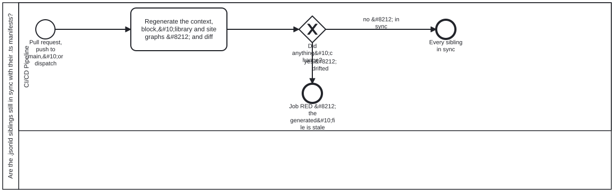

{: .note }
> Generated from `cat-harness/processes/jsonld-drift-check.bpmn` by `gen-processes-viz.ts` — do not edit here. [All processes](index.html)


# Are the .jsonld siblings still in sync with their .ts manifests?

`Process_JsonLdDrift` · strict · 1 step(s)

A GENERATED FILE THAT IS COMMITTED CAN GO STALE, AND A STALE ONE IS CONSULTED. Five `--check` runs in one job: the JSON-LD context, the block siblings, the library nodes, the site graph, and the label-resolution tests. Each regenerates from the `.ts` manifest that owns it and fails on any difference.&#10;&#10;They are drawn as ONE task rather than five, because they are independent of each other and sequential only because a single job runs them. Five boxes would assert an ordering the workflow does not have.&#10;&#10;THIS DIAGRAM IS DELIBERATELY SMALL, AND SAYING SO IS PART OF IT. Bean `7yvd` warns that "a diagram that is drawn once and then drifts is worse than none, because it is consulted", so each of the six was read before being drawn and classified by whether it says anything the YAML does not. `docs-site`, `ci-health`, `health-check` and `code-quality-gates` do &#8212; a full-replace compensation pair, two three-state verdict gateways, five independent parallel jobs. THIS ONE DOES NOT: it is one job with no branch and no compensation path, and dressing it up as more would be decoration that still has to be maintained.&#10;&#10;IT EARNS A DIAGRAM FOR A DIFFERENT REASON. Without one it carries no `<cat-harness.processes:job>`, so `check:workflow-coverage` has nothing to compare and a job added here would tell nobody. That is drift detection rather than exposition, and it is worth the file on its own &#8212; but the two are not the same thing, and a reader who opens this expecting the second should be told which they are getting.

## How it connects

- **Called by:** no call activity names this process
- **Calls:** none

## Lanes — who acts

| lane | role | what it does here |
|---|---|---|
| CI/CD Pipeline | `build-pipeline` | The only lane, running the one task this diagram draws deliberately as a single box rather than five: the five checks it performs are independent of each other and only sequential because one job runs them, so five boxes would assert an ordering that does not exist. Its declared job is also the reason this diagram exists at all — without it, check:workflow-coverage would have nothing here to compare a real job against. |

## Steps

Every one of the 1 step(s) is documented.

| step | lane | skill / sub-process | what it does |
|---|---|---|---|
| **Regenerate the context, block,&#10;library and site graphs &#8212; and diff** `Task_Check` | CI/CD Pipeline | — | Run the five --check generators in one job — the JSON-LD context, block siblings, library nodes, site graph, then the label-resolution and emitter tests. Any committed .jsonld that differs from what its generator now produces fails the PR, because a stale generated file is still consulted. |

## Decisions

Every one of the 1 decision(s) is documented.

| decision | what decides it | branches |
|---|---|---|
| **Did anything&#10;change?** `GW_Drift` | Answered by the diff Task_Check takes after regenerating the context, block, library and site graphs. No difference ends clean; any difference ends the job red, because a committed file is stale against its source. | **no &#8212; in sync** → Every sibling in sync **yes &#8212; drifted** → Job RED &#8212; the generated&#10;file is stale |


