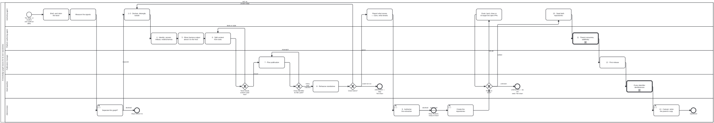

{: .note }
> Generated from `cat-harness/processes/kg/kg-separation.bpmn` by `gen-processes-viz.ts` — do not edit here. [All processes](index.html)


# A knowledge graph leaves for its own repositories

`Process_KgSeparation` · strict · 17 step(s)

Move part of a knowledge graph into repositories of its own: the content and the tools that write and check it separate as a pair, into two repositories, not one. The content (files to read, no code) and its tools (the code that writes and checks it) separate as a pair. `kg-separation.md` is the practice; this is its order and its gates. Stages 1-3 are `graph-detanglement`, reused rather than restated.

EVERY GATEWAY IS A COMMAND. `Tools closed?` is `check:tools-closure` with the content's no-code test and a byte-identity check on the generated files; `Every identifier its file's path?` is `check:node-iris`; `Green alone?` is the standalone rehearsal. A check that could not run stops the process rather than reading as clean.

A PERSON DECIDES FOUR TIMES, AND THE ADMINISTRATOR LANE SAYS WHERE: whether to separate at all, whether to authorise the extraction, creating the repositories, and the cutover. Nothing is committed to the new repositories before they are created, and the parent keeps its own copy until it consumes the first release.

VERSIONS: the pair starts at the content's version at the split, then each is versioned on its own; a tools release lists the content majors it supports. Worked example: bootstrap and bootstrap-tools (beans r3gy, xsqm). cat-harness and cat-harness-tools follow the same stages.

## How it connects

- **Called by:** no call activity names this process
- **Calls:** [Verify the export before it is deployed](publish-verification.html), [Adopting an upstream version bump](upstream-version-adoption.html)
- **Presented on:** no docs page section shows this diagram
- **Skill:** [`kg-separation`](../reference/skill-instructions/kg-separation.html)

## Lanes — who acts

| lane | role | what it does here |
|---|---|---|
| Authoring agent | `authoring-agent` | Briefs, measures the signals, runs declare-detangle-isolate, reports what would move, seeds the repositories once they exist, and adopts each later release. Verification is always by re-running a gate, never by a change looking right. |
| Platform authoring agent | `platform-authoring-agent` | The platform-side stages: the graph's identity (version, iriBase, nodeSchemas), moving harness output about it into the host, splitting the content from its tools, and making the parent consume the pair additively. |
| Publication manager | `publication-manager` | Owns where things are published: every identifier the content mints must be a file some step publishes, at /<version>/ for programs and /v<major>/ for people; and the first release. |
| Build pipeline | `build-pipeline` | Runs the checks that decide the gateways: the tools' import closure and the content's lack of code, node identifiers against file paths, the standalone rehearsal, and dereferencing after release. A gate that cannot tell stops the process; it never reads as clean. |
| Administrator | `administrator` | The person's decisions: whether to separate at all, authorising the extraction, creating the repositories, and the cutover that deletes the parent's copy. An agent reports and waits at each; none of them may be relaxed by a package. |

## Steps

Every one of the 17 step(s) is documented.

| step | lane | skill / sub-process | what it does |
|---|---|---|---|
| **Brief, and claim the bean** `Task_Brief` | Authoring agent | [`opening-brief`](../reference/skill-instructions/opening-brief.html) | What is separating and why, what is already measured with its provenance, how it will be done, and what would falsify the approach. Claim the bean so a sibling session sees the work. |
| **Measure the signals** `Task_Measure` | Authoring agent | [`kg-separation`](../reference/skill-instructions/kg-separation.html) | Files and bytes per instance, clone cost (`bun run health`), gate time, merge contention, the candidate's cohesion and cut (`kg:detangle`), wrong-direction edges, and the would-be tools package's import cone. Recorded in the bean; none alone is a trigger. |
| **Separate this graph?** `Task_Decide` | Administrator | [`kg-separation`](../reference/skill-instructions/kg-separation.html) | The owner decides from the measured signals, and also decides the address base for its identifiers, where verdicts about it live, and what its tools repository owns. Declining is a real outcome: the graph stays where it is. |
| **1–3 · Declare, detangle, isolate** `Task_Detangle` | Authoring agent | [`graph-detanglement`](../reference/skill-instructions/graph-detanglement.html) | The graph-detanglement practice, all of its gates: declared in place, zero wrong-direction edges on every axis, and standing alone with its own declaration, namespace and artefact. A plain task on purpose, not a call to graph-detanglement.bpmn: that process ends in its own authorise-and-extract steps, which here are stages 9-13 of this one, and calling it would run them twice. |
| **4 · Identity: version, iriBase, nodeSchemas** `Task_Identity` | Platform authoring agent | [`kg-separation`](../reference/skill-instructions/kg-separation.html) | The declaration carries name, version, iriBase, needs and nodeSchemas. A base move is `bun run iri:sync -- --from <old base>`, once; then `iri:sync:check` and `check:node-iris` are green. |
| **5 · Move harness output about it to the host** `Task_Hosted` | Platform authoring agent | [`kg-separation`](../reference/skill-instructions/kg-separation.html) | QA verdicts, translation templates, the exported graph and the glossary ledger are harness output ABOUT the graph: they live with the harness (kgQaHomeFor, translationsHomeFor). The content keeps only what its own checks need; the leak test's pending list is empty. |
| **6 · Split content from tools** `Task_Split` | Platform authoring agent | [`kg-separation`](../reference/skill-instructions/kg-separation.html) | Create <name>-tools as a sibling directory and move the code: the Zod source, the generators, the README and diagram writers, the content checks. Cut its import cone to its own files and declared packages. Both start at the content's version. |
| **7 · Plan publication** `Task_Plan` | Publication manager | [`instance-publication`](../reference/skill-instructions/instance-publication.html) | Every identifier the content mints is a file some step publishes: /<version>/ for what programs read, kept for every version; /v<major>/ for pages people read. Name collisions between published files are resolved here. |
| **8 · Rehearse standalone** `Task_Rehearse` | Build pipeline | [`kg-separation`](../reference/skill-instructions/kg-separation.html) | Copy the content and the tools alone into a temporary directory, with nothing else on the path, and run the tools' checks there. An empty tree must exit non-zero, so a rehearsal over nothing cannot pass. |
| **Report what moves — sizes, what breaks** `Task_Propose` | Authoring agent | [`deletion-requires-confirmation`](../reference/skill-instructions/deletion-requires-confirmation.html) | The agent reports and waits: what moves, how large, what in the parent breaks, and the rollback. It never relocates a durable artefact on its own initiative. |
| **9 · Authorise the extraction** `Task_Authorise` | Administrator | [`deletion-requires-confirmation`](../reference/skill-instructions/deletion-requires-confirmation.html) | A repository cut changes the substrate every other process binds to; that is a person's decision. Declining leaves the graph declared, detangled, isolated and split in place. |
| **Create the repositories** `Task_Create` | Administrator | [`kg-separation`](../reference/skill-instructions/kg-separation.html) | The owner creates the content and tools repositories and their Pages. Nothing is committed to them before this. |
| **10 · Seed both repositories** `Task_Seed` | Authoring agent | [`kg-separation`](../reference/skill-instructions/kg-separation.html) | Seed main, then bring the content and the tools in as reviewed pull requests with their history, so neither repository's first commit is unreviewable. |
| **11 · Parent consumes, additively** `Task_Consume` | Platform authoring agent | calls [Adopting an upstream version bump](upstream-version-adoption.html) [`upstream-version-adoption`](../reference/skill-instructions/upstream-version-adoption.html) | The parent pins the pair (a commit while staging, a version once released), repoints its imports, and keeps its own copy until it is green with the dependency declared. |
| **12 · First release** `Task_Release` | Publication manager | [`package-release`](../reference/skill-instructions/package-release.html) | Tag each repository, publish /<version>/ and /v<major>/. From here the two are versioned independently; a tools release lists the content majors it supports. |
| **Every identifier dereferences** `Task_Verify` | Build pipeline | calls [Verify the export before it is deployed](publish-verification.html) [`publish-verification`](../reference/skill-instructions/publish-verification.html) | After the release is live, every published identifier resolves to the file it names. |
| **13 · Cutover: delete the parent's copy** `Task_Cutover` | Administrator | [`deletion-requires-confirmation`](../reference/skill-instructions/deletion-requires-confirmation.html) | The one commit worth reverting, made only after the parent consumes the release and every identifier dereferences. |

## Decisions

Every one of the 3 decision(s) is documented.

| decision | what decides it | branches |
|---|---|---|
| **Tools closed, content code-free?** `GW_Closed` | Decided by commands, not judgement: `check:tools-closure` (no import leaves the tools directory or names an undeclared package), the content's no-code test (FR-7), and generated files byte-identical before and after the move. Any failure goes back to the split. | **leaks or stale** → 6 · Split content from tools **closed** → 7 · Plan publication |
| **Every identifier its file's path?** `GW_Ids` | Decided by `check:node-iris`: a published node's own identifier ($id or @id) under the release address must be its file's path. A mismatch goes back to the plan: move the file, or change the identifier before it is ever served. | **mismatch** → 7 · Plan publication **every one matches** → 8 · Rehearse standalone |
| **Green alone?** `GW_Alone` | Green with nothing else present goes on. Red means an edge the earlier gates did not see, so back to detangling. If the rehearsal could not run, that is not a pass: stop. | **red: an unseen edge** → 1–3 · Declare, detangle, isolate **could not run** → UNKNOWN — stop. Not clean **green** → Report what moves — sizes, what breaks |


