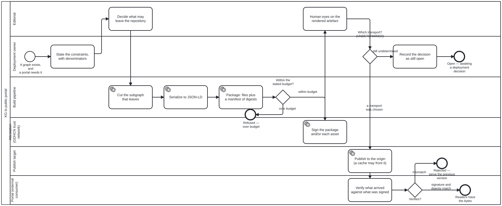

{: .note }
> Generated from `cat-harness/processes/kg-to-portal.bpmn` by `gen-processes-viz.ts` — do not edit here. [All processes](index.html)


# KG to public portal

`Process_KgToPortal` · advisory · 10 step(s)

folio-assistant — KG to public portal. Six stages: select, serialize, package, sign, distribute, verify. Three decisions belong to the DEPLOYMENT and are drawn as gateways rather than as steps — the ingestion transport, the versioned store, and the signing scheme. A pipeline that picks one of those is asserting a decision nobody made. A CDN is a LAYER, not a publication host. PUBLICATION_HOSTS answers "what serves the rendering"; a cache answers "what stands between the server and the reader", and the canonical URL stays the origin's either way.

## How it connects

- **Called by:** no call activity names this process
- **Calls:** none
- **Skill:** [`kg-to-portal`](../reference/skill-instructions/kg-to-portal.html)

## Lanes — who acts

| lane | role | what it does here |
|---|---|---|
| Editorial | `editor` | Two decisions, not one: E_Scope bounds what may leave the repository before the pipeline runs, and E_HumanEyes — reached only after S_Sign — approves what a reader will actually see, which merging to main does not. When GW_Budget rejects a package as over budget, narrowing scope here is the only way back in, so this lane is doing gatekeeping at both ends of the pipeline rather than once. |
| Deployment owner | `publication-manager` | Owns the numbers every other gate in the pipeline checks against: GW_Budget measures the package against D_Constraints' figures, not a feeling. When GW_Transport has no default branch to take, this lane is the one that records the gap as still open — at D_Undetermined — rather than letting the build pick a transport nobody decided on. |
| Build pipeline | `build-pipeline` | Executes E_Scope's decision as bytes — cut, serialize, package — precisely enough that GW_Budget can weigh the actual package rather than guess from the graph's node count. Each step reports what it did rather than only succeeding, which is what lets an empty selection be told apart from one that never ran. |
| Attestation (GDHCN / WHO SMART Trust) | `attestation-service` | Signs after A_Package and before E_HumanEyes, so what a human approves downstream is exactly what got signed — reordering the two would let a reviewer approve bytes the signature no longer covers. Whether that signature covers the whole package, each asset, or both composed is a deployment choice this lane executes rather than makes. |
| Publish target | `publish-target` | The one lane whose action makes a URL live, which is exactly why a CDN in front of it is not drawn as a second lane — folding the cache in as a participant would make its URL look like the published one, and the canonical URL is this lane's promise to keep, not the cache's. Uploading and exposing stay two separate moments here rather than one, so a bad layout is still catchable before a reader can reach it. |
| Portal (external consumer) | `external-registry` | The only lane outside this instance's control, so P_Verify checks against an external trust anchor — the GDHCN trustlist — rather than against anything the pipeline itself asserts. When that trustlist cannot be reached, this lane's answer is `unknown`, and GW_Verified routes it the same way as a mismatch: to the last good version, never to a guessed pass. |

## Steps

Every one of the 10 step(s) is documented.

| step | lane | skill / sub-process | what it does |
|---|---|---|---|
| **State the constraints, with denominators** `D_Constraints` | Deployment owner | [`kg-to-portal`](../reference/skill-instructions/kg-to-portal.html) | Money, network traffic, graph size, latency. Each needs a NUMBER and each number needs a denominator, because a constraint with no denominator is a preference: "the graph is too big" is not a finding, "6.2 MB per publication against a 100 GB free tier" is. Say which figures were measured, which were quoted from a vendor, and which could not be obtained — a figure from a chat message is none of the three, and the who-iris catalogue carries the worked example where "0.7 TB" propagated through ten files and the measured figure was about half. |
| **Decide what may leave the repository** `E_Scope` | Editorial | [`kg-to-portal`](../reference/skill-instructions/kg-to-portal.html) | EDITORIAL, and it is stage 1 rather than a filter bolted to the exporter. kg-export produces the WHOLE graph because inspection wants the whole graph; a portal wants what its readers may see. Running the second as the first is how a QA verdict, a bean's blocking note or an unpublished draft reaches a public cache. Decided once, here, rather than at each consumer. |
| **Cut the subgraph that leaves** `A_Select` | Build pipeline | [`kg-to-portal`](../reference/skill-instructions/kg-to-portal.html) | Apply the editorial scope mechanically and report what it removed. A selection that reports nothing cannot be told from one that ran over an empty rule. |
| **Serialize to JSON-LD** `A_Serialize` | Build pipeline | [`kg-export`](../reference/skill-instructions/kg-export.html) | kg-export, already built and host-agnostic by design. Every edge term declared {"@type": "@id"} — without that coercion the document is a list of records that merely LOOKS linked, and the node IRIs are fragments of the document's own @id so the graph is mergeable with anyone else's. |
| **Package: files plus a manifest of digests** `A_Package` | Build pipeline | [`kg-to-portal`](../reference/skill-instructions/kg-to-portal.html) | The serialization alone is not a package. A package is an addressable set — the JSON-LD, the assets it references, and a manifest naming every file with its digest and byte count. The manifest is what makes a REMOVED file detectable, which a per-file signature cannot do on its own. |
| **Sign the package and/or each asset** `S_Sign` | Attestation (GDHCN / WHO SMART Trust) | [`kg-to-portal`](../reference/skill-instructions/kg-to-portal.html) | THE TRUST ANCHOR IS GDHCN, SPECIFIED BY THE WHO SMART TRUST IG (owner, 2026-09-20: `propsal signing = GDHCN`, then `smart-trust`). READ OFF THAT IG rather than from general knowledge: a GDHCN trustlist distributes KEY MATERIAL as W3C DID documents, and says nothing about what you wrap your bytes in — the health-certificate envelope is a separate specification in the same IG, and a document package is not a health certificate. So what is settled is where a verifier GETS THE KEY, not what it verifies. A portal that can fetch the bytes but not reach the trustlist cannot verify, which is `unknown` and not a failure — air-gapped is a declared deployment value, so that case is answered rather than assumed away. Still OPEN and unread: the rotation and revocation model, and whether a document-package signature can be expressed for a GDHCN-aware verifier at all. Two schemes with different properties remain to choose between, and the trustlist does not choose between them. A PACKAGE signature over the manifest verifies the SET — nothing added, removed or altered — and must be reissued whenever any file changes. A PER-ASSET signature verifies one file independently, which is what an edge cache serving one asset can actually check, and it cannot detect a removal because there is nothing left to verify. They compose; composing them is the safer and more expensive default, and it is the deployment's choice rather than the pipeline's. |
| **Human eyes on the rendered artefact** `E_HumanEyes` | Editorial | [`continual-progress`](../reference/skill-instructions/continual-progress.html) | Bean xies, gate 3, and the one that is easy to drop because gate 2 (merge to main) looks like an approval. It is not: merging approves the CHANGE, and this approves what a reader will actually see. continual-progress measured why a description cannot stand in for it (PR #178, 2026-09-16). |
| **Record the decision as still open** `D_Undetermined` | Deployment owner | [`bean-blocking`](../reference/skill-instructions/bean-blocking.html) | An undetermined decision is DATA, not silence. It is recorded with what it waits on and what would settle it, so the next session can tell "nobody has chosen" from "somebody chose and did not write it down" — the same third state bean-blocking keeps for a block with no expiry. |
| **Publish to the origin (a cache may front it)** `A_Distribute` | Publish target | [`kg-to-portal`](../reference/skill-instructions/kg-to-portal.html) | Reach host behaviour through publication.host, never by assuming GitHub Pages' behaviour — Pages CANNOT serve application/ld+json and a local server can. A CDN in front is a layer, not the host: the canonical URL stays the origin's, and the cache is an accelerated route to the same bytes. Uploading and exposing are separable steps on purpose (xies, gate 4), because collapsing them removes the last moment at which a bad URL layout can still be caught. |
| **Verify what arrived against what was signed** `P_Verify` | Portal (external consumer) | [`kg-to-portal`](../reference/skill-instructions/kg-to-portal.html) | Against a GDHCN DID trustlist, which means the verifier needs THE NETWORK and not only the bytes — the key is resolved from the trustlist rather than read out of the package. The trustlist is itself static JSON served from a CDN (`tng-cdn.who.int`), and its path is a hierarchical filter — domain, participant, key usage, with `-` as a wildcard — so a verifier fetches the slice it needs rather than the whole list. WHO's own trust network is therefore the same shape as this diagram one layer down, which is the strongest argument the design has. The stage that gets dropped, because every other stage produces something visible and this one produces nothing when it passes. A package that is signed and never verified is a package whose signature is decoration. A portal that CANNOT verify reports `unknown` — a portal nobody asked is not a portal that checked. |


