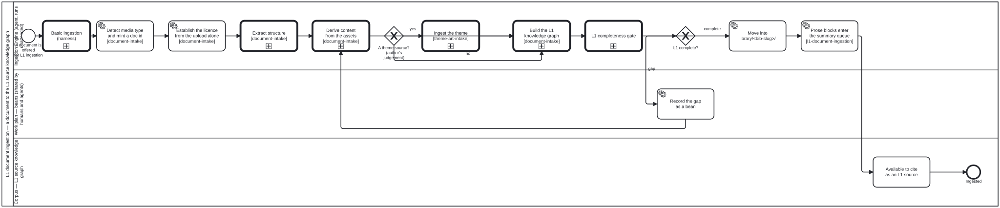

{: .note }
> Generated from `folio-assistant-core/processes/library/l1-document-ingestion.bpmn` by `gen-processes-viz.ts` — do not edit here. [All processes](index.html)


# L1 document ingestion — a document to the L1 source knowledge graph

`Process_L1DocumentIngestion` · advisory · 12 step(s)

folio-assistant — L1 document ingestion — a document to the L1 source knowledge graph.

Source of truth: this file. Open it in bpmn.io, Camunda Modeler, or any other
BPMN 2.0 tool. The SVG under docs/assets/img/workflows/ is generated from it
by `bun run render:bpmn` — never hand-edit the SVG.

The <bootstrap.processes:skill> extension on an activity names the folio-assistant skill
that implements it; <cat-harness.processes:bean> marks a step that reads or writes the shared
work plan in beans/.

CARRIES THE BODY `document-ingestion.bpmn` HAD until placement PR6 (bean `apcg`; owner ruling 3, 2026-09-30: "only basic doc ingestion high level workflow in cat-harness … more detailed doc ingestion/cataloguing methodologies in folio-asst-core"). Every activity id is unchanged, so a reference to `Task_Detect` or `CallActivity_Extract` means what it meant.

IT REFINES THE HARNESS FLOW BY CALLING IT. CallActivity_Basic runs the harness's `Process_Ingestion` first — accept the upload, put its metadata into the KG, catalogue the asset in library/ — and this process then reads the document into a complete L1 entry. That is the inversion the harness skill `library-ingestion` describes: the call points DOWN, from core to the harness, and nothing in the harness names this process. The theme branch's call into the harness's `ingest-theme.bpmn` is downward for the same reason; the four `ingest-*` phases sit beside this file. The method is the `l1-document-ingestion` skill.

## How it connects

- **Called by:** no call activity names this process
- **Calls:** [Ingestion subprocess — build the L1 knowledge graph](ingest-build-l1-kg.html), [Ingestion subprocess — derive content from the assets](ingest-derive-content.html), [Ingestion subprocess — extract structure](ingest-extract-structure.html), [Basic ingestion — an upload to an asset catalogued in library/](document-ingestion.html), [Ingestion subprocess — ingest a theme](ingest-theme.html), [Ingestion subprocess — the L1 completeness gate](ingest-l1-completeness-gate.html)
- **Presented on:** [Document ingestion — The pipeline](../guides/document-ingestion.html#the-pipeline)
- **Skill:** [`l1-document-ingestion`](../reference/skill-instructions/l1-document-ingestion.html)

## Lanes — who acts

| lane | role | what it does here |
|---|---|---|
| Ingestion Engine (agent, runs unattended) | `ingestion-agent` | Runs the whole pipeline from CallActivity_Basic through Task_Promote, and then Task_SummaryQueue, where it drains a few prose blocks of the advisory summary queue — including the theme branch, which stays in THIS lane rather than dipping into Lane_2: deciding a document is a theme source is the engine asking its author a question, not a write to the shared work plan. It does not stop at a gap: Gateway_Complete's 'gap' branch leaves this lane only long enough for Lane_2 to record the bean, then Flow_i8 returns control here at CallActivity_Derive rather than ending the run — so an incomplete L1 build is this lane's problem to keep working until Gateway_Complete says otherwise. |
| Work plan — beans (shared by humans and agents) | `work-plan` | A one-task detour from the Ingestion Engine's own loop: it exists as its own lane rather than a step inside Lane_1 specifically so that recording an incomplete L1 build is visible as a write to the SHARED plan — a bean anyone can see and pick up — rather than a private retry the engine keeps to itself. |
| Corpus — L1 source knowledge graph | `corpus` | The terminal state the whole diagram exists to reach: once Task_Promote lands material in library/<bib-slug>/, this lane is where that fact is recorded as available, and it is the boundary this diagram stops at — everything that depends on the source afterward, such as authoring-a-document.bpmn's citations, starts from here rather than being drawn into this process. |

## Steps

Every one of the 12 step(s) is documented.

| step | lane | skill / sub-process | what it does |
|---|---|---|---|
| **Basic ingestion (harness)** `CallActivity_Basic` | Ingestion Engine (agent, runs unattended) | calls [Basic ingestion — an upload to an asset catalogued in library/](document-ingestion.html) [`library-ingestion`](../reference/skill-instructions/library-ingestion.html) | The harness's `document-ingestion.bpmn`: accept the upload by a declared route, extract its metadata into the KG, and catalogue the asset in library/ — placed if materialized, recorded as referenced if not. Everything below refines that result for a document. Called, not copied: this was Lane_0 and Task_Place of this diagram until placement PR6 moved them down as the basic flow. |
| **Detect media type and mint a doc id** `Task_Detect` | Ingestion Engine (agent, runs unattended) | [`document-intake`](../reference/skill-instructions/document-intake.html) | Sniff the media type rather than trusting the extension, and mint the doc id from the page-1 arXiv stamp where there is one, else from the filename. |
| **Establish the licence from the upload alone** `Task_Licence` | Ingestion Engine (agent, runs unattended) | [`document-intake`](../reference/skill-instructions/document-intake.html) | EARLY, by the owner's ruling on bean 7bg9 (2026-09-20): before any derivation, because library/ is holds: content and anything derived first is committed, so refusing it later is a deletion nobody may take unasked. This step sees only the upload itself — the licence recorded in its intake.json (the same stated / unknown record a library manifest carries) and whether a LICENSE file sits beside it. It never infers a licence from extracted text. The verdict is stated, unknown, or UNDETERMINED, and undetermined is never reported as cleared: the pipeline proceeds and says so, because a licence that only extraction can reveal is a later check's to find. |
| **Extract structure** `CallActivity_Extract` | Ingestion Engine (agent, runs unattended) | calls [Ingestion subprocess — extract structure](ingest-extract-structure.html) [`document-intake`](../reference/skill-instructions/document-intake.html) | See ingest-extract-structure.bpmn. |
| **Derive content from the assets** `CallActivity_Derive` | Ingestion Engine (agent, runs unattended) | calls [Ingestion subprocess — derive content from the assets](ingest-derive-content.html) [`document-intake`](../reference/skill-instructions/document-intake.html) | See ingest-derive-content.bpmn. Most of this subprocess is not implemented yet. |
| **Ingest the theme** `CallActivity_IngestTheme` | Ingestion Engine (agent, runs unattended) | calls [Ingestion subprocess — ingest a theme](ingest-theme.html) [`theme-art-intake`](../reference/skill-instructions/theme-art-intake.html) | See ingest-theme.bpmn. The subprocess derives one Theme node with kind sticky\|webpage\|publication, and refuses a source it cannot complete rather than emitting a partial theme. |
| **Build the L1 knowledge graph** `CallActivity_BuildKg` | Ingestion Engine (agent, runs unattended) | calls [Ingestion subprocess — build the L1 knowledge graph](ingest-build-l1-kg.html) [`document-intake`](../reference/skill-instructions/document-intake.html) | See ingest-build-l1-kg.bpmn. |
| **L1 completeness gate** `CallActivity_Gate` | Ingestion Engine (agent, runs unattended) | calls [Ingestion subprocess — the L1 completeness gate](ingest-l1-completeness-gate.html) [`l1-document-ingestion`](../reference/skill-instructions/l1-document-ingestion.html) | See ingest-l1-completeness-gate.bpmn. Skill-backed by `l1-document-ingestion` (2026-09-30, bean 7bg9; the section moved there from the harness's `library-ingestion` in placement PR6): its section "What a complete L1 entry holds" names `check:l1-complete` as the gate and states its three results. Until then this step named `paper-relevance-triage`, which never existed, and was left uncovered rather than bound to a guess. The gate contains one adjudication (Task_FlagDrift: `real`, `spurious` or `source-wrong`), and its own Task_Verdict records the answer as a reason against the verdict before returning. So both answers reach this step, and nothing here branches on them; Gateway_Complete branches on the gate's completeness verdict instead. |
| **Record the gap as a bean** `Task_OpenBean` | Work plan — beans (shared by humans and agents) | [`todo-manager`](../reference/skill-instructions/todo-manager.html) | A missing derived artefact is a tracked gap, not a silent omission. The document stays in uploads/ until the gap closes. |
| **Move into library/<bib-slug>/** `Task_Promote` | Ingestion Engine (agent, runs unattended) | [`document-intake`](../reference/skill-instructions/document-intake.html) | The folder name IS the bibliography citation key, so a citation and a directory are the same string. |
| **Prose blocks enter the summary queue** `Task_SummaryQueue` | Ingestion Engine (agent, runs unattended) | [`l1-document-ingestion`](../reference/skill-instructions/l1-document-ingestion.html) | Owner, 2026-09-24: "Make as QA sidecar as part of general doc ingestion to slowly drain." Nothing is written to ENQUEUE a block: the queue is derived (every prose block in every declared library, minus those whose summaries.json record is a current draft or confirmation), so a promoted entry is in it the moment its blocks are. A re-ingested document whose text changed re-enters it on its own, because the record's source_hash no longer matches. What an agent doing ingestion work does here is DRAIN a few: `bun run summaries:next -- --n K` hands it the next K blocks with their text, it writes a short summary of each in its own words, and `bun run summaries:record` writes them into library/<bib-slug>/summaries.json as drafts naming the agent and its model. The block itself stays verbatim and `ingested`. ADVISORY, never a gate: this step does not hold up Task_Citeable, and check:l1-complete reports the backlog (`block-summaries`) without failing on it. Confirming or rejecting a draft is a person's act, in `bun run narratives`. |
| **Available to cite as an L1 source** `Task_Citeable` | Corpus — L1 source knowledge graph | [`document-intake`](../reference/skill-instructions/document-intake.html) | Every knowledge-graph reference to this source now resolves through library/. Authoring and review consume it from here -- see authoring-a-document.bpmn. |

## Decisions

Every one of the 2 decision(s) is documented.

| decision | what decides it | branches |
|---|---|---|
| **A theme source? (author's judgement)** `Gateway_ThemeSource` | Wired 2026-09-23 on the owner's ruling for bean `j66n`, choosing "human/agentic judgement at the gateway" over a declared predicate. THE PREDICATE IS DELIBERATELY ABSENT. The alternative on offer was a testable rule — a captured web deployment, or a document that STATES palette and typography rules — and it was refused for the reason the owner had already given when withdrawing `xffc`/`d3yq`: "no formal role/theme mapping per se. that is authoring (human/agentic) decision/judgement." So this gateway is answered by whoever is ingesting, not computed. An arbitrary branded PDF is not a theme source because a rule says so; it is not one because the author says it is not. WHY IT IS A GATEWAY AND NOT A FILTER INSIDE THE SUBPROCESS. `ingest-theme.bpmn` starts at "Theme source in hand" and can refuse as incomplete. Routing every document into it would make "this is not a theme" and "this theme is malformed" the same refusal, and the second is a defect while the first is the normal case. | **yes** → Ingest the theme **no** → Build the L1 knowledge graph |
| **L1 complete?** `Gateway_Complete` | The verdict of the L1 completeness gate. `gap` records the gap as a bean; `complete` promotes the source into library/<bib-slug>/. | **gap** → Record the gap as a bean **complete** → Move into library/<bib-slug>/ |


