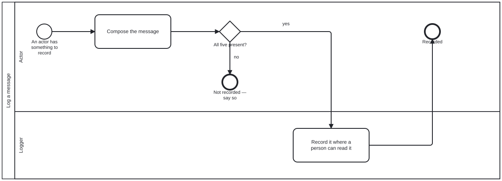

{: .note }
> Generated from `bootstrap/processes/log-message.bpmn` by `gen-processes-viz.ts` — do not edit here. [All processes](index.html)


# Log a message

`Process_LogMessage` · strict (defaulted) · 2 step(s)

A SUB-PROCESS, never an entry point. Nobody starts here; it is reached by a call activity from a task in another process, which is why bootstrap's README still says there is one process you START. It may be called OPTIONALLY from any task in any process — an actor logging what it is doing needs no permission — and a diagram may also REQUIRE it, which it says by drawing the call activity explicitly. The two are the same sub-process; the difference is whether the caller drew it. It lives in CAT_BOOTSTRAP rather than in the harness on purpose. CatBootstrap may not import the harness, so a logger defined upstream would be unusable by an Initiator — the actor with the most need to say what it is doing and the least machinery to do it with. Defined here, everything downstream inherits it. NO folio:bean, and isExecutable is false, for the same reasons as initialize-harness.

## How it connects

- **Called by:** [Initialize a harness](initialize-harness.html)
- **Calls:** none
- **Skill:** [`log-message`](../reference/skill-instructions/log-message.html)

## Lanes — who acts

| lane | role | what it does here |
|---|---|---|
| Actor | — | Whichever process called this sub-process, composing the five required fields and nothing more. GW_Complete then refuses an incomplete message rather than logging it anyway, because a partial entry that reads as a whole one is worse than no entry at all. |
| Logger | — | Records and decides nothing — the composing and the completeness judgement both happen in the Actor's lane before anything reaches here. In bootstrap the one destination available to it is the discussion the human actor is already in. |

## Steps

Every one of the 2 step(s) is documented.

| step | lane | skill / sub-process | what it does |
|---|---|---|---|
| **Compose the message** `A_Compose` | Actor | [`log-message`](../reference/skill-instructions/log-message.html) | Five required strings — timestamp, actor, process, task, message — and one optional markdown body. The five are required because each answers a question a reader of the log will otherwise have to guess, and a guessed answer in a log is worse than a missing one. |
| **Record it where a person can read it** `A_Record` | Logger | [`log-message`](../reference/skill-instructions/log-message.html) | Performed by the Logger, which records and decides nothing. In bootstrap the one available destination is the discussion the human actor is already in. |


