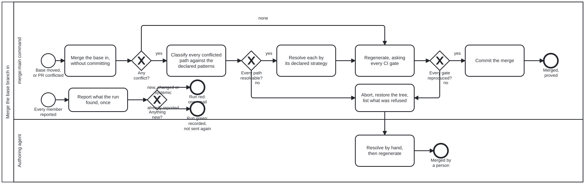

{: .note }
> Generated from `cat-harness/processes/sdlc/merge-base.bpmn` by `gen-processes-viz.ts` — do not edit here. [All processes](index.html)


# Merge the base branch in

`Process_MergeBase` · strict · 7 step(s)

CALLED FROM `Task_PrepareMerge` in code-change-review.bpmn, and executed by `bun run merge:main` (cat-harness/scripts/merge-base.ts). Bean `y7b3`, issue #1707. Owner, 2026-10-01: "put in merge process bpmn".

MEASURED 2026-09-30 over 300 main-into-branch merges: 235 conflicted, 147 (63%) ONLY on generated files, each resolved the same mechanical way. The declared patterns, and why each is or is not automatic, are in the `merge-conflict-patterns` skill.

ALL OR NOTHING: every conflicted path is classified before any is touched, and one refusal aborts the merge and restores the tree. PROVED, NOT ASSUMED: `regen` derives every check/writer pair from the CI workflow, and an unrepaired check aborts too. Only what both gateways pass is committed.

## How it connects

- **Called by:** [Code change and review](code-change-review.html), [A merge train](merge-train.html)
- **Calls:** none
- **Presented on:** no docs page section shows this diagram

## Lanes — who acts

| lane | role | what it does here |
|---|---|---|
| merge:main command | `build-pipeline` | Mechanical. Decides nothing a declaration has not decided: a path no pattern names is refused, and the gate set, not this lane, judges the result. |
| Authoring agent | `authoring-agent` | Reached only when the command refused: an authored conflict, an undeclared path, or a resolution the gates could not reproduce. The refused paths are listed for it; what to do with an authored conflict is judgement. |

## Steps

**2** of 7 step(s) carry no documentation — `activity-documented` lists them.

| step | lane | skill / sub-process | what it does |
|---|---|---|---|
| **Merge the base in, without committing** `Task_Merge` | merge:main command | [`prepare-merge`](../reference/skill-instructions/prepare-merge.html) | `git merge --no-ff --no-commit origin/main` on a clean tree (untracked files refuse too, so the final stage cannot sweep in a scratch file). |
| **Classify every conflicted path against the declared patterns** `Task_Classify` | merge:main command | [`merge-conflict-patterns`](../reference/skill-instructions/merge-conflict-patterns.html) | The first matching pattern decides: take-base, generated-regions, qa-sidecar, or refuse. A path no pattern names refuses. |
| **Resolve each by its declared strategy** `Task_Resolve` | merge:main command | [`merge-conflict-patterns`](../reference/skill-instructions/merge-conflict-patterns.html) | qa-sidecar paths first, through `qa:resolve-conflicts`; take-base paths take the base's copy; generated-regions files take the base's side of each hunk, which lies inside a generated region by construction. |
| **Regenerate, asking every CI gate** `Task_Regen` | merge:main command | [`prepare-merge`](../reference/skill-instructions/prepare-merge.html) | `bun run regen`: every check/writer pair the CI workflow runs, repeated until the tree settles. |
| **Commit the merge** `Task_Commit` | merge:main command | [`continual-progress`](../reference/skill-instructions/continual-progress.html) | — |
| **Abort, restore the tree, list what was refused** `Task_Abort` | merge:main command | [`merge-conflict-patterns`](../reference/skill-instructions/merge-conflict-patterns.html) | `git merge --abort`. Each refused path is listed with its pattern's reason, or "no declared pattern". |
| **Resolve by hand, then regenerate** `Task_ByHand` | Authoring agent | [`prepare-merge`](../reference/skill-instructions/prepare-merge.html) | — |

## Decisions

Every one of the 3 decision(s) is documented.

| decision | what decides it | branches |
|---|---|---|
| **Any conflict?** `GW_Conflicts` | `none` still regenerates: a CLEAN merge can produce an artefact neither side would emit (bean `lxpq`), so only the gates can say it is right. | **none** → Regenerate, asking every CI gate **yes** → Classify every conflicted path against the declared patterns |
| **Every path resolvable?** `GW_AllDeclared` | `no` if even one path is refused: the merge is aborted whole, never half-resolved. | **yes** → Resolve each by its declared strategy **no** → Abort, restore the tree, list what was refused |
| **Every gate reproduced?** `GW_Proved` | `no` when regen reports an unrepaired check, or one with no writer: a resolution the gates cannot reproduce is not a resolution. | **yes** → Commit the merge **no** → Abort, restore the tree, list what was refused |


