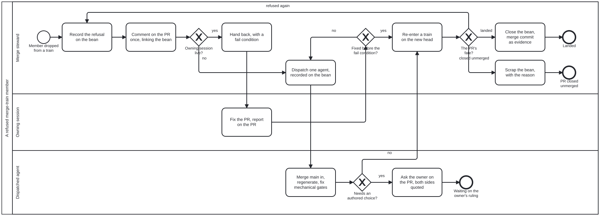

{: .note }
> Generated from `cat-harness/processes/sdlc/merge-refusal.bpmn` by `gen-processes-viz.ts` — do not edit here. [All processes](index.html)


# A refused merge-train member

`Process_MergeRefusal` · strict (defaulted) · 10 step(s)

What a merge steward does with a PR it dropped from a merge train: its merge (`merge-base.bpmn`, run with `--no-regen`) refused an authored or undeclared conflict, or the train's combined result failed a gate. Owner, 2026-10-02: "create a new bean (under appropriate epic/story…), hand it back to the sibling (use the agent-to-agent handoff process with a fail condition) for resolution, or dispatch an agent as appropriate." Bean `zacz`; the discipline is in `merge-conflict-patterns` §"When a merge-train member is refused".

ONE INSTANCE PER REFUSED PR, started with `bean:` set to the refusal bean. The steward finds or creates that bean BEFORE starting the instance, because creating a bean is the agent's own `beans create` call, deduplicated by the PR number in its title; the engine has no create op (`bean-lifecycle.bpmn`). A second refusal of the same PR loops back into this instance rather than opening a second bean.

## How it connects

- **Called by:** [A merge train](merge-train.html)
- **Calls:** none
- **Presented on:** no docs page section shows this diagram

## Lanes — who acts

| lane | role | what it does here |
|---|---|---|
| Merge steward | `session-coordinator` | Coordinator and verifier of the hand-back: records, hands back, takes back when the fail condition fires, and closes. Never edits the bean's instructions after the executor claims it; later facts go to the PR. |
| Owning session | `sibling-session` | The session named in the PR's `Claude-Session:` trailer. The executor of the hand-back: claims the refusal bean, fixes the PR, reports on the PR in the bean's one-line formats. |
| Dispatched agent | `authoring-agent` | ONE agent with a modest budget, reached only when no live owner can be. May do what a declared pattern would have done; may NOT decide an authored conflict, which goes to the owner as a question. |

## Steps

**2** of 10 step(s) carry no documentation — `activity-documented` lists them.

| step | lane | skill / sub-process | what it does |
|---|---|---|---|
| **Record the refusal on the bean** `Task_Record` | Merge steward | [`merge-conflict-patterns`](../reference/skill-instructions/merge-conflict-patterns.html) | The PR, the head sha the train used, the train and its other members, each refused path or failing gate and why. A repeat refusal goes under `## Attempts` with `--body-append`. |
| **Comment on the PR once, linking the bean** `Task_Comment` | Merge steward | [`merge-conflict-patterns`](../reference/skill-instructions/merge-conflict-patterns.html) | One comment per refused PR, edited in place on every later event. |
| **Hand back, with a fail condition** `Task_HandBack` | Merge steward | [`merge-conflict-patterns`](../reference/skill-instructions/merge-conflict-patterns.html) | The `agent-handoff` format (#1884): Roles, Report to (the PR), Done when, Fails if. The fail condition: no `started` line within 4 h, no push within 24 h, the session gone, or `blocked` on something it cannot settle. One line to the session; the instructions are in the bean. |
| **Fix the PR, report on the PR** `Task_Fix` | Owning session | [`prepare-merge`](../reference/skill-instructions/prepare-merge.html) | Claims the refusal bean, brings main in with `merge:main`, settles what it refused, pushes. Completed with the outcome `fail condition` by the steward when the condition fires first. |
| **Dispatch one agent, recorded on the bean** `Task_Dispatch` | Merge steward | [`dispatch-agent`](../reference/skill-instructions/dispatch-agent.html) | Before the agent starts: the date, why the fail condition fired, the agent's id, its budget. Never while the first writer may still be live. Two failed attempts with the same cause go to the owner instead. |
| **Merge main in, regenerate, fix mechanical gates** `Task_AgentFix` | Dispatched agent | [`merge-conflict-patterns`](../reference/skill-instructions/merge-conflict-patterns.html) | Merge commits only; never a force-push. |
| **Ask the owner on the PR, both sides quoted** `Task_AskOwner` | Dispatched agent | [`interaction-modality`](../reference/skill-instructions/interaction-modality.html) | — |
| **Re-enter a train on the new head** `Task_Retrain` | Merge steward | [`merge-conflict-patterns`](../reference/skill-instructions/merge-conflict-patterns.html) | The next train is the verifier: the executor's own log is evidence, not the close. |
| **Close the bean, merge commit as evidence** `Task_Close` | Merge steward | [`bean-coordination`](../reference/skill-instructions/bean-coordination.html) | — |
| **Scrap the bean, with the reason** `Task_Scrap` | Merge steward | [`bean-coordination`](../reference/skill-instructions/bean-coordination.html) | The agent's own `beans update --status scrapped`; never deleted. |

## Decisions

**2** of 4 decision(s) carry no documentation — `gateway-documented` lists them.

| decision | what decides it | branches |
|---|---|---|
| **Owning session live?** `GW_Owner` | `no` when the session is archived, failed, or unknown to `get_session`, or the PR names none. | **yes** → Hand back, with a fail condition **no** → Dispatch one agent, recorded on the bean |
| **Fixed before the fail condition?** `GW_FailCond` | — | **yes** → Re-enter a train on the new head **no** → Dispatch one agent, recorded on the bean |
| **Needs an authored choice?** `GW_Authored` | Two siblings editing one bean, one script changed differently on both sides, a budget exceeded only in combination: each is a choice between authors. | **yes** → Ask the owner on the PR, both sides quoted **no** → Re-enter a train on the new head |
| **The PR's fate?** `GW_Fate` | — | **landed** → Close the bean, merge commit as evidence **refused again** → Record the refusal on the bean **closed unmerged** → Scrap the bean, with the reason |


