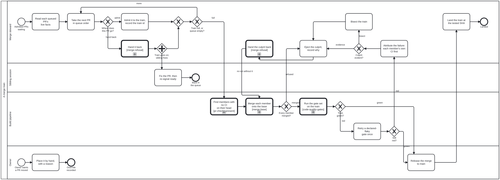

{: .note }
> Generated from `cat-harness/processes/sdlc/merge-train.bpmn` by `gen-processes-viz.ts` — do not edit here. [All processes](index.html)


# A merge train

`Process_MergeTrain` · strict · 16 step(s)

Land the ready pull requests as one train: place each by the merge-priority decision table, merge the members with `merge-base`, run the gate set on the combination, and on red eject the culprit rather than reject the train. A TRAIN OF PULL REQUESTS, landed together. Bean `hfag` (merge-pipeline epic), owner's ruling 2026-10-02. One instance per train run, committed under `beans/workflows/` like every other instance, so a sibling steward sees the same position and the run's record is what T4 will later be tuned from (R10).

IT LINKS THE EXISTING PROCESSES AND DUPLICATES NONE. Each member is merged by `merge-base.bpmn` (`Process_MergeBase`); the train is gated by `code-quality-gates.bpmn` and `pr-checks-present.bpmn`; a refused or ejected member is handed back by `merge-refusal.bpmn` (`Process_MergeRefusal`, draft PR #1888 — until it lands the call stays opaque, which the engine permits). The ORDER is computed by `decisions/merge-priority.dmn`, whose inputs come from the ordering processes: `graph-detanglement.bpmn` (a PR that removes tangle edges unblocks others, input b) and `kg-separation.bpmn` (a PR that seeds the staging repos, input a; `seed:ready` on branch `claude/seed-ready` reports which). A landed member's preview is taken down by `feature-staging.bpmn`, which this process does not repeat.

THE QUEUE STORES DECISIONS, NEVER GITHUB'S FACTS. CI status, mergeability, labels and head SHA are read live at each step (`schemas/merge-queue.ts`). What this instance records is what the steward decided and the dated evidence it acted on.

FROM THE LITERATURE (requirements note `cat-harness/docs/proposals/merge-pipeline-requirements.md`, branch `claude/merge-pipeline-library`): T3 cheap conflict prediction on authored paths (R6, R7; SQ19 §5.2 pp. 7-8) feeds the placement table; T7 retries a declared-flaky gate once (R11; TAP17 Table II p. 5); T2 attributes a red train from each member's own CI before bisecting (SQ19 §2.1 pp. 2-3); T1 ejects the culprit and re-runs the rest rather than rejecting the whole train (R3; SQ19 §2.2 p. 3), handing it back with the reason (R4; SQ19 §3.2 p. 4). The tools behind the steps are `merge:overlap`, `merge:train` and `merge:leftover`, on branch `claude/merge-pipeline-tools`.

## How it connects

- **Called by:** no call activity names this process
- **Calls:** [The gates a change must pass before it can merge](code-quality-gates.html), [Merge the base branch in](merge-base.html), [A refused merge-train member](merge-refusal.html), [Which open pull requests have no CI run on their head?](pr-checks-present.html)
- **Presented on:** no docs page section shows this diagram

## Lanes — who acts

| lane | role | what it does here |
|---|---|---|
| Merge steward | `merge-steward` | Composes the train from the queue, decides nothing the placement table or the owner has not, attributes and ejects on red, and lands at the tested SHA. |
| Sibling session | `sibling-session` | The session that owns a handed-back PR. Fixes it on its own branch and re-signals ready; never merged on its behalf. |
| Build pipeline | `build-pipeline` | Mechanical: merges, regenerates and runs the gates, and reports. Judges nothing a declaration has not decided. |
| Owner | `user` | Releases a merge to `main` (or has released it by a standing ruling, which the steward quotes), and may override a placement, always with a reason. |

## Steps

Every one of the 16 step(s) is documented.

| step | lane | skill / sub-process | what it does |
|---|---|---|---|
| **Read each queued PR's live facts** `Task_ReadLive` | Merge steward | [`merge-queue`](../reference/skill-instructions/merge-queue.html) | From GitHub and the checkout, now: authored paths, shared declarations, size, conflict risk and overlap KIND against the other queued PRs (T3), own CI and whether it ran on the head (T2). Tools: `merge:overlap` for the overlap facts, `check:head-has-run` for `ownCi`. Nothing read here is written to a queue entry; it is the input to the placement table. `ownCi` IS NOT A VERDICT READ. Never ask whether anything is red: ask which workflow runs are OWED for the head's event and whether each one is present and successful. The two readings come apart, measured 2026-10-02 on #1889's head 7ab6119405 -- 9 runs present, all 9 gating job NAMES matching, 3 of them in_progress with a null conclusion, and 3 check SUITES completed as `action_required` having executed nothing. A filter for conclusion = failure finds zero, and counting the runs does not catch it either. `check:head-has-run` is the only thing here that asks the owed question (bean `3pqn`), and the five states it distinguishes are the five values of `ownCi`. `Rule_HeadNotGreen` in merge-priority.dmn then hands back anything but `green`, so this is a gate the engine applies rather than advice a steward remembers. Overlap kind matters as much as overlap: `merge:overlap` over all 36 open PRs on 2026-10-02 (459 pairs) found #1907 x #1909 NOT independent on `package.json` alone, with zero authored content shared. `generated-only` needs a regeneration and `shared-declaration` needs ordering; only `authored` needs a train. |
| **Take the next PR in queue order** `Task_TakeNext` | Merge steward | [`merge-queue`](../reference/skill-instructions/merge-queue.html) | Owner overrides at their positions first, then by the table's rank, then by PR number, oldest first (`scripts/merge-queue.ts` `orderQueue`). |
| **Admit it to the train, record the train id** `Task_Admit` | Merge steward | [`merge-queue`](../reference/skill-instructions/merge-queue.html) | Writes the queue entry's `trainId` and `placement` (rule, class, rank) with who decided and when. A decision, so it is stored; the facts it was decided on are not. PRECONDITION, CHECKED RATHER THAN ASSUMED: the worktree carries no untracked, non-ignored file before the member is merged and the tree regenerated. `git status --porcelain` must be empty. The reason is specific: generated directory READMEs carry a per-subdirectory file count, and the writer counts the files GIT WOULD COMMIT -- `git ls-files --cached --others --exclude-standard` (bootstrap-tools/scripts/git-files.ts:23). `--exclude-standard` already keeps IGNORED junk out, which is the `__pycache__` case that drove that line, but `--others` still counts an untracked file nobody has ignored. So a transient written by an earlier train step moves a committed count, `readme:subgraphs:check` goes red, and the red belongs to nobody. Train 6 hit this. The count is volatile for a second reason the precondition cannot fix: two members each adding a file write different integers to one line. Measured in bean `y7b3` -- 76 of 300 replayed merges conflicted on `beans/README.md`, every one on the `\| defs/ \| N files \|` line -- and the exposure is wider than that bean states: 54 generated READMEs across 14 instances carry 207 such rows (measured 2026-10-02). `merge:main` already resolves them (`readme-generated-regions`), so the cost falls on merges made by plain git. The chosen fix is bean `ba9e`: take the integer off `main` into the KG's `_data` layer, which classifies `take-base` and is therefore auto-resolved, leaving the README with a marker that is invariant until the directory crosses LIST_LIMIT. Not done here -- it spans the pinned `bootstrap-tools` submodule. |
| **Hand it back** `Call_HandBack` | Merge steward | calls [A refused merge-train member](merge-refusal.html) [`merge-conflict-patterns`](../reference/skill-instructions/merge-conflict-patterns.html) | `merge-refusal.bpmn` (PR #1888, bean `zacz`): a bean under the right epic, a hand-back to the owning session with a fail condition (agent-handoff, #1884), or a dispatch when nobody owns it. R4: the PR returns with its reason. |
| **Fix the PR, then re-signal ready** `Task_SiblingFix` | Sibling session | [`bean-coordination`](../reference/skill-instructions/bean-coordination.html) | On the sibling's own branch: merge main in, fix, push, and re-mark ready (`ready: <head sha>`). It re-enters the queue as a new placement; the ejection stays on its entry until a later train lands it. |
| **Find members with no CI on their head** `Call_ChecksPresent` | Build pipeline | calls [Which open pull requests have no CI run on their head?](pr-checks-present.html) [`ci-health`](../reference/skill-instructions/ci-health.html) | GitHub runs no `pull_request` CI while a PR conflicts, so a member can arrive with nothing on its head (bean `u7be` item 3). That member is T2's first suspect if the train goes red. |
| **Merge each member onto the base** `Call_MergeMembers` | Build pipeline | calls [Merge the base branch in](merge-base.html) [`prepare-merge`](../reference/skill-instructions/prepare-merge.html) | `merge-base.bpmn` once per member, in order, `--no-regen`; then ONE `bun run regen` over the result. Tool: `merge:train`. Always onto the current base, never a cached one (R5). |
| **Run the gate set on the train** `Call_Gates` | Build pipeline | calls [The gates a change must pass before it can merge](code-quality-gates.html) [`platform-gates`](../reference/skill-instructions/platform-gates.html) | Every gate CI runs, on the combination (R2): a member that passes alone can still break `main` with another. The merge-gate epic (`nok9`, #1887) adds its gates here when they land. |
| **Retry a declared-flaky gate once** `Task_RetryFlaky` | Build pipeline | [`ci-health`](../reference/skill-instructions/ci-health.html) | T7, narrow (R11; TAP17 Table II p. 5): only gates on a declared flaky list (browser e2e), once, both outcomes recorded. A deterministic gate is never retried: that would spend a CI cycle to learn nothing. |
| **Attribute the failure: each member's own CI first** `Task_Attribute` | Merge steward | [`merge-queue`](../reference/skill-instructions/merge-queue.html) | T2 (SQ19 §2.1 pp. 2-3). A member whose own PR CI is red, or never ran on its head, is the prime suspect, and the evidence is already on GitHub. Only when every member is green alone is the failure a real conflict between them. |
| **Bisect the train** `Task_Bisect` | Merge steward | [`merge-queue`](../reference/skill-instructions/merge-queue.html) | Halve the members and re-run the gates on each half until the conflicting one is found: two or three CI runs for three to six members. Only reached when the cheap evidence is silent. |
| **Eject the culprit, record why** `Task_Eject` | Merge steward | [`merge-queue`](../reference/skill-instructions/merge-queue.html) | T1 (R3; SQ19 §2.2 p. 3): the culprit leaves, the rest re-run. Writes `ejection` on its queue entry (train id, reason, evidence URL, when) and a dated evidence snapshot on this instance. The train is never rejected whole for one member. |
| **Hand the culprit back** `Call_EjectHandBack` | Merge steward | calls [A refused merge-train member](merge-refusal.html) [`merge-conflict-patterns`](../reference/skill-instructions/merge-conflict-patterns.html) | The same hand-back as a refused placement (#1888), carrying the ejection's evidence (R4). Then the train re-runs without it. |
| **Release the merge to main** `Task_Release` | Owner | [`interaction-modality`](../reference/skill-instructions/interaction-modality.html) | Explicit confirmation before merging to `main`, or a standing ruling the steward quotes verbatim with its date (2026-10-01: "you may merge green PRs"). |
| **Land the train at the tested SHA** `Task_Land` | Merge steward | [`prepare-merge`](../reference/skill-instructions/prepare-merge.html) | R1: what lands is exactly what CI tested. If `main` moved after the train's CI started, re-run rather than land (open question for the owner in the requirements note §6). Clears each member's `trainId`; its preview is then taken down by `feature-staging.bpmn`. |
| **Place it by hand, with a reason** `Task_Override` | Owner | [`interaction-modality`](../reference/skill-instructions/interaction-modality.html) | Recorded as a queue entry whose placement is `override` with a position and a reason; the schema refuses one without a reason. It enters the next placement as the table's `ownerOverride` input. |

## Decisions

Every one of the 6 decision(s) is documented.

| decision | what decides it | branches |
|---|---|---|
| **Where does this PR go?** `GW_Placement` | Computed, not chosen: decisions/merge-priority.dmn (hit policy FIRST) over the live facts plus `ownerOverride`. An owner override is an INPUT to the table, never a hand-supplied outcome, which the engine refuses here. `hand back` when a declared merge pattern refuses a path or the PR carries an un-cleared ejection; otherwise `admit`, with the class, rank and whether it rides alone (T3) recorded on its queue entry. | **admit** → Admit it to the train, record the train id **hand back** → Hand it back |
| **Train full, or queue empty?** `GW_More` | `more` while the queue has admissible PRs and the train is under its cap; `full` otherwise. The cap is fixed for now: T4 (risk-based size) waits for this process's own run records (R10). `merge:leftover` reports what a train left behind. | **more** → Take the next PR in queue order **full** → Find members with no CI on their head |
| **Every member merged?** `GW_AllMerged` | `refused` when `merge-base` refused a member's conflict: that member is ejected (T1) rather than the whole train aborted. `merged` otherwise. | **merged** → Run the gate set on the train **refused** → Eject the culprit, record why |
| **Train green?** `GW_Green` | Read per job from the check runs on the train's head, never from the legacy status API. `green` goes to the owner's release; `red` to a single retry of declared-flaky gates. | **green** → Release the merge to main **red** → Retry a declared-flaky gate once |
| **Still red?** `GW_StillRed` | `green` if the only red gate was a declared flake that passed on retry; `red` otherwise, and a member is to blame. | **green** → Release the merge to main **red** → Attribute the failure: each member's own CI first |
| **Culprit evident?** `GW_Culprit` | `evidence` when exactly the suspects' own CI explains the red; `bisect` when every member is green alone. | **evidence** → Eject the culprit, record why **bisect** → Bisect the train |


