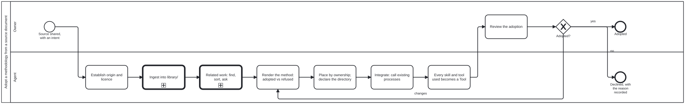

{: .note }
> Generated from `cat-harness/processes/methodology-from-source.bpmn` by `gen-processes-viz.ts` — do not edit here. [All processes](index.html)


# Adopt a methodology from a source document

`Process_MethodologyFromSource` · strict (defaulted) · 8 step(s)

The general process an agent follows when someone shares a paper, book or standard and asks for its method to be used: establish origin and licence, ingest it, render what the method says with what is adopted and refused, place it by ownership, integrate it into the processes that already exist by calling them rather than copying them, make every skill and tool it uses a declared Tool, relate it to existing beans and issues, and put the adoption to the owner. Written 2026-09-23 while adopting WireGen (arXiv:2312.07755) as the worked case. Operating skill: adopt-methodology-from-source; the adoption rules themselves are folio-assistant's methodology-adoption.

## How it connects

- **Called by:** no call activity names this process
- **Calls:** [Document ingestion — uploads/ to the L1 source knowledge graph](document-ingestion.html), [Related work: find, sort, summarize, ask to coordinate](related-work.html)

## Lanes — who acts

| lane | role | what it does here |
|---|---|---|
| Owner | `user` | Shares the source and the intent in chat, answers the coordination question, and decides the adoption. Only the owner accepts an adoption or moves a proposal's status. |
| Agent | `authoring-agent` | Does every step between the share and the review, and records each decision it made with its reason, so the owner reviews a record rather than an impression. |

## Steps

**1** of 8 step(s) carry no documentation — `activity-documented` lists them.

| step | lane | skill / sub-process | what it does |
|---|---|---|---|
| **Establish origin and licence** `A_Origin` | Agent | [`adopt-methodology-from-source`](../reference/skill-instructions/adopt-methodology-from-source.html) | Authors, publication, identifier, and the licence the source itself states. No stated licence means reference only: headings, page ranges and a summary in our own words; the file stays in uploads/ (git-ignored) pinned by checksum. A method with no origin is a house process; write a skill instead. |
| **Ingest into library/** `Call_Ingest` | Agent | calls [Document ingestion — uploads/ to the L1 source knowledge graph](document-ingestion.html) | folio-assistant's document ingestion, choosing the rung mechanically (embedded outline, pages, OCR). Section text is written only when the licence allows it. |
| **Related work: find, sort, ask** `Call_RelatedWork` | Agent | calls [Related work: find, sort, summarize, ask to coordinate](related-work.html) | Search beans, issues and open PRs for work the method touches, categorize and summarize them, and ask the owner whether and how to coordinate. CRDM calls the same sub-process. |
| **Render the method: adopted vs refused** `A_Render` | Agent | [`methodology-adoption`](../reference/skill-instructions/methodology-adoption.html) | What the source says, section by section, then a table of what this platform adopts and what it refuses, each with a reason. Extensions beyond the source (such as web plus mobile where the paper studied mobile) are stated as ours. Reported results are not imported as facts. |
| **Place by ownership; declare the directory** `A_Place` | Agent | [`methodology-adoption`](../reference/skill-instructions/methodology-adoption.html) | A domain-neutral method belongs to the harness and a domain method to the folio that owns the domain. If the session cannot write where it belongs, draft it where it can, say so in the file, and open a bean to move it. |
| **Integrate: call existing processes** `A_Integrate` | Agent | [`adopt-methodology-from-source`](../reference/skill-instructions/adopt-methodology-from-source.html) | The method's steps become a process whose judgement points call the processes that already exist (adjudication, options analysis, review) by calledElement. Nothing is re-implemented. A needed change to an existing process becomes a bean against its owner. |
| **Every skill and tool used becomes a Tool** `A_Tools` | Agent | [`adopt-methodology-from-source`](../reference/skill-instructions/adopt-methodology-from-source.html) | Each script, CLI or checker the process relies on gets a Tool node in cat-harness/tools/index.ts that satisfies a named skill, validated by folio-assistant's ToolDefinitionSchema. |
| **Review the adoption** `O_Review` | Owner | — | — |


