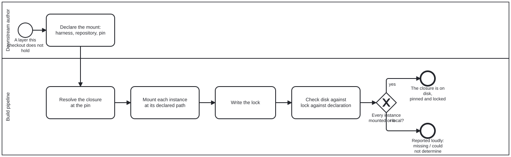

{: .note }
> Generated from `cat-harness/processes/kg/mount-dependency.bpmn` by `gen-processes-viz.ts` — do not edit here. [All processes](index.html)


# Remote-mount a dependency

`Process_MountDependency` · strict (defaulted) · 5 step(s)

Laying a harness — and every instance it needs — down from another repository at a pinned commit, as declared directories, with a lock that says exactly what arrived.

You are in this process whenever a folio or harness needs a layer it does not hold: a downstream folio built on a content layer above this harness, a separated instance whose foundation lives elsewhere. The downstream names the harness, its repository and a 40-character pin in `remoteMounts`; everything else is read from the harness's own declaration at that pin.

Every instance reached ends in one of three states — mounted, missing, could-not-determine — and the third is never reported as the first. The skill is `remote-mount`.

## How it connects

- **Called by:** no call activity names this process
- **Calls:** none
- **Presented on:** no docs page section shows this diagram

## Lanes — who acts

| lane | role | what it does here |
|---|---|---|
| Downstream author | `author` | A person decides WHICH harness and WHICH pin, and whether to override a default. Nothing below chooses a pin: a branch name is refused, and so is an abbreviated SHA. |
| Build pipeline | `build-pipeline` | Mechanical from the declaration on: the same declaration mounts the same bytes in every container, and only an override by id changes where or what. |

## Steps

Every one of the 5 step(s) is documented.

| step | lane | skill / sub-process | what it does |
|---|---|---|---|
| **Declare the mount: harness, repository, pin** `Task_DeclareMount` | Downstream author | [`remote-mount`](../reference/skill-instructions/remote-mount.html) | `remoteMounts: [{ harness, repository, ref }]` on the downstream's own declaration. `ref` is a full 40-character commit. Overrides, if any, are keyed by instance name and then by directory id — never by path. Decide first whether you want a remote mount at all: reading another graph without holding its code is a SUBSCRIPTION, not a mount. |
| **Resolve the closure at the pin** `Task_ResolveClosure` | Build pipeline | [`remote-mount`](../reference/skill-instructions/remote-mount.html) | Fetch the pinned tree (shallow, blobless). Read the harness's declaration from it; for each `needs` name, find that instance in the same tree, else follow a GITLINK at that tree as a pin into its own repository. A need found in neither is missing; one the downstream already holds is local. Paths and directories come from `mountDefaults` unless overridden. |
| **Mount each instance at its declared path** `Task_MountInstances` | Build pipeline | [`remote-mount`](../reference/skill-instructions/remote-mount.html) [`directory-conventions`](../reference/skill-instructions/directory-conventions.html) | Sparse checkout of the declaration and the chosen directories, copied to the mount path (by default the instance's home path, so relative imports and sibling discovery hold). Never onto tracked bytes; never onto a directory no lock says this mount made; never over edits to a previous mount — those are left untouched and reported. |
| **Write the lock** `Task_WriteLock` | Build pipeline | [`remote-mount`](../reference/skill-instructions/remote-mount.html) | `<instance>.mount-lock.json` beside the downstream's declaration: the pins it was written for, each instance's repository, SHA and how the pin was found, each directory's tree digest — and what was NOT mounted, with why, so an offline check cannot read a gap as clean. |
| **Check disk against lock against declaration** `Task_CheckAgainstLock` | Build pipeline | [`remote-mount`](../reference/skill-instructions/remote-mount.html) [`ci-health`](../reference/skill-instructions/ci-health.html) | `mount:remote:check`, with no network: the lock's pins are the declaration's, and every locked directory is on disk and hashes to its digest. Could-not-determine outranks missing, which outranks mounted. |

## Decisions

Every one of the 1 decision(s) is documented.

| decision | what decides it | branches |
|---|---|---|
| **Every instance mounted or local?** `GW_State` | Read off the check's aggregate state. `skipped` and `local` are answers; `missing` and `could-not-determine` are not. | **yes** → The closure is on disk, pinned and locked **no** → Reported loudly: missing / could not determine |


