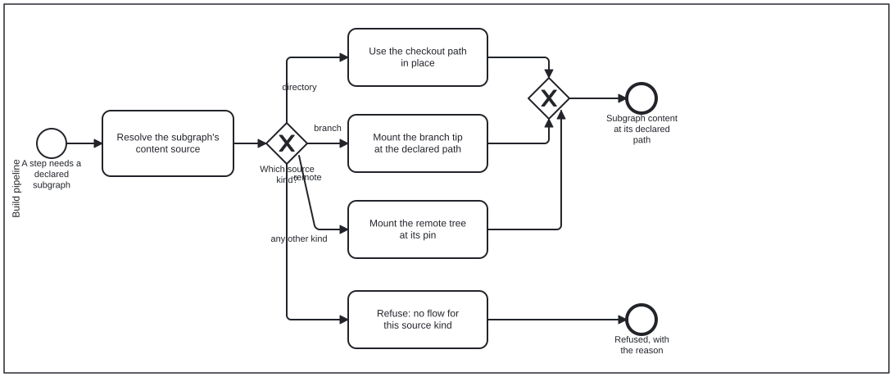

{: .note }
> Generated from `cat-harness/processes/kg/mount-subgraph.bpmn` by `gen-processes-viz.ts` — do not edit here. [All processes](index.html)


# Mount a declared subgraph

`Process_MountSubgraph` · strict (defaulted) · 4 step(s)

Making a declared subgraph's content available at its declared path, whatever its content source.

You are in this process whenever a step is about to read or write the contents of a declared subgraph — beans, todos, fsh-guts, or any directory a declaration names. The source is resolved once, by `declaredSubgraph` (`schemas/harness-config.ts`) through `resolveSubgraphSource` (`schemas/subgraph-source.ts`): the instance config's `subgraphSources` override by id, then the entry's `source`, then a legacy `storage`, then the `directory` default.

The gateway is on the source KIND, and its flows are the only places the kinds differ. A `directory` subgraph is already where its path says, and writing it is an ordinary commit. A `branch` subgraph is mounted from the declared branch's tip into its path, and written back by splicing onto the tip without force. A kind with no flow here is refused.

## How it connects

- **Called by:** no call activity names this process
- **Calls:** none
- **Presented on:** no docs page section shows this diagram

## Lanes — who acts

| lane | role | what it does here |
|---|---|---|
| Build pipeline | `build-pipeline` | Mechanical: every decision on this lane is read off the resolved source, so the same declaration mounts the same way in every container, and an override in the instance config is the only thing that changes it. |

## Steps

Every one of the 4 step(s) is documented.

| step | lane | skill / sub-process | what it does |
|---|---|---|---|
| **Resolve the subgraph's content source** `Task_ResolveSource` | Build pipeline | [`directory-conventions`](../reference/skill-instructions/directory-conventions.html) | `declaredSubgraph(start, id)`: the declaring instance, the entry, and the resolved source with `declaredIn` saying which layer answered. Never read `source` off the declaration directly — the config override and the legacy `storage` field are folded in by the resolver and nowhere else. A contradiction (both `source` and `storage`; a `qa` subgraph keyed by tip) throws here, before anything is mounted. |
| **Use the checkout path in place** `Task_UseCheckoutPath` | Build pipeline | [`directory-conventions`](../reference/skill-instructions/directory-conventions.html) | A `directory` source IS its declared path. Nothing is mounted; a write is an ordinary commit on the working branch, which is why `branch-store push` answers "commit through git" for it rather than pushing anything. |
| **Mount the branch tip at the declared path** `Task_MountBranchTip` | Build pipeline | [`directory-conventions`](../reference/skill-instructions/directory-conventions.html) [`content-context-and-state-graphs`](../reference/skill-instructions/content-context-and-state-graphs.html) | A `branch` source keyed by `tip`: `branch-store mount --id <dir-id>` writes the tip's files at the declared path, so every reader finds the directory where it always was; `push` splices edits back onto the tip, never forcing, and a same-file race is a conflict. The branch's NAME is the declaring directory's `storage` (or `source`) — a branch no declaration names is refused rather than guessed. A `commit`-keyed branch is read per commit through its own store (`qa-store`), not mounted. |
| **Refuse: no flow for this source kind** `Task_RefuseUnknownKind` | Build pipeline | [`directory-conventions`](../reference/skill-instructions/directory-conventions.html) | A kind added to the union (a graph database, say) before this diagram and the mount tool learn it. Refused with its own exit code — reading it as a directory would scan an empty path and report it clean, the `dh4f` defect. |

## Decisions

Every one of the 1 decision(s) is documented.

| decision | what decides it | branches |
|---|---|---|
| **Which source kind?** `GW_SourceKind` | The resolved source's `kind`: `directory`, `branch`, or a kind this diagram has no flow for. | **directory** → Use the checkout path in place **branch** → Mount the branch tip at the declared path **any other kind** → Refuse: no flow for this source kind |


