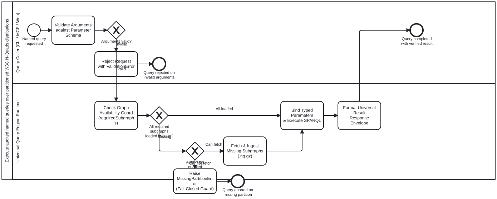

{: .note }
> Generated from `cat-harness/processes/kg/named-query-execution.bpmn` by `gen-processes-viz.ts` — do not edit here. [All processes](index.html)


# Execute audited named queries over partitioned W3C N-Quads distributions

`Process_NamedQueryExecution` · strict · 7 step(s)

Universal execution of audited named SPARQL queries against W3C RDF 1.1 N-Quads distributions across CLI, MCP, and Web runtimes. Governed by skill `named-query-execution` and schema `schemas/nquads-distribution.ts`.

CRITICAL INVARIANTS:
1. FAIL-CLOSED GRAPH AVAILABILITY GUARD: Execution verifies all declared requiredSubgraphs are present in the Oxigraph store before SPARQL evaluation; missing partitions raise MissingPartitionError rather than returning silently incomplete results.
2. SPARQL INJECTION PREVENTION: Parameters are strictly validated against manifest NamedQueryDef parameter schemas; IRIs and literals are escaped and substituted into pre-audited templates.
3. UNIFIED THREE-SURFACE PARITY: Identical query semantics and result envelopes across CLI (bun run cat nquads:query), MCP (nquads-query tool), and Web (oxigraph-query-client.js).
4. SCOPED GRAPH MATCHING: Triple patterns match inside GRAPH ?g { ... } or GRAPH <iri> { ... } to conform to W3C N-Quads 4th-slot named graph semantics.

## How it connects

- **Called by:** no call activity names this process
- **Calls:** none
- **Names the `named-query-execution` skill without calling this process:** [Package and distribute partitioned W3C N-Quads and named queries](nquads-distribution.html) — `activity-calls-skill-process` asks whether each should be a call activity.
- **Presented on:** no docs page section shows this diagram
- **Skill:** [`named-query-execution`](../reference/skill-instructions/named-query-execution.html)

## Lanes — who acts

| lane | role | what it does here |
|---|---|---|
| Query Caller (CLI / MCP / Web) | `authoring-agent` | The invoking entity (agent, CLI command, MCP tool call, or browser web client) requesting execution of an audited named query with typed arguments. |
| Universal Query Engine Runtime | `build-pipeline` | The Oxigraph in-memory RDF store runtime (Node/Bun oxigraph or browser oxigraph.js WASM) enforcing graph availability, parameter binding, and query evaluation. |

## Steps

Every one of the 7 step(s) is documented.

| step | lane | skill / sub-process | what it does |
|---|---|---|---|
| **Validate Arguments against Parameter Schema** `A_ValidateParams` | Query Caller (CLI / MCP / Web) | [`named-query-execution`](../reference/skill-instructions/named-query-execution.html) | Look up query definition by queryId in distribution manifest. Validate supplied arguments against parameter types, required fields, and pattern constraints. |
| **Reject Request with ValidationError** `A_RejectInvalidArgs` | Query Caller (CLI / MCP / Web) | [`named-query-execution`](../reference/skill-instructions/named-query-execution.html) | Abort execution immediately with detailed validation error describing missing or ill-typed arguments. |
| **Check Graph Availability Guard (requiredSubgraphs)** `A_CheckSubgraphs` | Universal Query Engine Runtime | [`named-query-execution`](../reference/skill-instructions/named-query-execution.html) | Inspect query definition requiredSubgraphs list. Verify that each required subgraph is currently loaded into the Oxigraph store. |
| **Fetch & Ingest Missing Subgraphs (.nq.gz)** `A_FetchPartitions` | Universal Query Engine Runtime | [`named-query-execution`](../reference/skill-instructions/named-query-execution.html) | Fetch missing partition payloads over HTTP (servedRoute) or local files, decompress gzip streams, and ingest quads directly into store. |
| **Raise MissingPartitionError (Fail-Closed Guard)** `A_RaiseMissingPartition` | Universal Query Engine Runtime | [`named-query-execution`](../reference/skill-instructions/named-query-execution.html) | Fail execution fast: throw MissingPartitionError naming the required subgraphs that are absent. Never return silent partial answers. |
| **Bind Typed Parameters & Execute SPARQL** `A_BindExecute` | Universal Query Engine Runtime | [`named-query-execution`](../reference/skill-instructions/named-query-execution.html) | Safely bind validated parameters into the audited SPARQL template with escaping. Execute SPARQL query against the Oxigraph store. |
| **Format Universal Result Response Envelope** `A_FormatResponse` | Universal Query Engine Runtime | [`named-query-execution`](../reference/skill-instructions/named-query-execution.html) | Serialize query results into NamedQueryResponseSchema envelope: queryId, executionTimeMs, rowCount, bindings (for SELECT), boolean (for ASK), or quads (for CONSTRUCT). |

## Decisions

**3** of 3 decision(s) carry no documentation — `gateway-documented` lists them.

| decision | what decides it | branches |
|---|---|---|
| **Arguments valid?** `GW_ValidParams` | — | **Valid** → Check Graph Availability Guard (requiredSubgraphs) **Invalid** → Reject Request with ValidationError |
| **All required subgraphs loaded in store?** `GW_SubgraphsLoaded` | — | **All loaded** → Bind Typed Parameters & Execute SPARQL **Missing** → Auto-fetch enabled & source reachable? |
| **Auto-fetch enabled & source reachable?** `GW_AutoFetch` | — | **Can fetch** → Fetch & Ingest Missing Subgraphs (.nq.gz) **Cannot fetch** → Raise MissingPartitionError (Fail-Closed Guard) |


