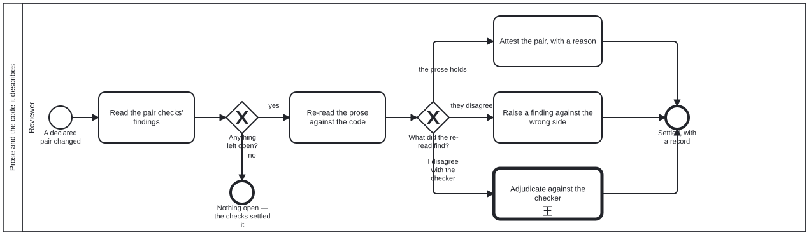

{: .note }
> Generated from `cat-harness/processes/narrative-code-review.bpmn` by `gen-processes-viz.ts` — do not edit here. [All processes](index.html)


# Prose and the code it describes

`Process_NarrativeCodeReview` · advisory · 5 step(s)

Judging whether the prose side of a declared prose/code pair still says what the code does, once the machine has done what it can. You are in this process when a change touches both sides of a declared pair — a diagram and the workflow it implements, a skill and the code beside it — and review-task has sent it here. The mechanical half is already on the subject's kg-qa sidecar: prose-reviewed-since-code-changed says whether the code moved while the prose stood still, and prose-claims-resolve says which claims the prose makes about the code hold, are false, or could not be determined. This process judges only what is left — the stale pairs, the false claims and the undetermined ones — and never re-derives what the checks already settled. Three outcomes, each leaving a record: the prose holds (attested, with a reason), the two really disagree (a finding against the side that is wrong), or the reviewer disagrees with a checker's verdict (adjudication, which keeps the checker's entry beneath the judgement). A proof and its Lean are the one pair kind a proof assistant can settle; that specialisation is proof-narrative-lean-equivalence, not this diagram.

## How it connects

- **Called by:** [Review task](review-task.html)
- **Calls:** [Criterion adjudication](criterion-adjudication.html)
- **Presented on:** no docs page section shows this diagram

## Lanes — who acts

| lane | role | what it does here |
|---|---|---|
| Reviewer | `reviewer` | The generic reviewer, taking this lane for the call path only: it reads what the pair checks left open and settles each item one of three ways. It can attest and raise findings but cannot overrule a checker on its own say-so — that is what the call into adjudication is for. |

## Steps

Every one of the 5 step(s) is documented.

| step | lane | skill / sub-process | what it does |
|---|---|---|---|
| **Read the pair checks' findings** `A_ReadPairFindings` | Reviewer | [`narrative-asserts-code`](../reference/skill-instructions/narrative-asserts-code.html) | Open the subject's kg-qa sidecar and list what is open: a failing prose-reviewed-since-code-changed (code moved, prose did not), and every false or undetermined claim from prose-claims-resolve — `bun run pairs:claims` prints the full list, including what it did not check. Claims that hold and pairs that are not stale need nothing. |
| **Re-read the prose against the code** `A_ReRead` | Reviewer | [`narrative-asserts-code`](../reference/skill-instructions/narrative-asserts-code.html) | For each open item, read the prose claim beside the code it describes and decide what is true. For a stale pair, read what changed in the code and whether the prose still describes it. For an undetermined claim, say whether it points at something real outside this repository. For a false claim, check the checker's reading before trusting it. |
| **Attest the pair, with a reason** `A_Attest` | Reviewer | [`narrative-asserts-code`](../reference/skill-instructions/narrative-asserts-code.html) | The prose holds: record it with `bun run pairs:attest -- --sidecar … --by agent\|human --reason "…"`, naming what was compared. The attestation moves the pair's baseline to the current hashes, so the staleness flag clears and stays cleared until the code moves again. |
| **Raise a finding against the wrong side** `A_RaiseFinding` | Reviewer | [`content-feedback`](../reference/skill-instructions/content-feedback.html) | The prose and the code really disagree: raise a finding that names which side is wrong and why. Usually the prose, because the code is what runs — but a skill can state intended behaviour correctly while the code has regressed, and then the finding is against the code. |
| **Adjudicate against the checker** `Call_Adjudication` | Reviewer | calls [Criterion adjudication](criterion-adjudication.html) | The reviewer and a checker read the same claim differently — a disagreement about ONE kg-qa criterion (prose-claims-resolve). Descend into Process_CriterionAdjudication, which runs the shared adjudication and then one of its three outcomes: the checker's finding stands, the criterion is scoped, or a dispensation is granted with its reason. The checker's entry is kept beneath the verdict rather than overwritten (requirement R4 of issue #1042). |

## Decisions

Every one of the 2 decision(s) is documented.

| decision | what decides it | branches |
|---|---|---|
| **Anything left open?** `GW_Open` | Whether the sidecar holds anything the machine could not settle: a stale pair, or a claim that is false or undetermined. Computable from the two criteria's results, not a judgement. Nothing open means the pair review has nothing to add. | **yes** → Re-read the prose against the code **no** → Nothing open — the checks settled it |
| **What did the re-read find?** `GW_Verdict` | The reviewer's reading, one of three: the prose still holds; the prose and the code really disagree; or the reviewer disagrees with a checker's own verdict. The third is never resolved in this lane, because a reviewer overruling a checker quietly loses the disagreement, which is information. | **the prose holds** → Attest the pair, with a reason **they disagree** → Raise a finding against the wrong side **I disagree with the checker** → Adjudicate against the checker |


